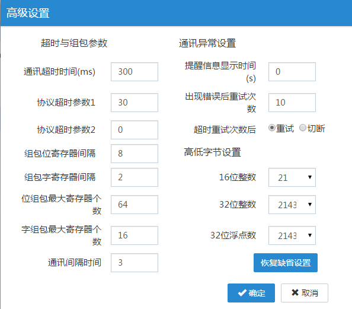

## 高级设置参数的含义  

高级设置参数中参数含义，怎样避免检查状态参数不报警（红色）  

  

**通讯超时时间ms**  

这个参数主要是用于判断一个报文的超时。  

具体是指：  

    当盒子发送一个写或读报文之后。多久之后如果没有收到数据，则认为是超时了。  

比如盒子读一个位变量的报文发送出去之后，等了300ms，还没有收到plc的数据回复，就判断为当前通信超时了。  

    这个一般需要看plc的响应速度来调节。有些plc反应比较慢的时候，需要调节这个参数调节大一些。这个时间往小了调节并不会提高通信速率和效率。  

**协议超时时间1**  

    这个参数比较重要，一般受波特率的影响。  

    这个参数指的是，当一个读或写的报文发送之后，开始接收到了plc的数据。然后由于不同的波特率，plc回复的数据所使用的时间是不一样的，而且字节与字节之间的时间间隔也不一样。当盒子接收了一部分数据之后，再等多久，比如再等30ms看还有没有数据。如果还有，则继续读数据，如果没有数据了，则认为数据接收完成。  

    比如plc理论要回复100个字节，这时候，盒子已经接收了90个字节，再等30ms看是否还有数据，如果有，则继续读剩下的10 个字节。  

    这个时间如果太短，则可能会少接收报文，如果太长，有可能会多接收报文。这里有个经验值：  

9600的波特率，这个值建议在40到80.  

115200 ，这个值建议在30到50.  

**协议超时时间2**  

这个值一般情况下不开放。试驱动而定。默认为0的时候基本是不开放的。  

**组包位寄存器间隔**  

     这个指的是两个位元件的地址间隔不超过这个值的情况下，则会进行组包。组包的意思把这几个位元件放到一个读或写报文里传输，一次读多个位，提高通信速度和效率。  

**组包字寄存器间隔**  
     这个指的是两个字元件的地址不超过这个值，则会进行组包。比如界面有一个D0和一个D2，则驱动会把D0和D2进行组包，组成D0D1D2传输读plc的数据。  

**位组包最大寄存器个数**  
    这个指的是，如果有很多个位元件并且可以组包的情况，最大可以多少个位可以组包一个包。比如有1到200共需要读200个位，但是最大一次也只能组64个位作为一个数据包。  

**字组包最大寄存器个数**  

   和位组包最大寄存器个数 意思一样。  

**通信间隔时间**  

    这个参数也比较关键。  
    这个参数指的是，当一个读指令完成之后，盒子再隔多久再发下一个读或写指令。  
    比如需要D0 和D100这两个地址。  
    当读到D0之后，再间隔3 ms 再读D100.  
这个就是通信周期吧。有些PLC不支持这么快的通信周期，两个命令之间的时间可能不支持这么高，因为需要调节大一些。一般建议10到100。最大是255.  

**提醒信息显示时间**  

    这个值只针对屏有效，针对盒子无效。指的是满足超时条件后，界面弹出相应的对话框提示通信超时。  

**出现错误后重试次数**  

   指的是某个读或写指令发生了超时了后，再对这个命令进行重试，重试一定次数后确认为超时。  

**高低字节设置**  

    这个一般是针对不同的PLC储存的数据格式不一样。比较大小端字节格式不一样。才需要调节的。一般情况下默认，这个不影响通信。  