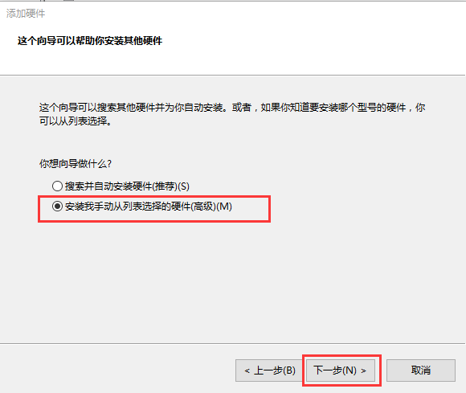
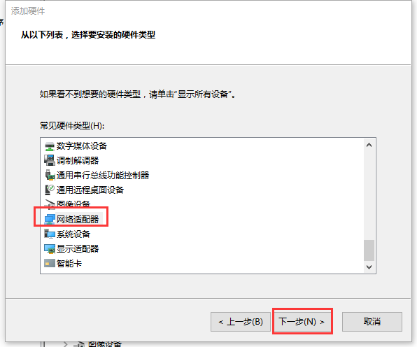
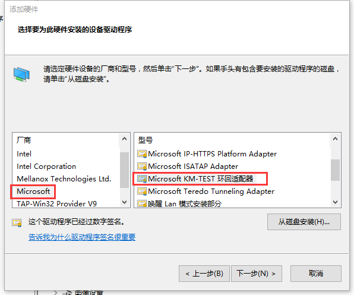

## 使用以太网透传  

1）透传的时候，如果不能正常透传，可在win7及win10系统上要将FlexManager软件和PLC的软件都以管理员身份运行，且需要将电脑上的杀毒软件退出。  

2）以太网透传，需要手动安装虚拟网卡。安装步骤如下：  

在设备管理器里，单击“操作”选择“添加过时硬件”，然后选择“安装我手动从列表选择的硬件”。  

  

单击下一步，选择网络适配器。  

  

厂商选择microsoft，型号选择microsoft KM-TEST 环回适配器，这是win10系统的型号。Win7系统上是microsoft loopback adapter。  

  

4）以太网透传的时候，需要将虚拟网卡的IP地址设置成PLC的IP地址。  

5）普通透传时，需要将VPN的虚拟网卡禁用。  

6）具体透传步骤可参照有相关文档的PLC透传手册。不同PLC透传的透传注意事项不一样，详情可参考《FBox相关产品使用说明》或联系技术支持咨询。  