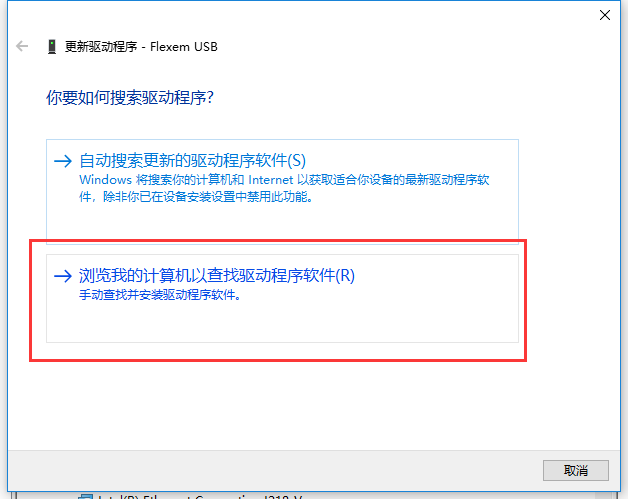
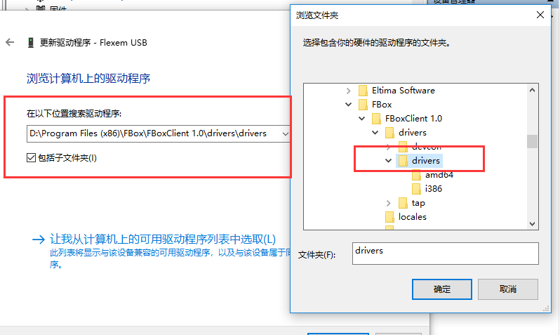
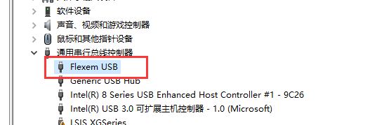
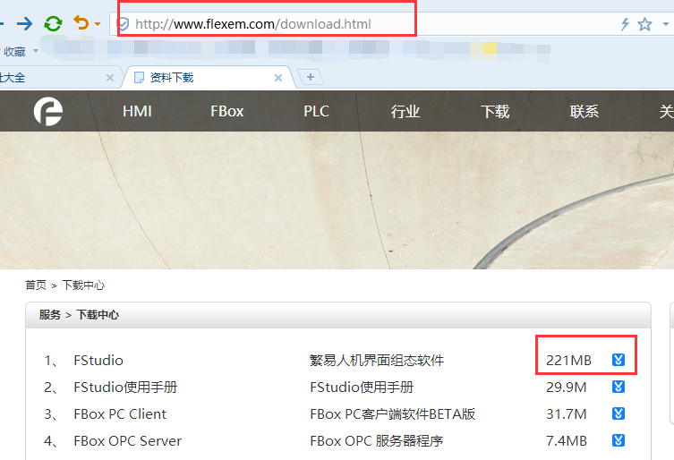
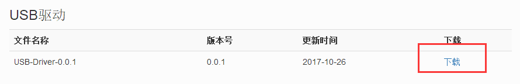
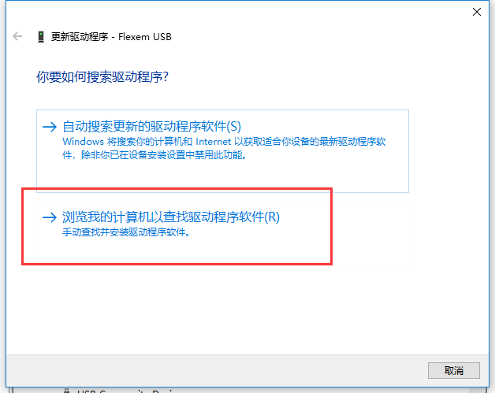
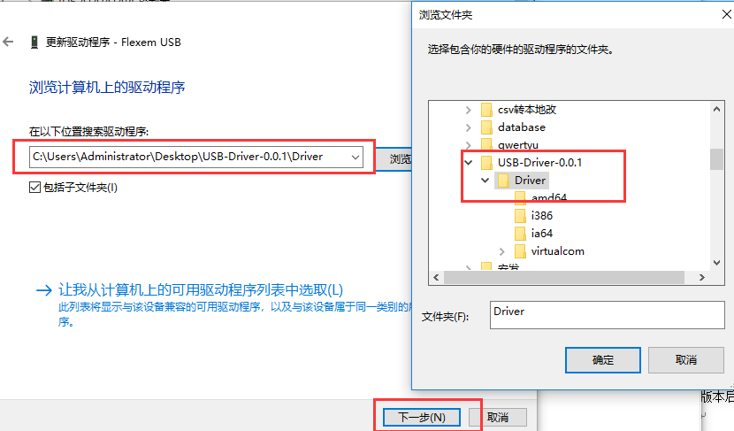

## 安装usb驱动  

使用usb线直连FBox和电脑下载配置时，发现usb驱动未安装成功，在电脑的设备管理器里，插拔usb线找到usb驱动，若显示下面的“Gadget Serial v2.4”，则需要更新驱动。  

  

#### **方法一：**  

右击该驱动，选择“更新驱动文件”，在弹出的对话框里选择“浏览我的计算机以查找	驱动程序软件”，见下图。  

  

点击浏览，手动选择FlexManager软件的安装目录到drivers文件夹，选好之后，点击下一步，提示安装成功即可。  

  

安装成功后，在设备管理器，通用串行总线控制器下，有flexem usb驱动，表示正常。  

  

#### **方法二：**  

前往www.flexem.cn下载中心，选择FStudio软件，拉倒页面的最下方就是usb驱动文件，点击下载即可。  

  

  

对驱动文件进行解压缩。在设备管理器里，usb驱动上面右击选择“更新驱动文件”，手动选择刚才的驱动目录，到driver文件夹，点击下一步，安装驱动。  

  

  

安装成功后，在设备管理器，通用串行总线控制器下，有flexem usb驱动，表示正常。  

  