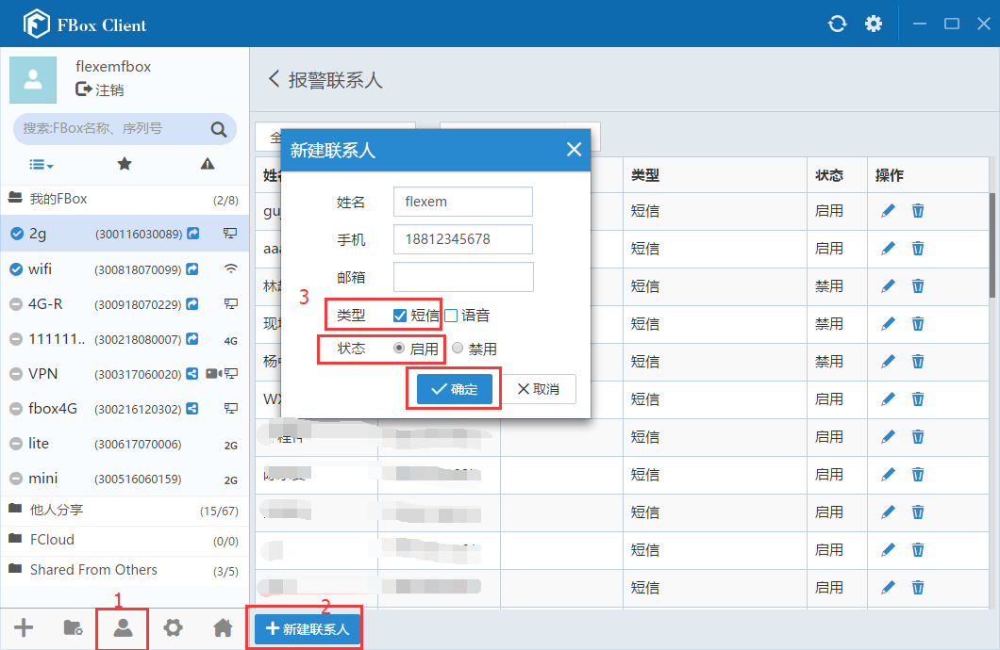
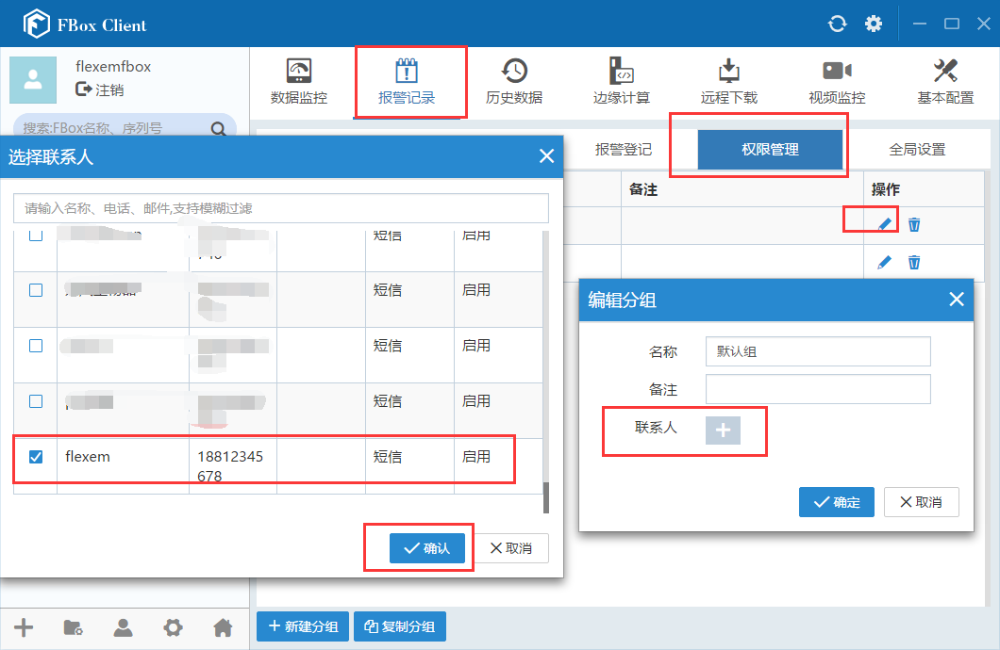

## 短信报警  

短信报警用于，FlexManager报警登记里添加的报警点，产生报警时向用户手机发送短信报警提示，报警恢复时也会发送短信提示。该报警是由繁易云服务器发送，跟FBox的上网方式没有关系。  

**设置方式：**  

#### **添加报警联系人**  

在FlexManager软件左下角，点击“联系人”选项，新建联系人，输入姓名和手机号，类型勾选“短信”，状态“启用”。然后点击确定，如下图。  

  

#### **选择报警联系人**  

添加好联系人之后，在报警记录，权限管理，报警分组里，选择要发送短信的联系人。点击确定。这样该分组下的报警产生时，就会发送短信报警。  

  