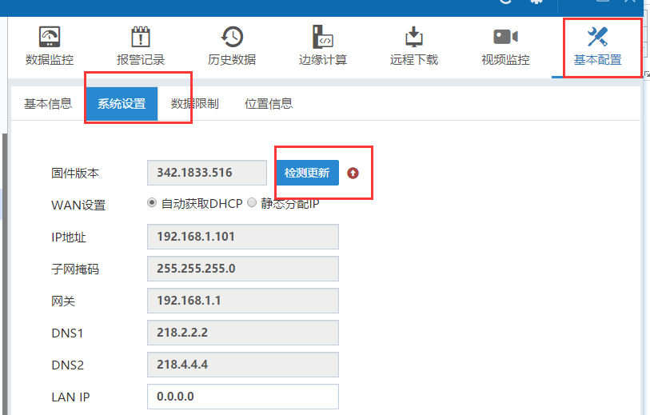
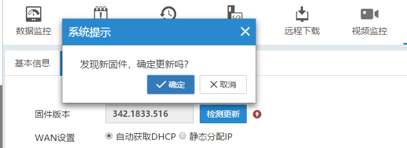
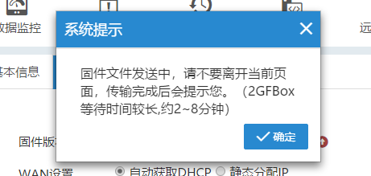
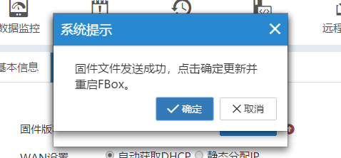
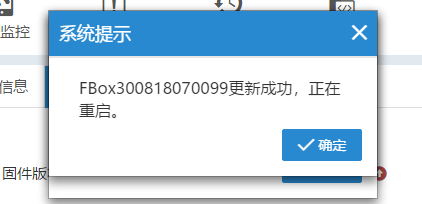

## 更新固件方式  

FBox在线情况下，在FlexManager软件内的基本配置中查看系统设置，固件版本后的检测更新，如果固件不是最新版，那么在检测更新后面会有一个红色的箭头提示  

  

点击检测更新即可在线更新。  

  

然后出现“文件发送中，不要离开当前页面”等字样。出现该提示时，停留在当前页面，不要操作FlexManager软件，直到提示“文件发送成功，点击确定更新并重启FBox”，点击确定。  

**注意：在出现提示“固件发送成功，点击确定更新并重启FBox”之前，不要频繁的点击检测更新按钮，会导致固件更新失败。需要停留在该页面，耐心等待。**  

  

  

提示“FBox更新成功，正在重启”，点击确定。FBox会自动重启。等FBox 之后，固件即是最新版。  

  