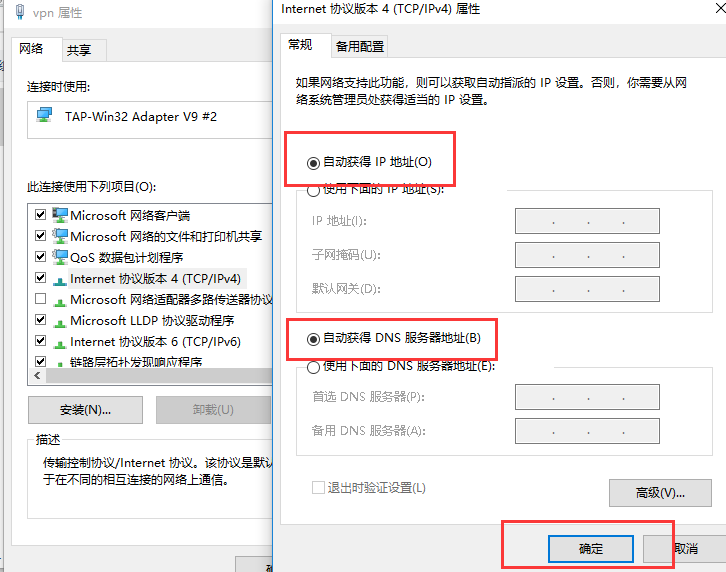
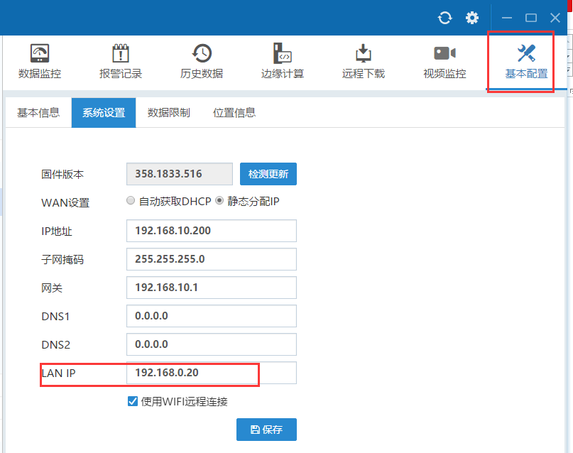
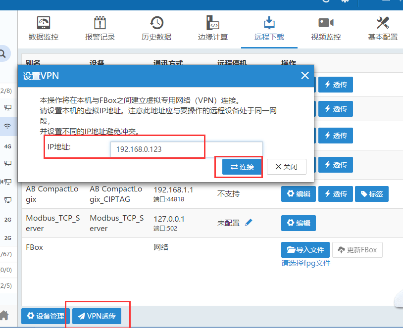
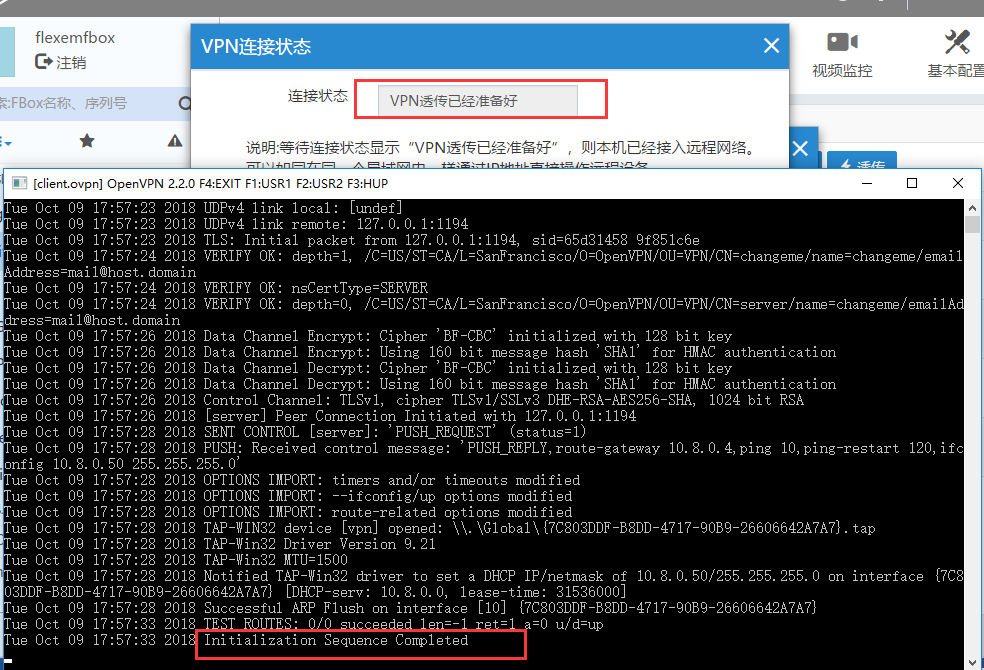
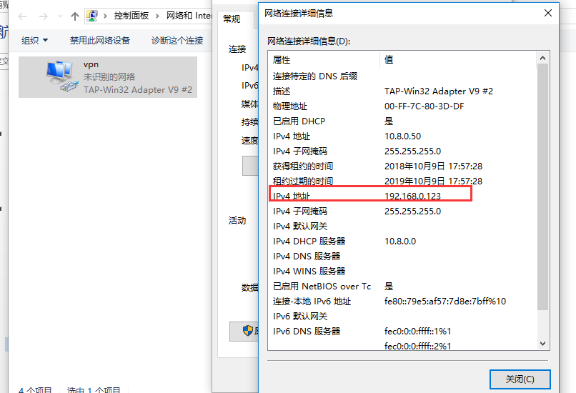
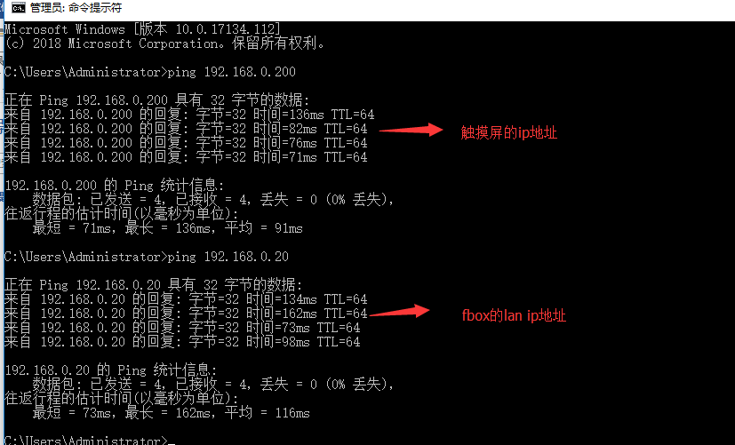
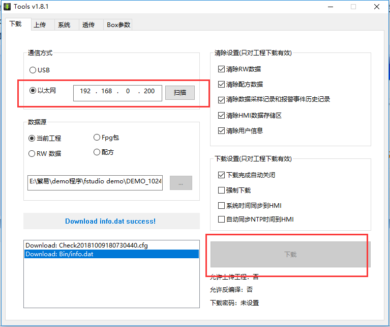

## 使用VPN透传  

**注意事项：**  

1）VPN透传适用条件：FBox具备vpn透传功能，且FBox和PLC之间采用以太网通讯。  

2）VPN透传时，需要将普通透传的虚拟网卡禁用。  

3）透传的时候，如果不能正常透传，可在win7及win10系统上要将FlexManager软件和PLC的软件都以管理员身份运行，且需要将电脑上的杀毒软件退出。  

4）VPN透传的虚拟网卡，在安装FlexManager软件的时候已经自动安装了，不需要再手动安装。虚拟网卡如下：  

  

5）vpn透传前。将vpn网卡的IP地址设为自动获取。  

  

6）透传前，需要将FBox的固件版本升级到最新版。固件更新方式参照第6条。  

**透传步骤：（以繁易触摸屏为例）**  

1）1）将FBox的lan IP设置成跟触摸屏的IP在一个网段，摸屏的IP是192.168.0.200。所以将FBox的lan IP设置成192.168.0.20。  

  

2）点击“VPN透传”，在弹出的窗口里输入一个跟FBox的lan IP和触摸屏的IP同网段的IP地址，点击连接。  

  

3）出现透传已准备好，并且在弹出的窗口里出现“initialization sequence completed”字样，说明VPN透传功能正常。  

  

4）可在虚拟网卡上“右击”选择“状态”，查看IP地址是否正确写入。若未写入，而且虚拟网卡的IP地址也是自动获取，需要将IP地址手动写入。  

  

5）可ping一下触摸屏的IP，检查下FBox和触摸屏之间的连接是否正常。  

  

6）打开触摸屏软件，选择以太网下载方式。  

  