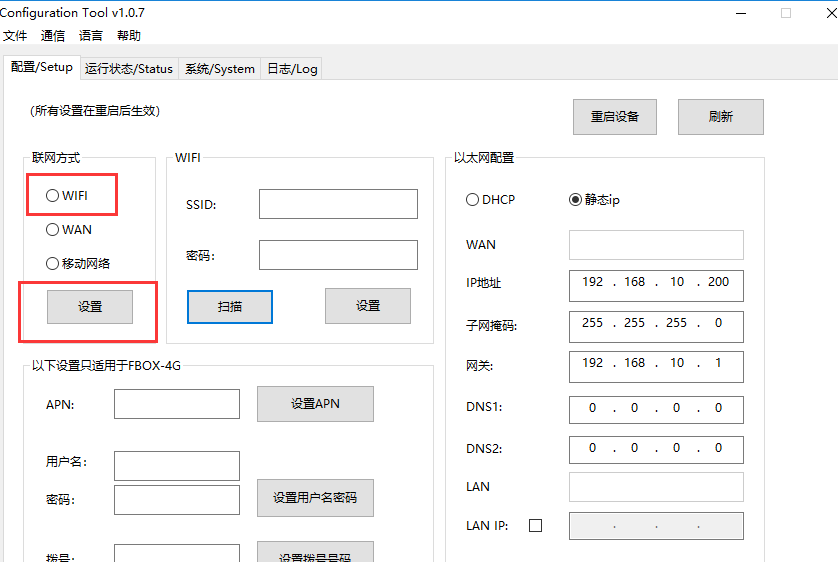
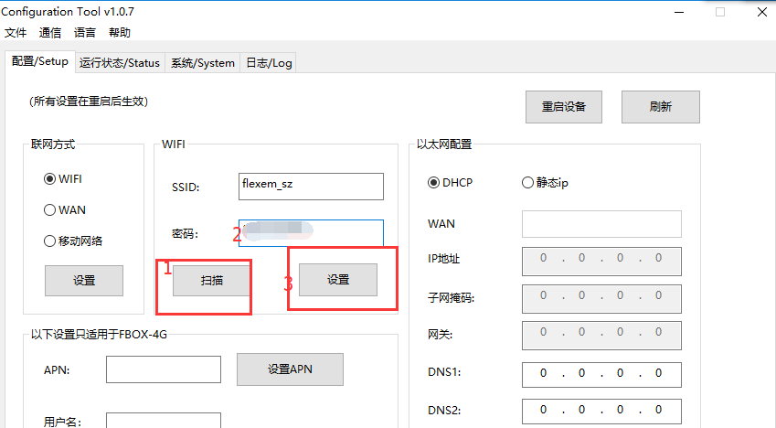
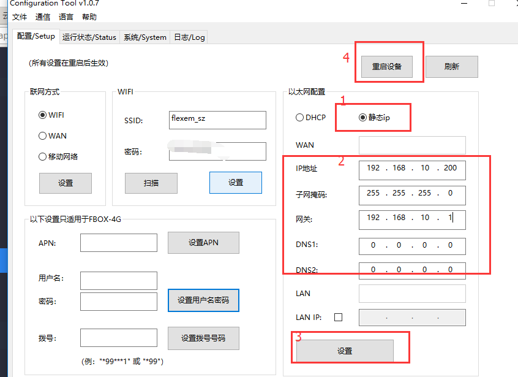
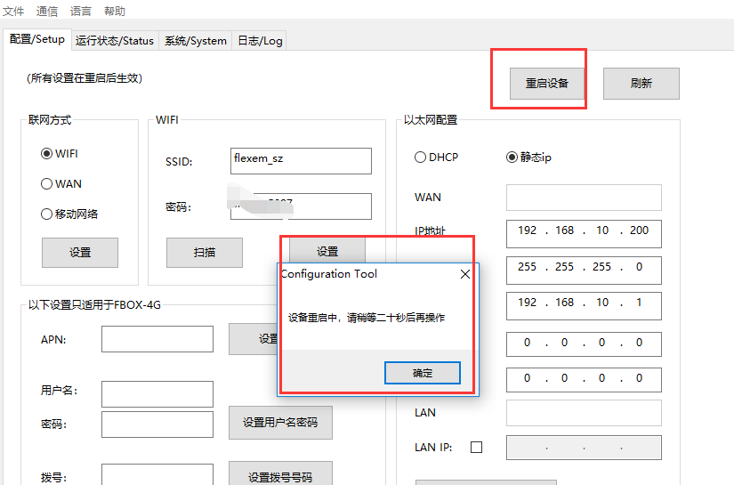
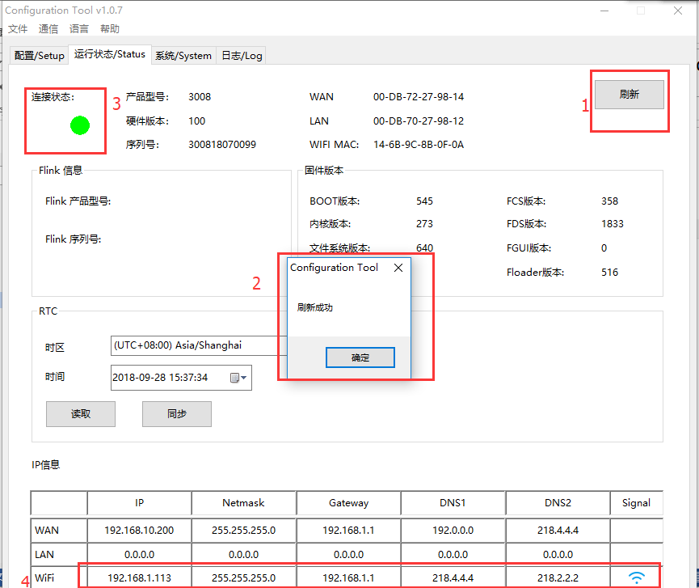
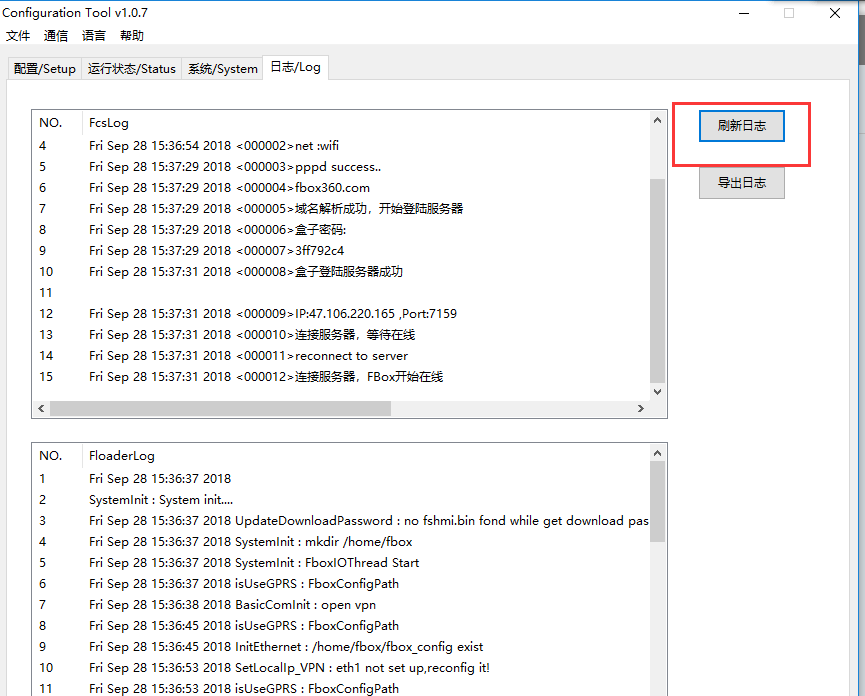

## FBox使用wifi上网配置方式  

FBox-wifi这个盒子，使用wifi上网，需要使用configuration tool工具配置wifi的账号和密码，使用usb线下载到FBox里。配置方式如下：  

1）打开FlexManager软件，点击全局设置里选择FBox的配置工具。  

  

2）联网方式里，选择wifi，点击下面的设置  

  

3）点击扫描wifi，选择一个wifi名称，wifi名称不可为中文。在密码栏里输入wifi的密码，然后点击设置。  

  

4）以太网设置里，选择静态分配IP，输入IP 子网掩码和网关，IP注意不要设置成跟wifi的IP在一个网段。  

  

5）设置完上网方式，点击重启设备，会提示等待20s。  

  

6）在运行状态里，点击刷新，若是连接状态灯为绿色，wifi的IP也可以看到，表示FBox已经在线。  

  

7）若是FBox无法在线，则需要检查配置的wifi的账号密码是否正确，也可以在日志里刷新日志，看下上网情况。  

  