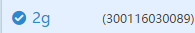
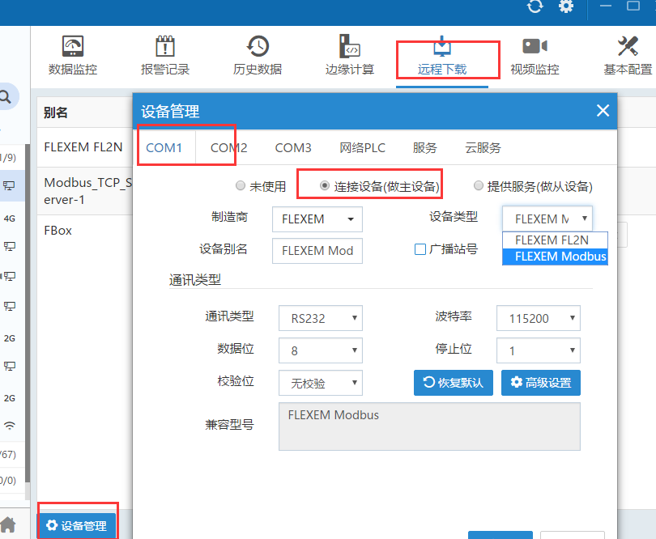
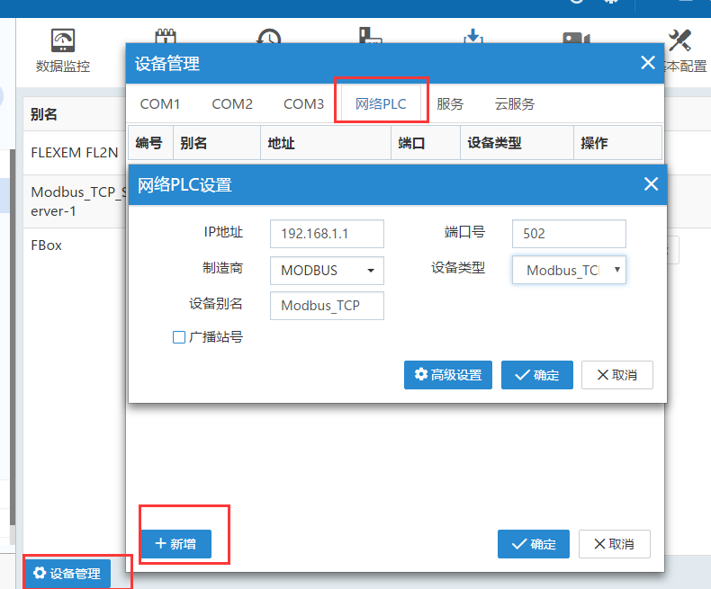
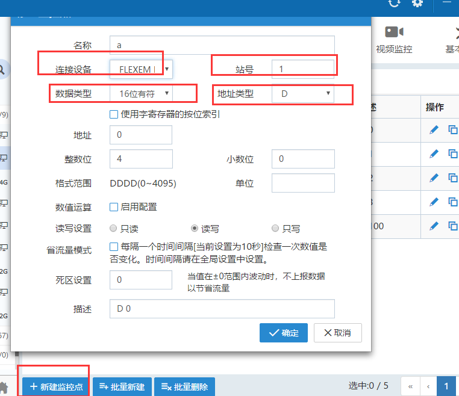
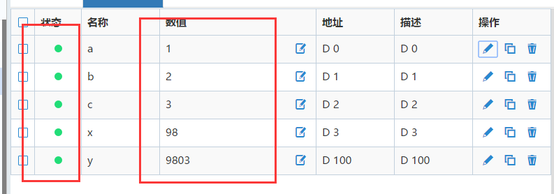

## **如何配置新盒子**  

先使用24V直流电源给盒子供电，上电后RUN灯闪烁，频率一秒一次。需要先配置FBox的上网方式，FBox在线之后，在FlexManager软件配置和所连设备的通讯。  

1）下载FlexManager软件，注册账号，登录FlexManager。然后点击左下角的“+”号，添加FBox，FBox的序列号和密码在盒子背面的标签上，别名自己定义。  

2）配置FBox的上网方式  

**注意：FBox-2g-lite和FBox-4G-lite是自动识别上网方式的，插上SIM卡或者网线，可以自动上线，无需使用下面介绍的上网配置方式。**  

当FBox前面显示这个状态时，表示FBox已经在线。可以进行下一步，配置FBox和所连设备的通讯。  

3）配置FBox和设备的通讯方式  

以繁易PLC为例。点击远程下载页面左下方的设备管理。可以设置COM口通讯和以太网通讯。  

  

通讯设置，需要设置成PLC侧一致。。  

网络PLC设置，以modbus tcp为例。IP地址设置成所连设备的IP，端口号默认。  

  

4）配置完通讯设置，接好通讯线之后，在数据监控里，新建监控点里添加PLC的地址，确认。若是状态是绿色，且能读到数据，说明通讯正常。需要注意的是，站号，数据类型和地址需要和PLC设置成一致才能保证通讯正常。  

  

  

