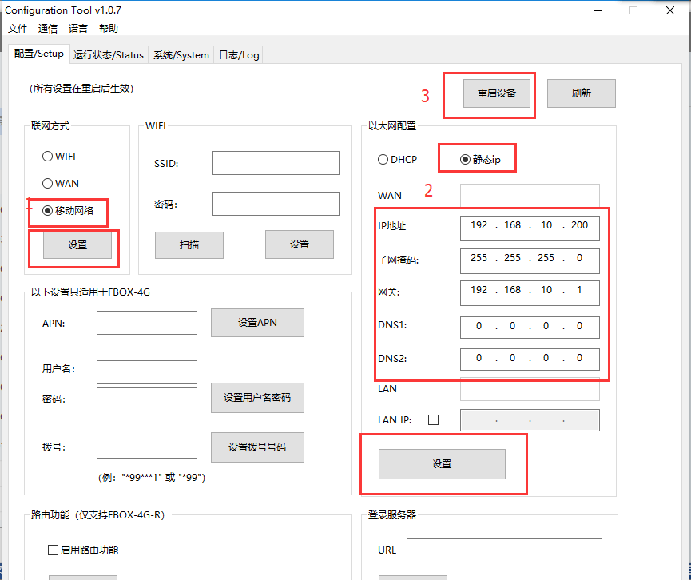
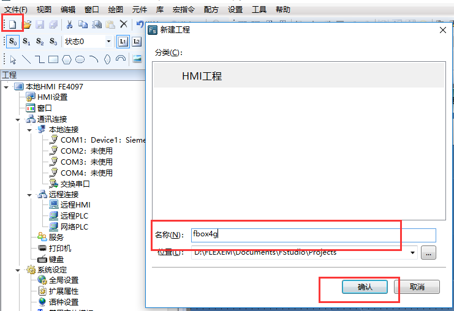
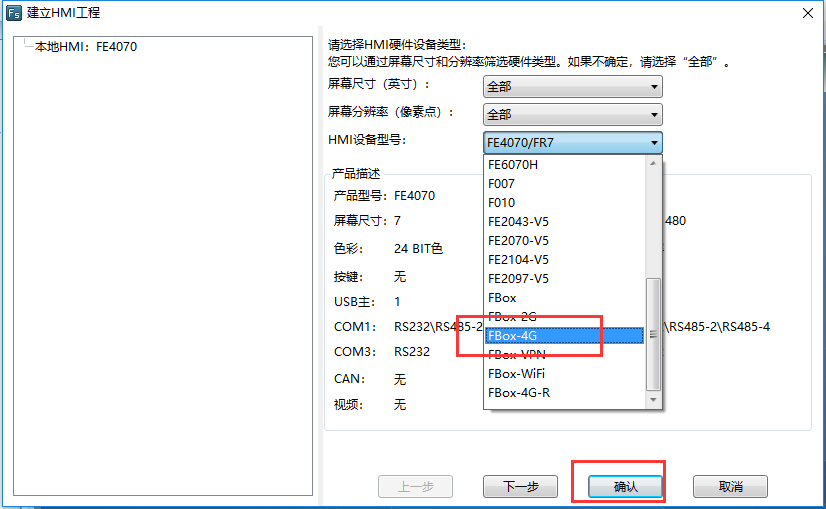
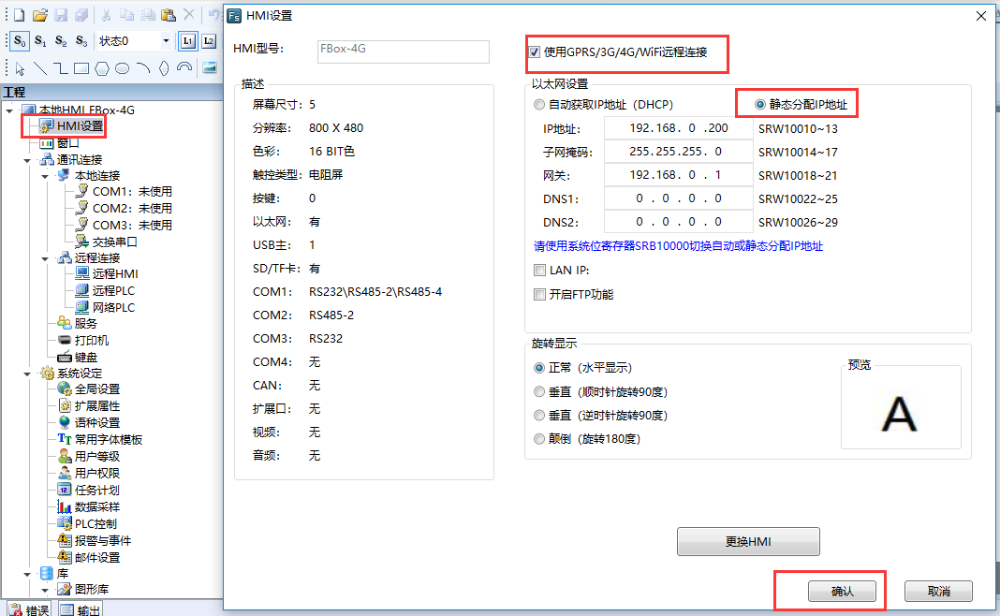
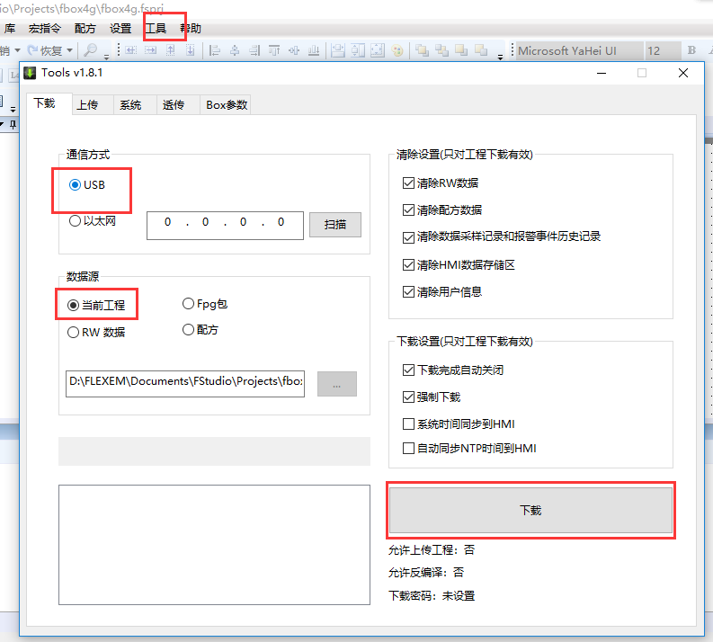
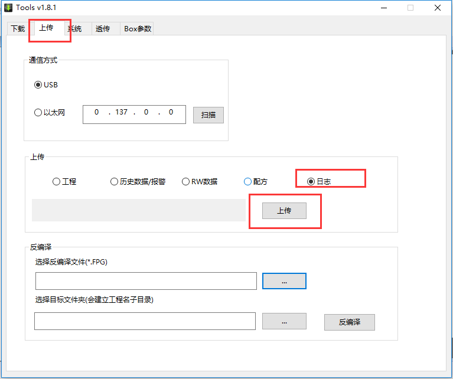
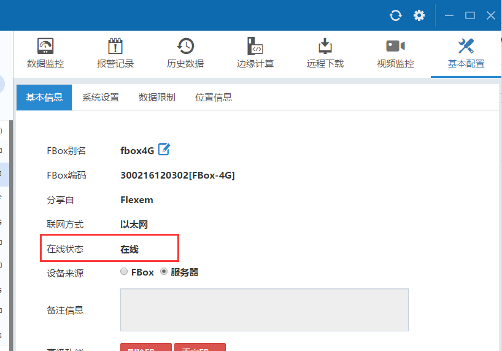
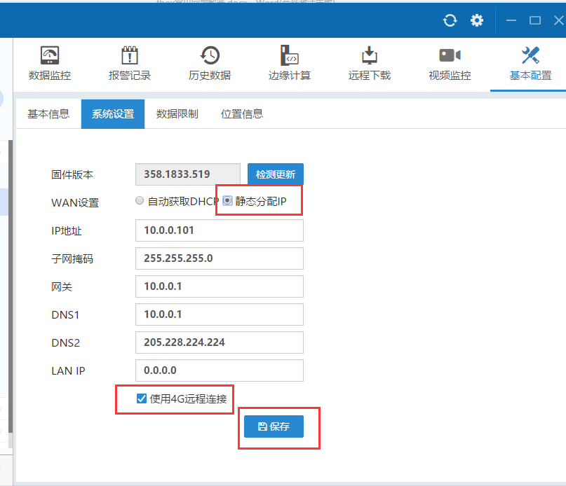

## **FBox使用2G/3G/4G上网配置方式**  

使用SIM卡上网方式有三种配置方式，configuration tool，FStudio，FlexManager。  

FlexManager只适用于FBox在线的情况下修改上网方式。若是FBox不在线，需要使用前两种方式。  

#### 使用configuration tool工具配置  

适用于FBox的固件版本是271以上的，若是固件版本低，需要使用FStudio软件配置。首先使用usb线（即打印机上使用的方口线）连接电脑和FBox。  

1）在FlexManager软件，全局设置里，点开FBox的配置工具。  

  

2）“联网方式”里，选择移动网络，点下面的设置。然后“以太网设置”里，选择静态IP，可以输入下方图形里所示的IP地址，需要注意的是，如果FBox通过网线连接PLC，那么该IP不能设置为跟PLC的IP在一个网段，而是将lan IP设置为跟PLC IP同网段。设置完点击下面的设置。最后点击重启设备，设置生效。  

  

3）在运行状态里，点击刷新，刷新成功后，若是连接状态灯由红色变为绿色，cellular的IP也可以看到，表示FBox已经在线。  

4）若是FBox不在线，则需要检查下SIM卡是否插好，天线是否接好，以及SIM有没有欠费这些可能性。另外可以上传FBox日志查看具体问题。  

#### 使用FStudio配置  

1）使用usb线连接电脑和FBox。新建工程，HMI型号选择对应的FBox型号，这里以FBox-4G为例。选择好FBox型号，点击确定。  

  

  

2）点击左边工程下的HMI设置，勾选“使用GPRS/3G/4G远程连接”，选择静态分配IP地址。然后点击确定。  

  

3）选择工具，下载，下载方式选择usb。然后点击下载。  

  

4）下载后，如果配置正确，SIM卡也正常，FBox可以正常在线，若是不在线，可以使用FStudio上传下日志。点击TOOLs里面的上传，选择日志，点击上传。  

  

#### 使用FlexManager配置  

1）FBox在线情况下，可使用FlexManager修改上网方式。  

  

2）在FlexManager软件的基本配置界面，查看基本信息，勾选下面的“使用4G远程连接”，然后IP设置为静态分配，设置完点保存。保存后FBox会重启。切换成4G之后，需要插上手机卡，安装天线吗，等待FBox在线  

  