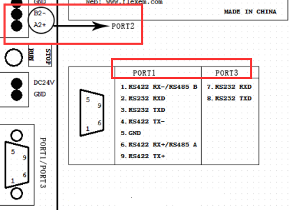

## FBox和设备通过串口通讯  

串口通讯需要在FlexManager软件里设置通讯方式和接线。  

1）通讯设置：在FlexManager软件里，点击远程下载，设备管理，选择com口配置。  

  

连接设备（做主设备），是指FBox做主站，提供服务（做从设备），FBox做从站，可根据通讯需求选择做主从设备。  

2）根据所连的设备选择制造商和设备类型，如果连接仪表或者变频器之类的，需选择modbus兼容设备。通讯类型里的波特率之类的参数跟所连设备设置成一致即可。
串口通讯的站号，需要在数据监控，添加监控点的时候设置。  

3）FBox，FBox-2G和FBox-4G，都分别有三个串口，com1和com3共用一个九针口，com2是绿色插排上的A2+和B2-。  

4）接线方式参考下图。  

  