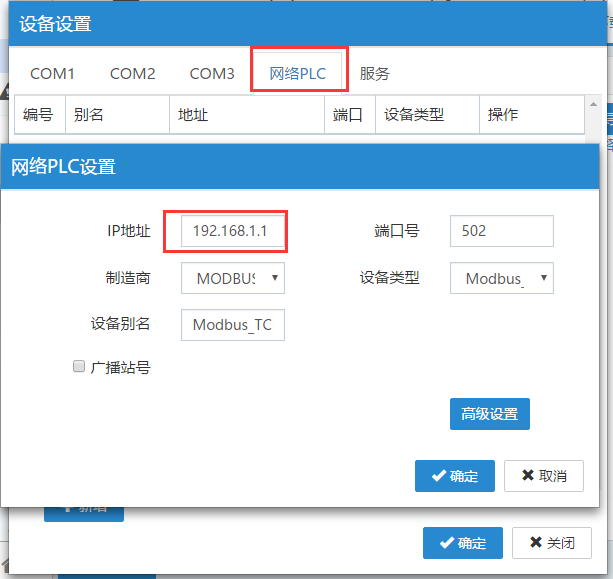
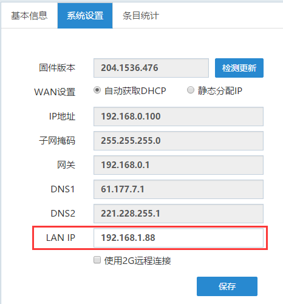

## FBox和设备通过以太网通讯  

1）以太网通讯，切记一定要将FBox的lan IP设置成跟PLC的IP地址在同一个网段。Lan IP地址在FlexManager软件里，基本配置，系统设置里修改。  

2）通讯设置：在FlexManager的远程下载，设备管理，网络PLC里配置。IP填写所连设备的IP地址，制造商、设备类型，根据所连设备型号选择。端口号默认。  

3）如上两项设置的没问题，在数据监控里添加监控点，读不到设备的数据，需要检查下网线是否正常。  

  

  