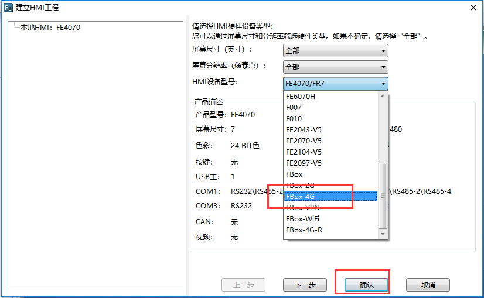
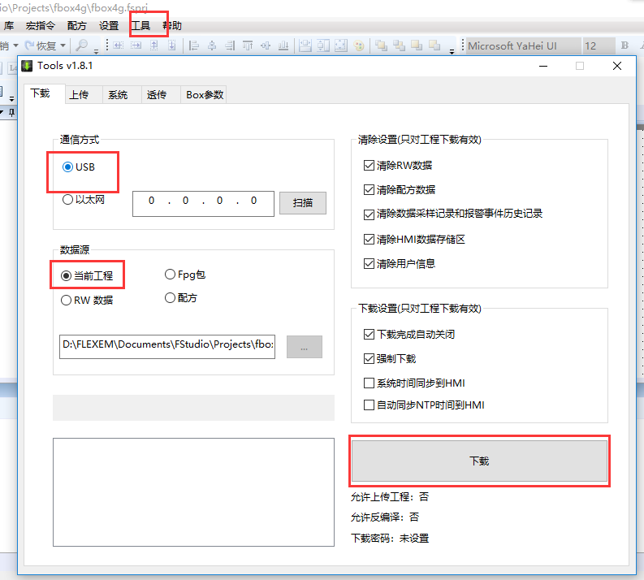

## 使用FStudio配置  

使用usb线连接电脑和FBox。新建工程，HMI型号选择对应的FBox型号，这里以FBox-4G为例。选择好FBox型号，点击确定。  

  

  

点击左边工程下的hmi设置，勾选“使用GPRS/3G/4G远程连接”，选择静态分配ip地址。然后点击确定。  

  

选择工具，下载，下载方式选择usb。然后点击下载。  

  

下载后，如果配置正确，sim卡也正常，FBox可以正常在线，若是不在线，可以使用fstudio上传下日志。工具，上传，日志。看下是什么问题。  

  