## VPN透传问题诊断  

使用FBox进行VPN透传时，在按说明文档进行操作的时候，如不能成功透传，可能出现的问题有：  

一 客户端点VPN透传后，不弹出黑色弹窗。  

二 弹出黑框后，会很快消失。  

三 弹出黑框框，但是会提示DHCP找不到或无效之类的。  

四 能建立VPN，但是ping 目标PLC IP地址无效  

五 能建立VPN，能ping目标PLC IP，但是PLC软件没法连接PLC。  

六 能建立VPN，但是连接断断续续的，有时候下载软件会提示中断，但是不需要重新点透传也可以恢复。  

七 能建立VPN，但是会中断，无法恢复  

#### **客户端点VPN透传后，不弹出黑框框，存在的可能性有:**  

A 透传程序可能没有起来，可能需要以管理员身份运行客户端。  

B 如果以管理员身份运行程序还是没有弹出黑框框，可能存在杀毒软件之类的拦截。  

C 如果还是没有弹出黑框框，可能是电脑所在的网络存在防火墙，可以禁用电脑的防火墙看一下，或者电脑所接的网络（比如公司网络，路由器）等是否存在防火墙等需要特殊开放端口的。  

D 点透传那一刻，盒子刚好掉线了。  

  待盒子上线后，再进行尝试。如果多次如次，建议换个SIM卡试试看。  

#### **弹出黑框框后，会很快消失**  

A、VPN网卡还没有安装。  

  

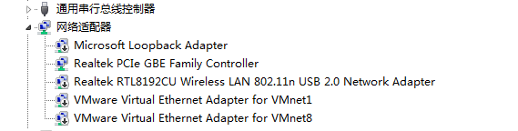  

如图，并没有存在VPN网卡。  
正确安装的话，应该是这样的  

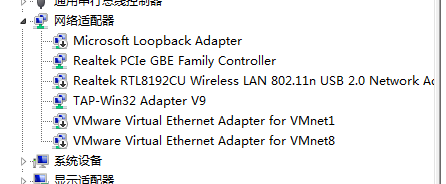  

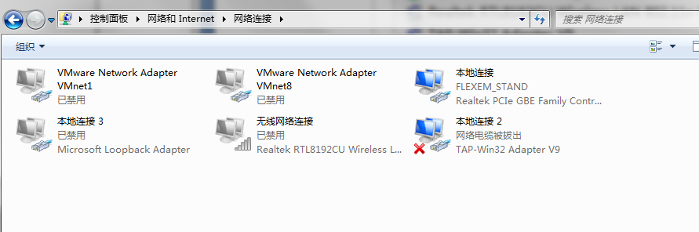  

B、VPN网卡安装，但是处于禁用状态。  

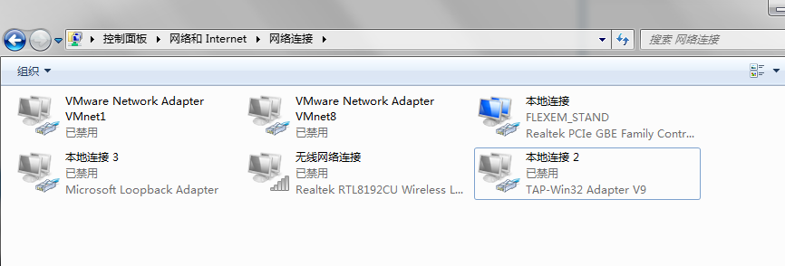  

vpn网卡是禁用的情况下，也会导致黑框框会消失很快。  

#### **弹出黑框框，但是会提示DHCP找不到或无效之类的**  

A、VPN网卡启用，但是并没有处于默认的自动获取模式。  

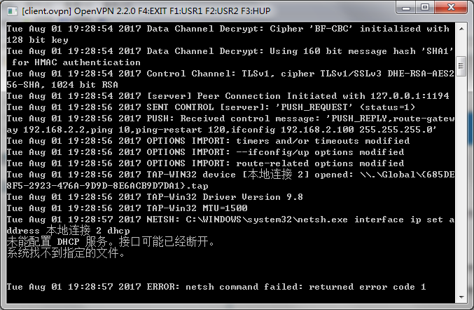  

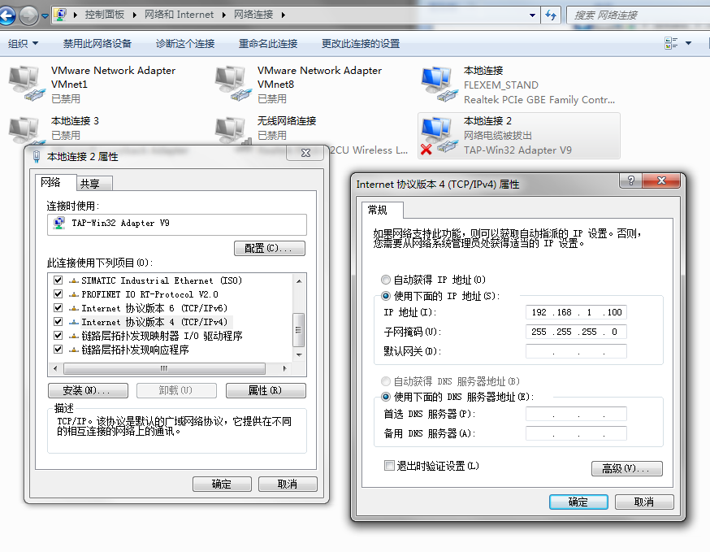  

因为可能会存在部分电脑没能自动设置好IP，手动设置过VPN网卡的IP，但是忘了改回自动获取模式，会出现VPN透传时出现黑框框提示DHCP的问题  

B、VPN网卡是自动获取，但是也提示DHCP相关问题，可能是网卡名称出现中文，可尝试改成英文看看，并且不要有空格。  

  

可以尝试改成这样。  

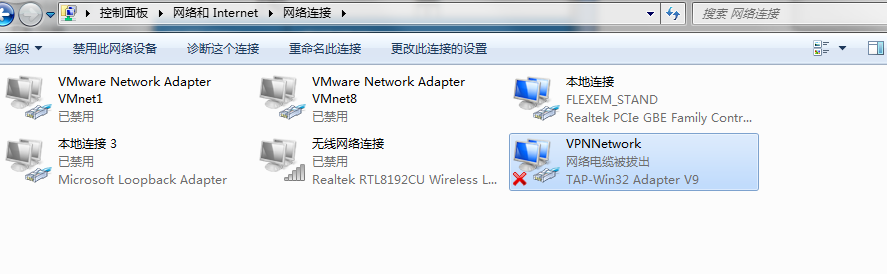  

注：这种情况相对较少，但也确实在客户的电脑遇到过。  

#### **能建立VPN，但是ping 目标PLC IP地址无效**  

A、检查VPN网卡的IP是否设置成功。  

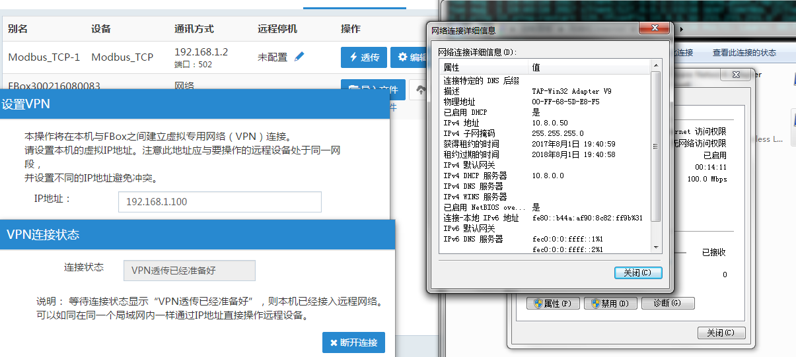  

建立VPN透传时设置的是192.168.1.100，检查VPN网卡，但是并没有这个IP的出现，说明这个IP没有设置成功。  

建议以管理员身份运行，或者把杀毒软件关闭掉再试试看。  

如果还是不行，建议可以先手动设置VPN网卡的IP。  

正常情况应该是这样：  

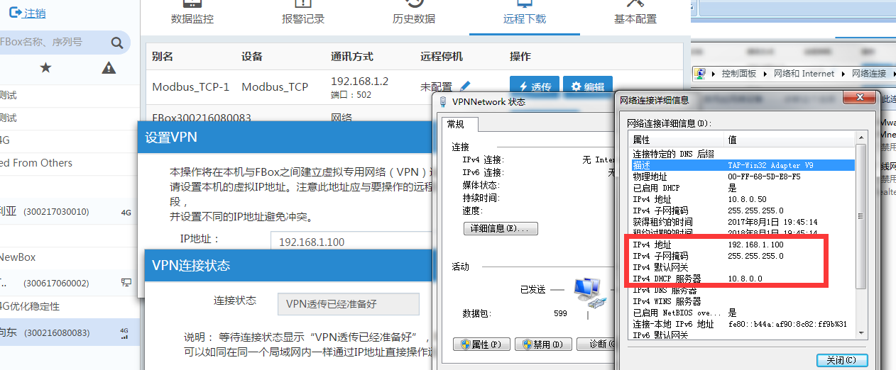  

B、检查建立VPN时设置的IP和目标PLC是不是同一个网段。如果不在同一个网段，也会存在ping不通的可能。  

C、检查VPN的网卡驱动是否存在#2 #3 之类的，或者VPN的网卡名称为TAP-Windows Adapter V9 之类的  

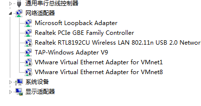  

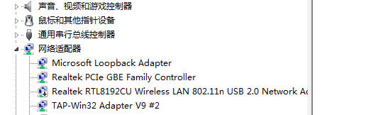  

不过，最新版的客户端VPN透传已解决这个问题。如果是最新版的客户端，即便是出现#2，#3或者TAP-Windows Adapter V9，也可以进行设置IP成功的。  

#### **能建立VPN，能ping通目标PLC IP，但是PLC软件没法连接PLC**  

A、存在本地网卡与此PLC的IP是一致的。比如使用过普通透传，安装过虚拟网卡，虚拟网卡的IP和PLC的IP一致，建立VPN透传时，忘了把虚拟网卡禁用了。  

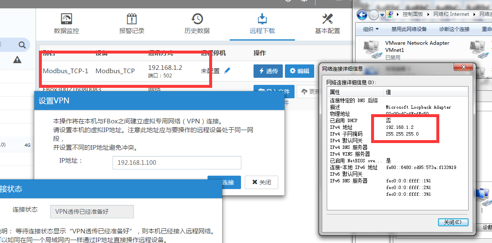  

解决办法：把虚拟网卡禁用掉。  

如果在执行ping　这个IP时，发现ping值的延时在1ms左右或者出现< 1ms ，基本上是属于这种情况了。  

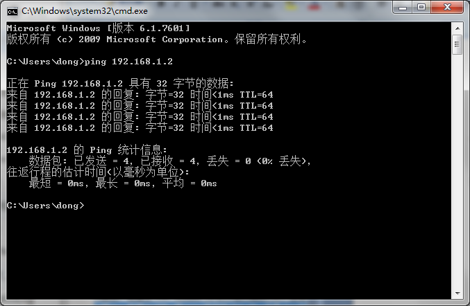  

B、检查电脑当前所有的网卡，网线，无线等所接的网络里，是否存在和PLC 同IP的设备。如果存在相同IP的设备，则建立了VPN后，要访问VPN连接的目标PLC IP会冲突的。  

检查办法：在没有进行VPN透传时，对PLC进行ping，看是否有反应，如果有反应，说明当前网络里存在相同IP的设备。  

解决办法：此情况下会导致VPN透传连接PLC异常，需要存在相同IP的设备想办法不要接入到电脑里。  

#### **能建立VPN，但是连接断断续续的，有时候下载软件会提示中断，但是不需要重新点透传也可以恢复。**  

A、检查是否存在IP冲突的问题。此问题可参照问题六进行排查。  

B、检查盒子的设置是否存在设置为自动获取的情况。  

如果盒子设置为自动获取，如果获取不到IP，则盒子会定时去进行自动获取IP命令。当盒子执行自动获取时，会对网口进行重置，此时会影响网口与PLC的连接。需要把自动获取改成静态IP。  

注：使用4G上网，接以太网PLC时，如果 自动获取+LAN IP与PLC进行通信，也会出现客户端的数据监控存在断断续续的情况。原因是一样的，就是会不停定时的刷自动获取命令，会网卡重置，影响了网口的通信。  

C、检查盒子网口网线是否过长从而影响了通信，或者盒子与PLC是否直连。  

  注：在进行VPN透传时，盒子网口所接的所有设备的数据，都会从网口通过VPN透传，从4G网络出去。  

D、我们的透传服务器拥挤，会暂时影响当前的透传性能。  

E、该SIM当前网络状态不是很好，网络存在拥挤等情况。  

#### **能建立VPN，但是会中断，无法恢复**  

A、网络情况不好。  

有一些特殊的物联卡，会存在当使用满一定流量之后，基站或运营商会断开SIM的连接，需要模块重新拨号联网。  

也有一些普通的卡，与基站连接满一定时长，比如4个小时，基站会主动断开，需要模块重新连接。  

当然，还有可能刚好网络当时不稳定，使用VPN时，峰值流量一上去，被切断了。特别是当盒子使用在展会，或人多，平时有会展时，这种情况也会造成网络拥挤，盒子也会存在被挤掉线的情况。  

这种情况下，有条件的，可以尝试换不同的卡再进行测试，或想办法增强信号再进行测试。  