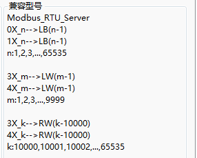
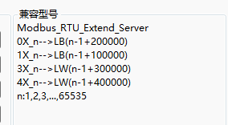

## 常见问题汇总  

#### **FBox做modbus从站时地址对应关系**  

FBox做modbus rtu server时，本地寄存器和modbus地址的对应关系。  

  

FBox做modbus rtu extend server时，本地寄存器和modbus地址的对应关系。  

  

#### **电信的卡，FBox-4G无法自动定位**  

可能的原因如下:  
1、物联网卡信号不好。（试一下其他物联网卡）  
2、附近基站问题。（同一地方其他盒子是否能定位，或者同一盒子在其他地方能否定位）  
3、盒子本身功能缺失。  

#### **一个摄像头是不是只可以被一个盒子，一个设备绑定？**  

答：如果在FBox客户端，摄像头绑定了一个盒子之后不能绑定到其他盒子，但是如果绑定在客户端之后再在云组态绑定，那就可以绑定在云组态的任意账号下的任意盒子  

#### **FlexManager删除摄像头的时候，盒子需要在线吗？**  

不需要。若出现删除失败，需要用手机登录萤石云视频客户端“我的”——“通用设置”——“账号安全”——“终端绑定”，关闭即可。  

#### **如何解除绑定物联网卡**  

旧的联通物联网卡才会绑定，新的联通物联网卡不会被绑定。若旧的物联网卡需要解绑，需要登录绑定此物联网卡的盒子账户，点击该盒子，点击“基本配置”——“基本信息”，点击“联网方式”右边的物联网卡小图标，输入物联网卡相关信息即可解绑。  

#### **FBox使用了FStudio软件里的定时器或宏指令，却不执行**  

1）在FBox里需要使用定时器，定时数据传输，宏指令等功能时，需要在fs软件里设置好，然后下载到FBox里。  

2）下载之前需要在FlexManager软件里，基本配置，基本信息里，将FBox的设备来源勾选为FBox。然后再下载程序到FBox里。  

3）在FBox里将设备来源勾选为FBox之后，不可以在FlexManager里修改通讯配置，修改通讯配置之后来源将变为服务器，造成FStudio软件里做的功能不执行，其他的可以修改。  

#### **FBox使用以太网上网，不能上线**  

1）首先要确定以太网上网方式是否配置的正确，以太网有静态分配和自动获取两种上网方式，要根据现场上网情况确定采用哪种上网方式。  

2）以太网上网在HMI设置里配置，如果是FBox-2G和FBox-4G，不勾选上面的使用gprs/3g/4G远程连接。  

3）检查网线是否正常，网口灯闪烁情况。  

4）如果使用的是静态分配ip地址上网，要注意现场上网是否要与mac地址绑定，并且是否开放了一些FBox上网所需的端口，端口号如下。  

5）如果是自动获取ip（DHCP）方式上网，检查获取的ip是否异常，请确保网络里不要存在多个路由器可提供DHCP服务器。  

6）使用FStudio软件上传日志，查找不能上线的原因。日志在工具，上传里勾选日志。  

#### **FBox使用手机卡上不了线**  

FBox-2G和FBox-4G使用手机卡上网，可以用普通的手机卡，也可以使用物联网卡，需要首先在FStudio软件里配置上网方式。 首先新建一个工程，HMI型号选择FBox-2G或FBox-4G，然后点击确定。 在左边工程栏下，有一个HMI设置，在HMI设置里设置手机卡上网方式,并且下载程序到FBox中。  

如果已经按上述方式配置，FBox仍然上不了线。要检查如下几个方面：  

1）检查手机卡是否插反，手机卡应芯片一侧朝内。  
2）确认手机卡是否欠费。  
3）FBox上是否接上天线，以及天线是否拉到信号好的地方。  
4）若使用FBox-2G盒子（只支持2G信号上网），采用手机卡上网，只支持移动和联通卡，不支持电信卡，电信只支持FBox-4G盒子。  
5）可将卡放到手机里查看是否可以上网，是否需要输入PIN码。  
6)若使用的是繁易提供的联通物联网卡，要确认物联网卡是否之前已在别的设备上使用过，若使用过，需要在FlexManager软件里，设置，SIM卡管理里解锁，繁易物联网卡会跟初次使用的设备绑定，不能再给别的设备使用。  
7)使用FStudio软件上传日志，查找不能上线的原因。日志在工具，上传里勾选日志。  

#### **繁易盒子FBox暂存数据容量？增加SD卡后，最大支持多大？恢复网络后，暂存在卡里数据，怎样的方式上传？上传时间？**  

答：因为盒子主要是走服务器数据为主，底下数据并不会以存储为主。只有在连接不上服务器这后，针对FBOX的历史数据功能才会临时存储，待上线后自动传到服务器。 SD卡只在FS里起作用。FS的组态功能有把数据存到SD卡里，但是并不会传到服务器。  

#### **客户端添加新摄像头失败**  

首先查看客户端是否绑定了萤石云账号，若绑定了萤石云账号是否是很久之前绑定的，萤石云账号会自动更新密码，重新绑定一遍萤石云账号即可  