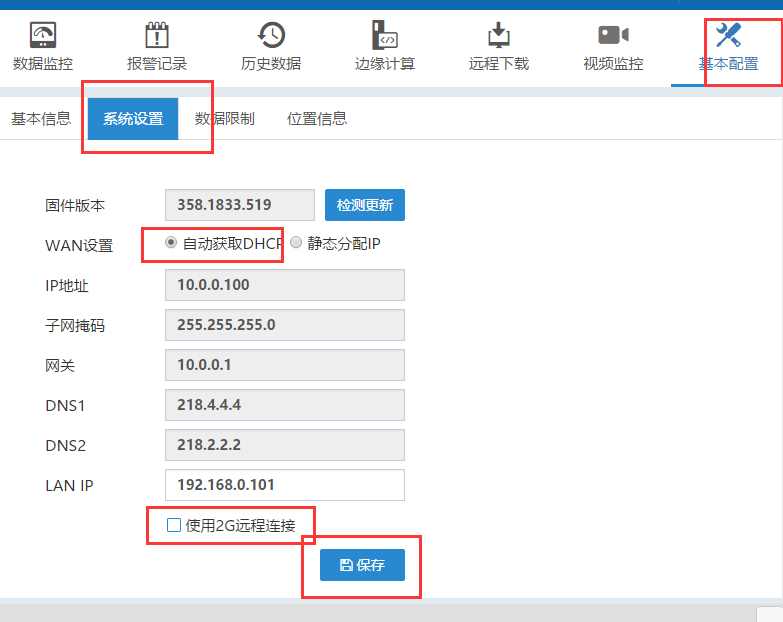

## 使用FlexManager配置  

FBox在线的情况下，可以使用FlexManager修改上网方式。在FlexManager软件，基本配置，系统设置，取消下面的“使用2g/4g/wifi远程连接”，Ip选择静态分配还是自动获取，根据现场的上网方式确定。设置完点击保存，FBox会自动重启。插上网线到FBox 的wan口，如果配置的上网方式正确，并且网线也没问题，FBox会在线。  

  