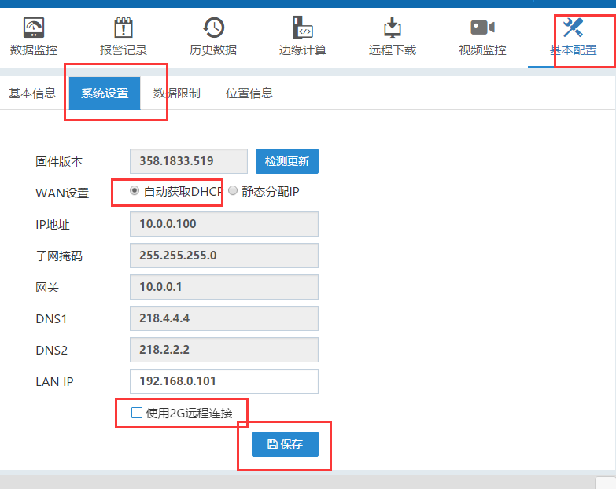

## FBox使用网线上网配置方式  

使用网线上网方式有三种配置方式，configuration tool，FStudio，FlexManager都可以配置，FlexManager只适用于FBox在线的情况下修改上网方式。若是FBox不在线，需要使用前两种方式。  

#### 使用configuration tool配置  

适用于FBox的固件版本是271以上的，若是固件版本低，需要使用FStudio软件配置。首先使用usb线（即打印机上使用的方口线）连接电脑和FBox。  

1）在FlexManager软件，全局设置里，点开FBox的配置工具。  

  

2）“联网方式”里，选择“wan”，点下面的设置。然后“以太网设置”里，根据现场的上网方式选择自动获取（DHCP将lan IP设置为跟PLC IP同网段。设置完点击下面的设置。最后点击重启设备，FBox重启后生效。  

  

3）在运行状态里，点击刷新，若是连接状态灯为绿色，表示FBox已经在线。  

  

4）若是FBox不在线，则需要检查下网线是否正常，上网方式配置的是否正确，以及现场上网是否有限制。另外可以在“日志”里上传日志，看下具体情况  

  

**备注：**FBox使用网线上网需要开放的端口号，这些可与网管确认。  

  

#### 使用fstudio配置  

1）使用usb线连接电脑和FBox。新建工程，HMI型号选择对应的FBox型号，这里以FBox-4G为例。选择好FBox型号，点击确定。  

  

  

2）点击左边工程下的HMI设置，取消勾选“使用GPRS/3G/4G/wifi远程连接”，以太网设置选择自动获取还是静态分配根据现场的上网方式定，这里以自动获取为例，然后点击确定  

  

3）选择工具，下载，下载方式选择usb。然后点击下载  

  

4）下载后，如果配置正确，网线也正常，FBox可以正常在线，若是不在线，可以使用FStudio上传下日志。工具，上传，日志。看下是什么问题  

  

#### 使用FlexManager配置  

FBox在线的情况下，可以使用FlexManager修改上网方式。在FlexManager软件，基本配置，系统设置，取消下面的“使用2G/4G/wifi远程连接”，IP选择静态分配还是自动获取，根据现场的上网方式确定。设置完点击保存，FBox会自动重启。插上网线到FBox 的wan口，若设置无误，FBox会上线。  

  