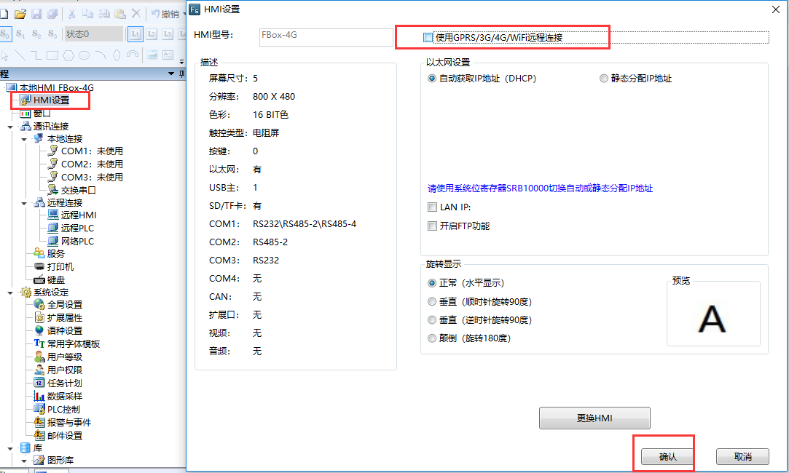

## 使用fstudio配置  

使用usb线连接电脑和FBox。新建工程，hmi型号选择对应的FBox型号，这里以FBox-4g为例。选择好FBox型号，点击确定。  

  

  

点击左边工程下的hmi设置，取消勾选“使用GPRS/3G/4G/wifi远程连接”，以太网设置选择自动获取还是静态分配根据现场的上网方式定，这里以自动获取为例，然后点击确定  

  

选择工具，下载，下载方式选择usb。然后点击下载  

  

下载后，如果配置正确，网线也正常，FBox可以正常在线，若是不在线，可以使用fstudio上传下日志。工具，上传，日志。看下是什么问题  

  