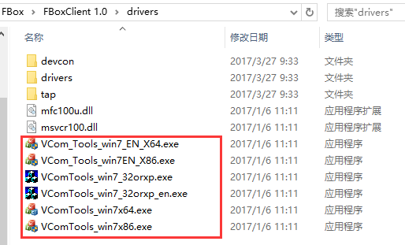
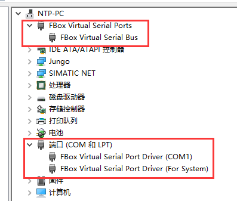

## 使用串口透传  

1）串口透传适用条件：如果电脑直连PLC的串口，可以下载程序，那么串口透传也是可以的。  

2）透传的时候，如果不能正常透传，可在win7及win10系统上要将FlexManager软件和PLC的软件都以管理员身份运行，且需要将电脑上的杀毒软件退出。  

3）串口透传，点击透传的时候会自动安装虚拟串口。  

4）如果虚拟串口不能自动安装，可以手动安装，驱动在FlexManager软件的安装目录下的driver文件夹下。在win7及win10系统上也是右击以管理员身份运行。  

  

安装之后，在设备管理器里可以看到虚拟串口。  

  

5）win10专业版上可能会出现安装不了虚拟串口的问题，需要先禁用数字签名，禁用方式可参考百度。禁用完再安装就可以了。  

6）如果第一次安装虚拟串口没安装成功，需要去设备管理器里先卸载掉安装失败的虚拟串口，然后再参照上面的方式手动安装；否则直接继续安装，还是会安装不成功。  