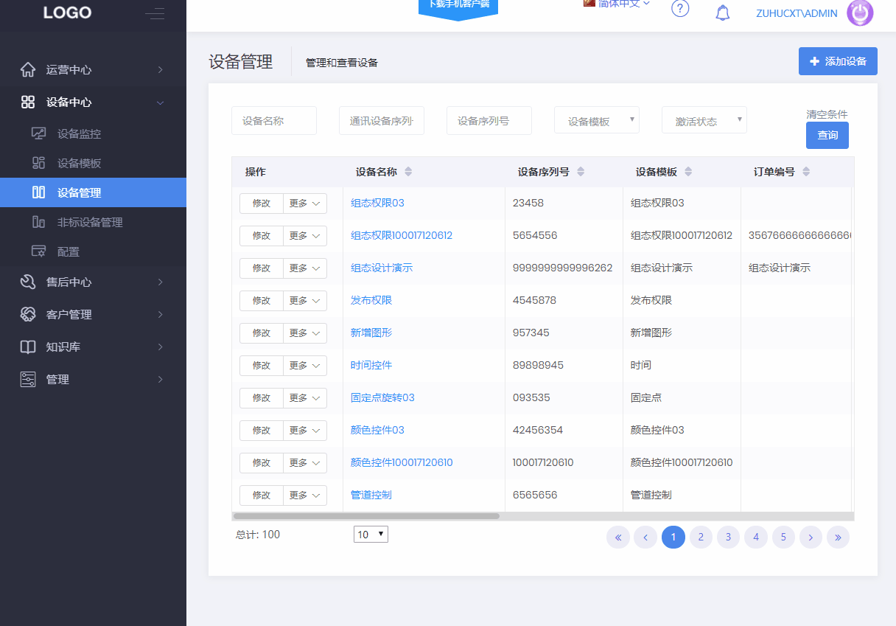

#### 设备管理

在设备中心，设备管理页面，创建设备，关联创建的设备模板，绑定盒子，就可以在设备监控中查看设计的组态。

**1、创建设备**  
在此处创建设备，选择需要的模板，填写基本信息，选择设备类型有盒子设备和蓝牙设备，根据选择的类型填写其他信息，为盒子设备定位，在地图监控中的相应位置可以查看到该设备。  
使用手机卡上线的盒子可以在定位中选择启用自动定位，系统将采集基站定位信息使用。 

设备选择自动定位时，选择数据源进行自动定位，如果数据源绑定的盒子是2/4G类型，设备位置会根据盒子的定位确定；如果是其他的盒子，就不能自动获取位置。

**2、绑定解绑数据源**  
设备创建完成后，就可以绑定数据源，将创建的设备正式关联现场的设备。一个设备关联的模板中有多少数据源就能绑定多少个盒子。  

一个设备可以绑定多个盒子，设备的状态会根据盒子的状态来确定。  

设备四种不同状态以不同图标标识，标识的含义如下：
图标  | 名称  | 含义
--- | ---  | ---
  | 在线 | 所有绑定的盒子都在线设备状态即为在线
  | 离线 | 任何绑定的盒子，其中一个有离线（无报警），设备状态即为离线
  | 未绑定 | 所有数据源都未绑定，设备状态即为未绑定
  | 报警 | 任何绑定的盒子，其中一个有报警，设备状态即为报警

  

**注意：**
- 云组态中的盒子解除绑定，不会清除盒子原有的数据，只会把设备与盒子的绑定关系解除。
- 盒子的配置信息为模板的配置信息，只要设备模板未删除，盒子重新绑定后，模板的配置信息将被重新写入盒子。
- 需要修改盒子变量表、连接的设备等的，需要在盒子Client中修改，完成后重新在设备模板中导入。
- 盒子配置与设备模板的配置关联，完全相同配置的设备可以使用同一个模板，不同配置的需要新建模板。
- 模板可以复制重用，包括所有的变量和组态画面。
- 如果修改或删除盒子Client中的变量数据，点击设备列表中的“更多”-->“强制同步数据”，会将模板的配置信息重新写入盒子。
- 模板中有多个数据源，模板需要发布之后，在设备绑定盒子时，模板中的数据源才能列在绑定解绑数据源列表中。

**3、强制同步数据**

当修改或删除盒子中的变量数据后，点击“强制同步数据”会将模板中的配置全部下发到盒子。强制同步会同步所有的绑定的数据源。    
注意：重新下发不会删除此时盒子中已经存在的各种数据配置，会替换更新同名的分组和变量。

**4、刷新设备状态**

当云组态的设备与盒子client中的被绑定的盒子状态不一致时，点击“刷新设备状态”会恢复异常的状态。

**5、绑定摄像头**

云组态绑定萤石云账号后就可以在此处绑定摄像头并管理。填写摄像头设备序列号和验证码，就可以进行添加，在设备监控中可以查看视频。

**6、设备权限**  

用户对设备管理列表中的设备默认具有“查看”的功能，不可修改。

**第一步：元件关联权限项**  
双击元件，可以对元件的控制、显示进行权限项配置。模板中默认有“管理员”、“操作工”两个权限项，用户可自行修改。可按照下图进行元件关联权限元件关联权限项"">

**第二步：发布**  
发布后，如果监控画面正在查看，需要刷新界面，新的权限配置才会生效。

**第三步：将设备权限分配给用户**  
设备关联了模板，就继承了模板的组态权限，通过设备管理页面进行权限分配。   
注意：权限项分配给用户后，立即生效。

**第四步：进入设备监控页面，拥有该设备组态元件权限的用户才可以查看并控制对应的元件。**  
注意：未关联权限的元件，所有用户都可以查看并控制

**第五步：通过用户查看拥有的设备**
在第三步操作完成后，可以在用户-设备权限里看到所分配的设备。

