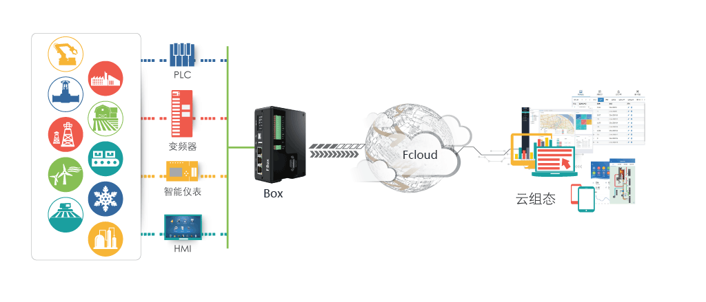

### 云组态介绍

>是一款专注于工业设备Web组态、设备管理、设备监控、故障预警、设备维保、设备数据分析和应用的设备全生命周期综合管理的平台。配合硬件网关产品使用，致力于打造互联时代最具创新的自动化软件产品。
>

### 网络结构
云组态为工业物联网平台的数据展示终端形式之一，设备依靠于智能网关设备连接，将数据推送至云服务器，云组态平台从服务器获取数据进行展示。能实现百万级的数据并发，秒级的数据实时变化， 7*24小时的不间断运行。

### 设备接入
设备接入是设备实现云平台管理的第一步，云组态通过绑定配置好的硬件模块，可以快速地获取底层设备的数据，轻松将设备运行情况的通过云组态监控，使您无需关注复杂的工业通讯协议与接入不同设备需要的繁琐设置。