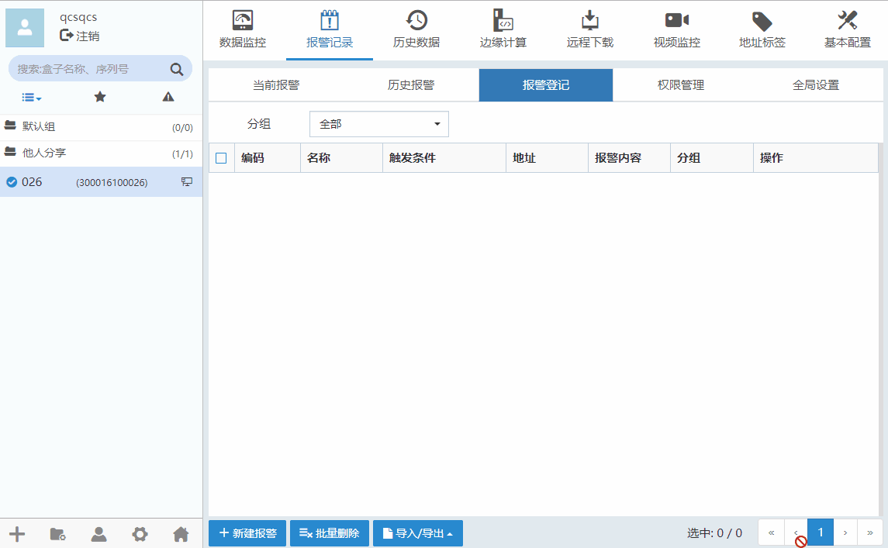
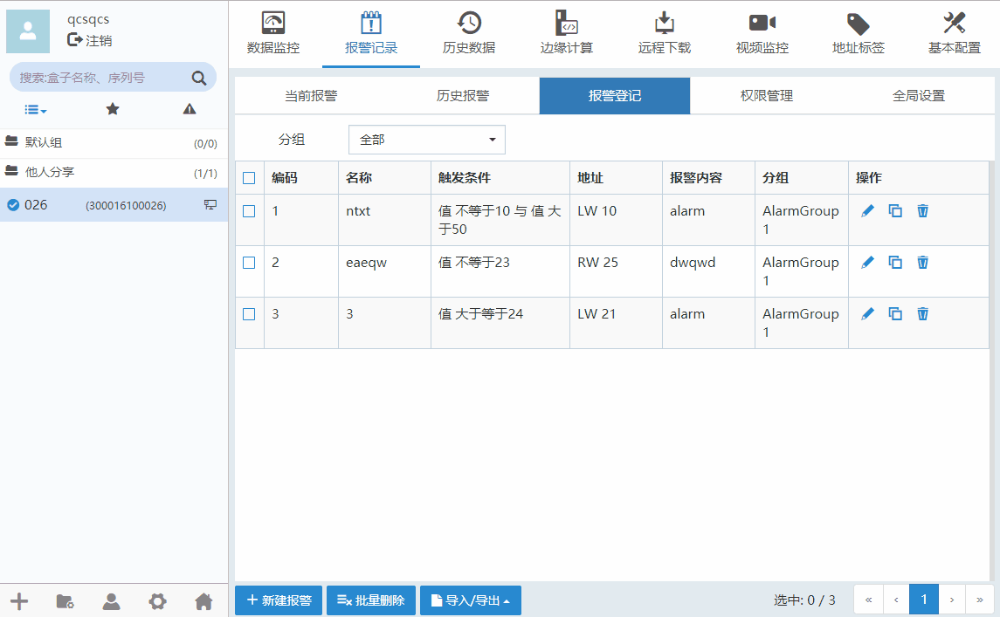
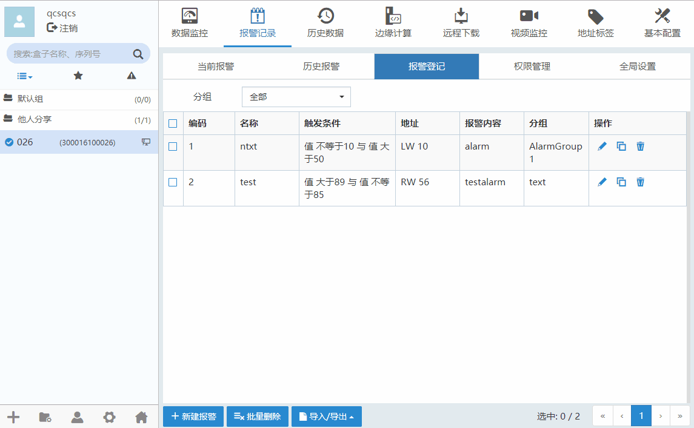

#### **报警登记**  

报警记录用于设置、查看和导出报警记录的选项。当发生报警时，盒子将报警推送至权限管理中启用的手机用户。推送方式可以是App、微信和短信或语音。  

点击“新建报警”按钮可以新增报警条目，报警记录”-->“报警登记”，如下图所示。  

  

点击修改报警条目，点击可以删除报警条目。  
表示设备已经被移除  

报警类型分为位报警和字报警两种。  

（1）在“报警登记”界面点击“新建报警”按钮，弹出新增报警记录对话框。在该对话框的“数据类型”选项，可以通过下拉列表选择位、16位无符号、16位有符号、32位无符号、32位有符号、16位BCD、32位BCD和单精度浮点等，其中，位数据类型对应位报警，其他数据类型对应字报警。  

（2）位报警类型可以对设备的数据位配置ON报警或OFF报警，还可以输入报警内容。  

（3）字报警类型可以对设备的某一字数据类型的变量选择合适的报警条件，还可以输入报警内容。  

**注意：选择“引用标签地址”，根据数据类型可选择地址，地址标签添加请看[地址标签](TagAddress.md)**  

#### **批量删除**  

点击“新建报警”按钮可以新增报警条目，报警记录”-->“报警登记”，点击修改监控点分组，点击可以删除监控点分组。如下图所示。  

  

#### **导入/导出报警条目**  

点击“导入/导出”按钮，可以将报警条目配置信息导出或导入。如下图所示。  

  

导出报警条目配置信息CSV文件参数  
| 参数名   |参数描述|
| - | :- |
|Name|名称|
|GroupName|分组名|
|DataType|数据类型 (Bit[位], UInt16[16位无符号], Int16[16位有符号],UInt32[32位无符号],Int32[32位有符号],Bcd16[16位BCD],Bcd32[32位BCD],Single[单精度浮点数])|
|UseAddressTag|是否使用地址标签|
|AddressTagName|地址标签名称（针对使用了地址标签的监控点）|
|PlcAlias|连接设备（针对没有使用地址标签的监控点）|
|StationNo|站号|
|RegName|地址类型|
|DeviceTagName|设备标签名称（针对直接使用设备标签的监控点）|
|MainAddress|主地址|
|SubAddress|子地址|
|SubIndex|地址块索引|
|BitIndexEnabled|是否按位索引|
|BitIndex|使用按位索引的子地址|
|Condition1|条件1 (Neq[不等于],Eq[等于],Gt[大于],Gte[大于等于],Lt[小于],Lte[小于等于])|
|Operand1|条件1中的数值|
|ConditionCombineMethod|条件关联 (None,Or,And)|
|Condition2|条件2 (Neq[不等于],Eq[等于],Gt[大于],Gte[大于等于],Lt[小于],Lte[小于等于])|
|Operand2|条件2中的数值|
|AlarmContent|报警内容|  

**注意：**  

1、导入的条目数量 + 盒子中本来就有的条目数量 <= 限制条目数  

2、导出CSV文件，如果用EXcel编辑，注意需要另存为.csv格式，再导入  