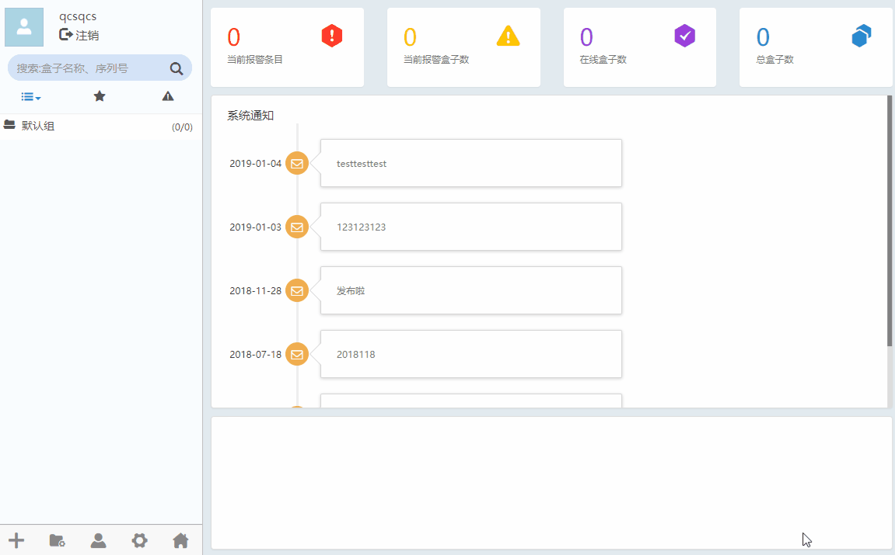
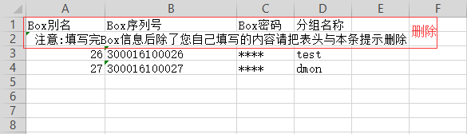

#### **添加盒子**  

要对某一盒子设备进行操作，需要先将其添加到客户端软件中。  

在设备管理区域，点击,选择“添加盒子”，如下图所示  

  

在弹出的对话框里，填入“盒子序列号”和“盒子密码”。这两项信息可在盒子硬件设备的标签上找到，也可通过扫描盒子硬件设备的二维码得到。“盒子别名”处为该盒子设备写入一个名称（最好是最终用户的名字，方便区分以及查看），便于管理。如果需要为当前盒子设备选择分组，可点击“分组”处的下拉列表来为当前盒子设备选择一个分组。  

  

在添加盒子的对话框中点击“确定”按钮，完成盒子的添加。  

#### **批量添加盒子**  

用户可以根据模板，填写CSV文件，进行批量添加盒子  

在设备管理区域，点击,选择“批量添加盒子”，如下图所示  

  

可以点击“模板”按钮，在下载的CSV模板中编辑将要批量添加的盒子。点击“导入”按钮，选择编辑好的CSV文件，点击“确定”完成添加。  

**注意：导出CSV文件，如果用EXcel编辑，注意需要另存为.csv格式，再导入**  

  

#### **主页显示**  

可以查看当前报警条目数、当前报警盒子数、在线盒子数、总盒子数。以及系统通知消息。  

在设备管理区域，点击，如下图所示  

  