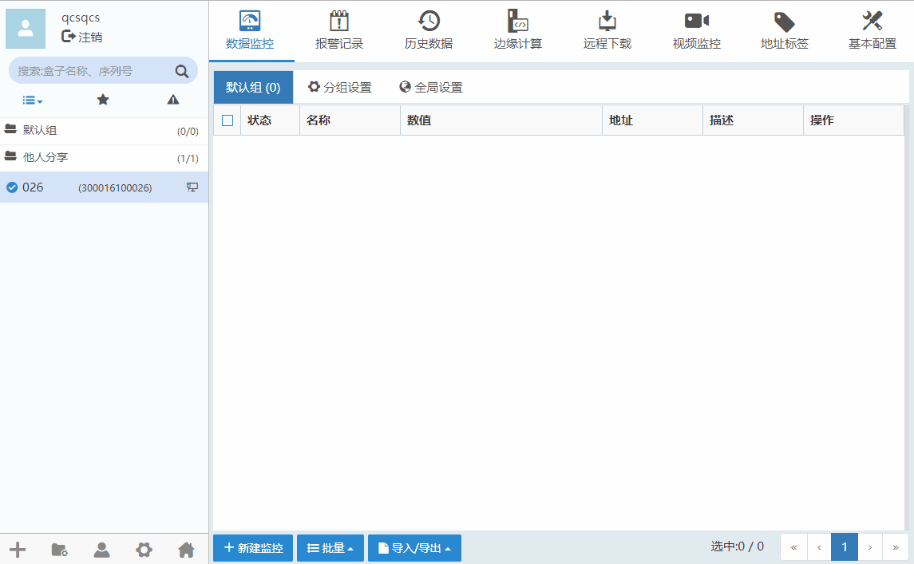
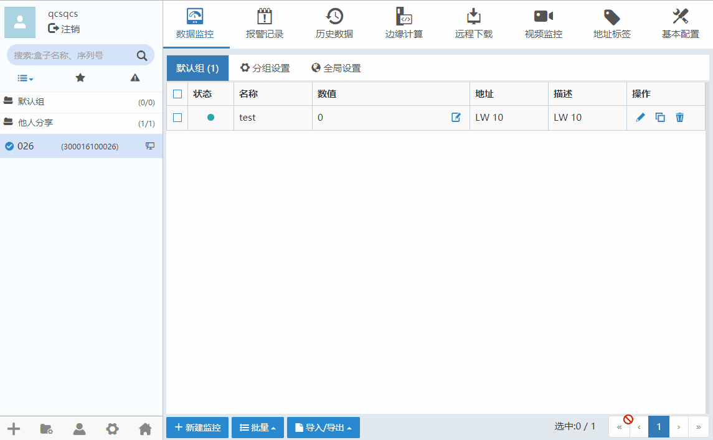
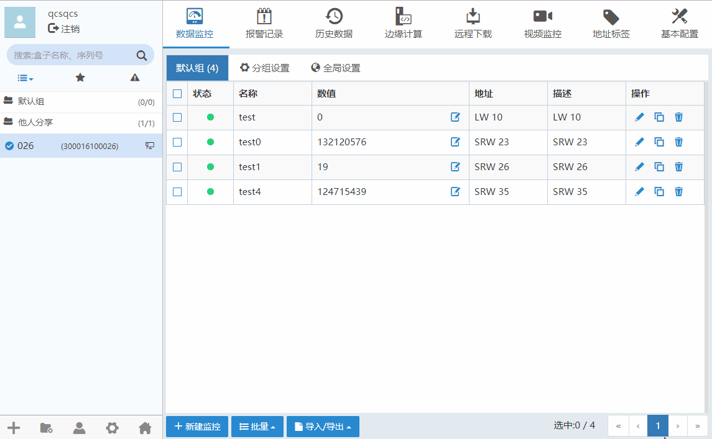
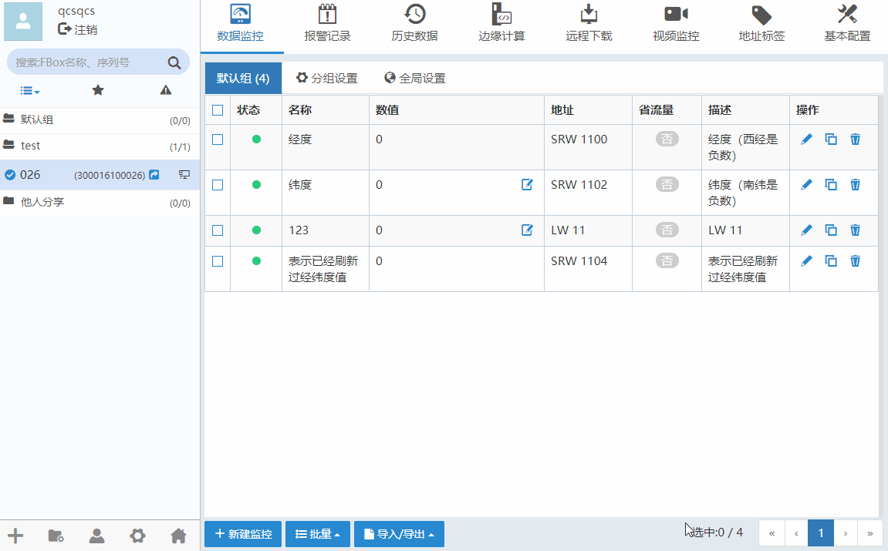

#### **数据监控**  

在数据监控中，可以实现查看现场设备的数据。可通过“添加监控点”或者“批量添加”的方式，监控PLC、仪表等数据，监控点名称可自由定义。  

#### **新建监控点**  

点击“新建监控”按钮可以新增监控点，如下图所示。  

  

点击修改监控点，点击可以删除监控点。  
表示监控点运行正常，表示监控点超时。  

**注意：选择“引用标签地址”，根据数据类型可选择地址，地址标签添加请看[地址标签](TagAddress.md)**  

#### **监控点写值**  

**升级盒子固件至最新**  

字地址中选择“按位写值”，对希望修改的位勾选“启用”，“开”状态为“1”，“关”状态为“0”。  

  

**注意：**  

按位写值只针对勾选“启用”的位进行写值，对于没有勾选的位，它们的值是不变的。  

例如：  
“16 位二进制 4X1”的值现在是:11000000 00000000现在只对它的低位进行写值：  

  

写值之后的值是:11000000 00000001  

  

#### **批量新建/批量删除**  

点击“批量”按钮，选择“批量新建”按钮，填写批量添加的监控点信息。如果“批量删除”，请先选中需要删除的监控点。如下图所示。  
  

**注意：批量添加监控点不支持使用标签**  

#### **更换监控点分组**  

点击“批量”按钮，选择更换分组按钮，在弹出的界面选择需要更换的分组。如下图所示。  

  

#### **导入/导出监控点**  

点击“导入/导出”按钮。可将盒子配置的监控点导出为csv格式。如下图所示。  

  

导出监控点数据CSV文件参数  
| 参数名   |参数描述|
| - | :- |
|Name|名称|
|GroupName|分组名|
|DataType|数据类型 (Bit[位], UInt16[16位无符号], Int16[16位有符号],UInt32[32位无符号],Int32[32位有符号],Bcd16[16位BCD],Bcd32[32位BCD],Hex16[16位16进制],Hex32[32位16进制],|Binary16[16位二进制],Binary32[32位二进制],Single[单精度浮点数],String[字符串])|
|UseAddressTag|是否使用地址标签|
|AddressTagName|地址标签名称（针对使用了地址标签的监控点）|
|PlcAlias|连接设备（针对没有使用地址标签的监控点）|
|StationNo|站号|
|RegName|地址类型|
|DeviceTagName|设备标签名称（针对直接使用设备标签的监控点）|
|MainAddress|主地址|
|SubAddress|子地址|
|SubIndex|地址块索引|
|BitTrueLabel|标签1|
|BitFalseLabel|标签0|
|BitIndexEnabled|是否按位索引|
|BitIndex|使用按位索引的子地址|
|IntDigits|整数位|
|FracDigits|小数位|
|Unit|单位|
|ValueTransformEnabled|是否启用数值运算|
|TransformType|运算类型 (None,Scale(比例转换),Zooming(缩放))|
|MaxValue|数值上限|
|MinValue|数值下限|
|ScaleMaxValue|比例上限|
|ScaleMinValue|比例下限|
|Gain|增益|
|Offset|偏移量|
|TrafficSaving|是否省流量|
|DeadValue|死区|
|EncodeType|编码方式 (None,Unicode,Ascii)|
|ByteSwap|高低字节互换|
|CharCount|字符个数|
|Privilege|读写设置(Read [只读],Write[只写] ,ReadWrite[读写])|
|Description|描述|

**注意：**  

1、导入的条目数量 + 盒子中本来就有的条目数量 <= 限制条目数  

2、导出CSV文件，如果用EXcel编辑，注意需要另存为.csv格式，再导入  