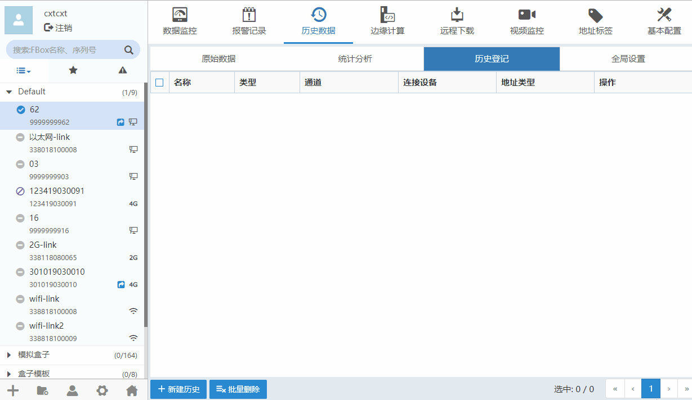
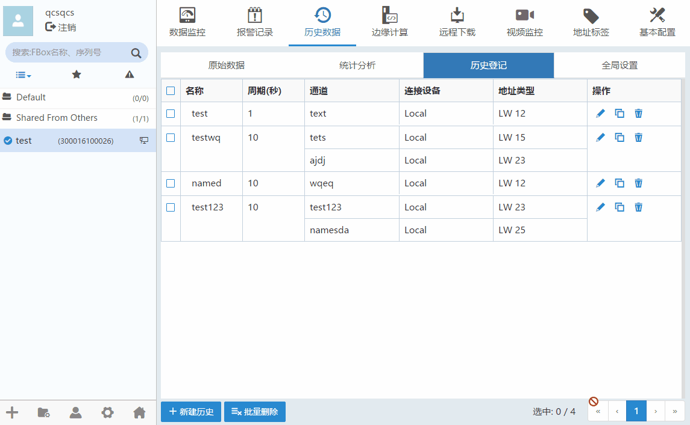

#### **历史登记**  

客户端软件可以实现设置和查看历史数据、显示趋势图、对历史数据进行统计分析等功能。  

**新建历史**  

历史数据”-->“历史登记”，点击“新建历史”。如下图所示。  

  

点击修改历史条目。点击可以删除历史条目。选择“引用标签地址”，根据数据类型可选择地址，地址标签添加请看[地址标签](TagAddress.md)  
表示设备已经被移除  

采样方式：  

**1、周期式：**用设置的固定周期来采集记录数据。  

**2、触发式：**没有固定周期，当设置的触发条件满足时采集一次数据。  

**使能设置：**用一个位类型的数据点作为使能参数，满足条件后，会开始用设置好的采样周期来采集历史数据。  

**注意：**  

1、历史数据将被所有用户看到，包括盒子的拥有者和分享者  

2、盒子离线工作后，每个数据点历史数据采集最多能存5万条。  

3、盒子掉线后，只要盒子在运行状态，数据将继续记录，等盒子恢复上线后，历史数据将被同步到服务器，但有本地存储极限。  

4、历史数据在服务器上保存的时间为半年，半年过后，新产生的数据将覆盖掉最早的数据。  

**批量删除**  

历史数据”-->“批量删除”，点击“批量删除”，如下图所示。  

  
