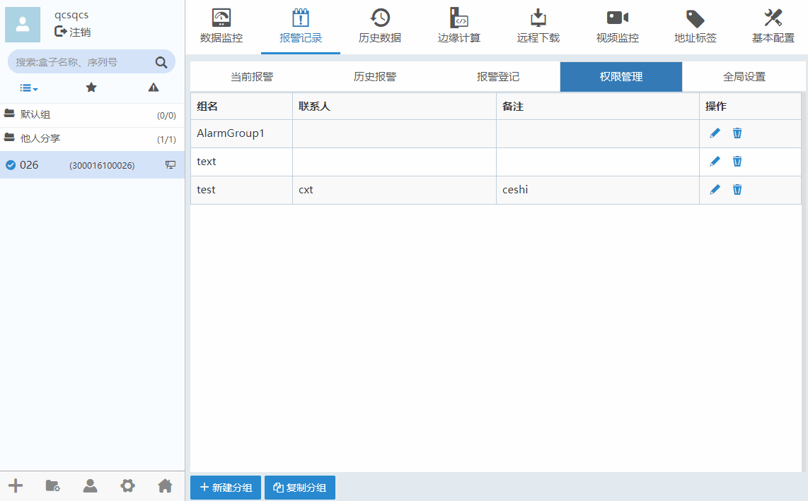

#### **新增报警联系人**  

在设备管理区域选择选项，如下图所示。  

点击“新建联系人”按钮可以新增报警联系人，点击修改报警联系人，点击可以删除报警联系人。  

  

在该对话框中:  
**姓名**用于设置短信用户的用户名。  
**手机**用于输入用户的手机号。  
**邮箱**用于输入用户的邮箱。  
**类型**用于报警发送的方式。  
如果勾选“**启用**”，则当发生报警时，向指定的手机号发送短信；如果勾选“**禁用**”，则不发送。 用户必须勾选“启用”选项，报警推送功能才能正常使用。  