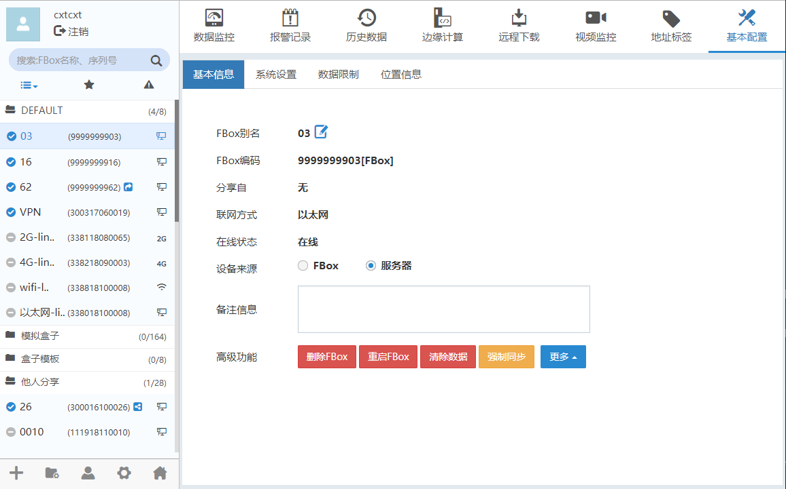
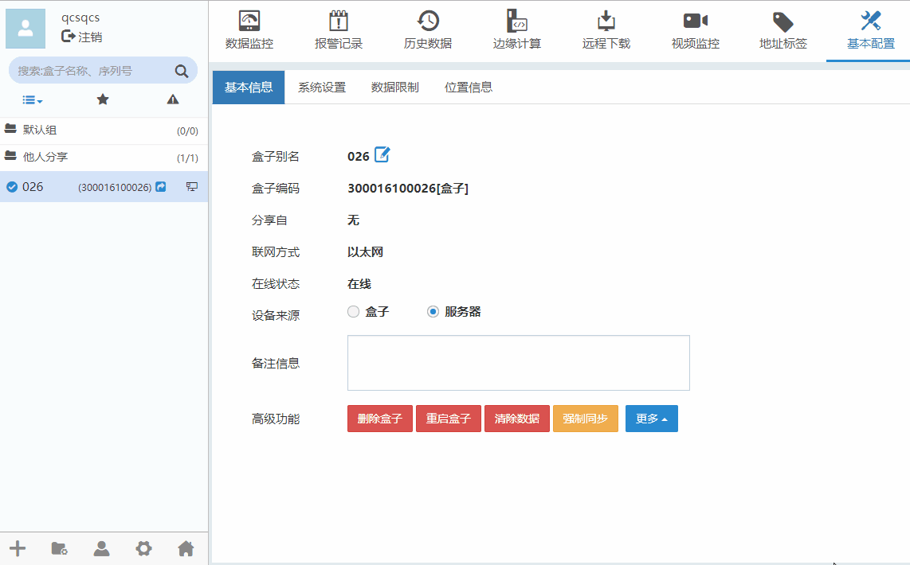
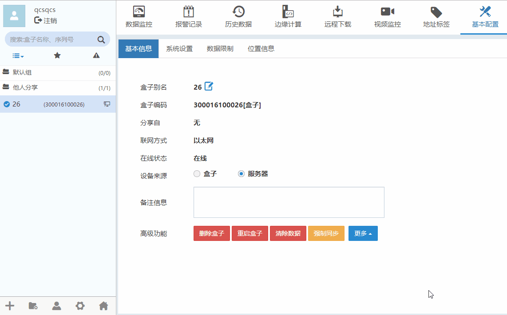
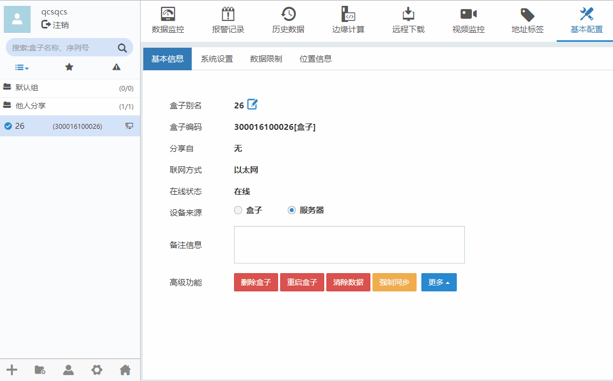
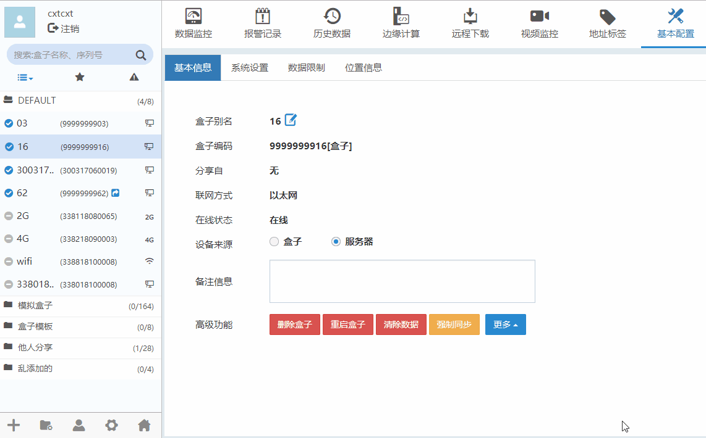
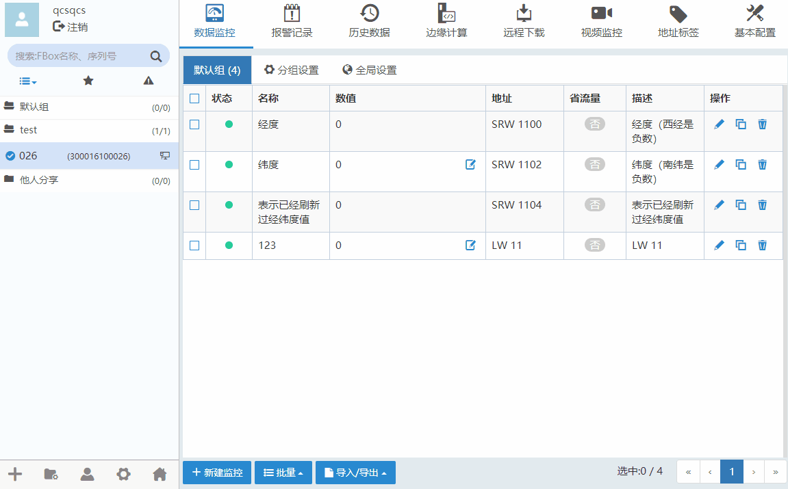

#### **基本信息**  

可以查看/修改盒子别名，查看盒子编码，联网方式，在线状态，切换设备来源，添加/修改备注信息。如下图所示。  

  

#### **删除盒子/重启盒子**  

基本配置”-->“基本信息”。“删除盒子”将盒子从账号下删除。如下图所示。  

  

#### **清除数据/强制同步**  

基本配置”-->“基本信息”，“清除数据”可以选择盒子下的监控点，报警条目，报警历史数据，历史条目，历史条目数据，边缘计算项进行快速删除。如下图所示。  

  

#### **分享盒子**  

盒子的分享功能可以将本账号所添加的盒子设备分享给其他账号查看。  

在盒子权限管理中，每个盒子设备只能有一个实际拥有者。每个盒子只允许被一个账号（实际拥有者）所添加，一旦被某一个账号添加后，其余账号将无法添加。但是实际拥有者可以将此盒子设备通过分享，让其他账户（诸如售后人员、经销商、终端客户等）看到此盒子设备的信息。  

盒子可以从拥有者分享到其他账号下。并且可以给分享者设置权限。如下图所示。  

  

分享权限管理  

分享设置中选择不同的角色表示被分享者有不同的权限。  

**默认的权限角色有：**操作工、工程师、管理员。  

**权限分为：**查看，写值，编辑。客户可根据自身情况自定义不同权限的排列组合。  

**查看：**可查看现有的的数据监控点数据、报警、历史数据、连接的设备型号等。查看为基础功能，默认所有类型的角色都有该权限。  

**写值：**可对数据监控点的数据进行写入操作。  

**编辑：**可添加、删除、修改、数据监控点、报警登记条目、历史条目，边缘计算，地址标签。  

分享的用户可在“基本配置”-->“基本信息”下查看盒子分享自哪个账号。  

#### **复制盒子**  

复制盒子功能是将当前盒子设备所连接的设备信息、远程数据、历史数据和报警信息等配置信息复制到目标盒子设备中，但不包含本身的网络配置等信息。当有多台盒子设备，需要实现相同的功能，可以通过复制盒子功能，实现将一台已配置好的盒子设备信息逐台复制给其他盒子设备，这样可以大大节省配置盒子的时间。如下图所示。  

  

注： 执行复制盒子功能时，要求被复制的盒子设备和目标盒子设备均在线，且目标盒子设备只能是当前账号拥有的设备。另外，对固件版本也有要求，如果不满足要求，可通过更新固件功能进行固件升级，然后再执行复制盒子功能。在复制完成前，不要对目标盒子做任何操作，以避免复制不成功。  

#### **移交盒子**  

当前盒子设备的拥有者和分享者的身份互换。如下图所示。  

注： 由于执行移交盒子功能后，拥有者将变为分享者，相应的操作权限变小，故该功能请谨慎使用。  

  