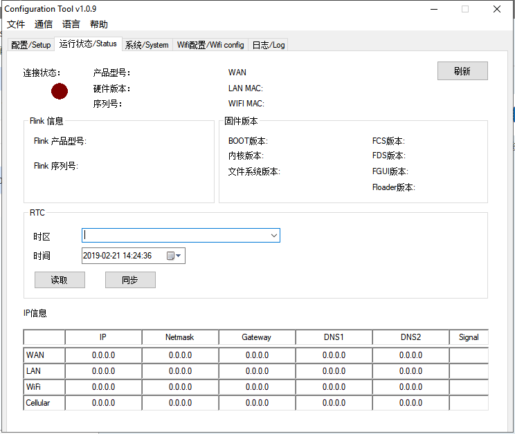

#### **盒子配置工具**  

在盒子在线的状态下使用，当盒子未具备上线条件时，可以使用配置工具Configuration Tool 进行本地设置。  

#### **连接方式**  

用户可以使用网线或者打印机线来连接 盒子 与电脑。 把盒子与电脑连接之后，在客户端软件下的设备管理区域，点击,选择“盒子配置工具”。  

点击主界面的“刷新”，若 盒子 通讯正常，主界面上则会显示 盒子 的网络配置。  

**注意：若使用网线连接盒子与电脑，要确保盒子所使用的网口有IP地址**  

**注意：若使用USB线连接盒子和电脑，当电脑未识别USB时，需要安装USB驱动。下载地址[http://fs.flexem.com/](http://fs.flexem.com/)**  

Configuration Tool 软件主界面如下图  

  

**注意：登录服务器请勿乱填，该URL为盒子登录服务器地址**  

区域 1 为菜单栏，有“文件”、“通信”、“语言”和“帮助”四个选项。  

**文件：**用于导出/导入 盒子 的配置文件以及退出软件。  

**通信：**选取 盒子 与电脑的通信模式，有串口和以太网两种方式。具体界面如下图  

  

**语言：**用户可以在此切换简体中文或者英文。  

**帮助：**本软件的版本信息。  

区域 2 为操作栏，有“配置”、“运行状态”、“系统”和“日志”四种操作指令。  

#### **配置窗口**  

用户可以用软件配置 盒子 的上网方式和服务器。配置的子标签界面如下图 所示。整个界面大致分为 5 个功能模块。  

  

**模块 1 ：**用户可以选择 盒子 的上网方式，有 WIFI、WAN、移动网络三种模式。  
**模块 2 ：**此模块是配置 WIFI 上网的配置参数。用户需要输入 WIFI 的 SSID 和密码。也可以采用扫描的方式来获取 SSID。  
**模块 3 ：**此模块是用来配置 WAN 上网的网络参数。用户可以手动输入各类参数，也可以在使用网线连接之后点击“扫描”来自动获取网络参数。使用 WAN 上网的用户需要勾选 DHCP 选项。  
**模块 4 ：**此模块是用来配置移动数据上网的参数。这项配置仅支持 4G盒子 系列的盒子。用户需要按照模块内的要求填入相应的 SIM 上的数据。  
**模块 5 ：**勾选启用路由功能，点击设置，提示设置成功后，点击重启设备。设备重启后即可生效。  
**模块 6 ：**此模块是用来切换 盒子 所在的服务器的域名。用户在框内填入想要转移到的服务器域名，点击设置，盒子 会自动重启，切换服务器。  

用户在配置完参数之后要点击页面最下方的“设置”按钮，盒子 会自动重启，所设置的参数生效。  

**注意：若使用WIFI上网，使用的WIFI名称不能有中文，必须要有密码**  

#### **运行状态窗口**  

在用户电脑连接上 盒子 之后，点击“刷新”，此界面会出现 盒子 的各类参数，具体情况如下图 所示。  

  
代表 盒子 通讯失败，代表 盒子 通讯正常。用户可以查看 盒子 的硬件、软件参数、IP 地址等数据。  

#### **系统窗口**  

系统窗口界面如下图所示。用户可以使用这个软件更新固件、重启设备、更新内核、更新文件系统。更新内核、文件系统步骤：  
（1）点击“跳转到 BOOT”，跳转成功后等待 5 秒。  
（2）点击“更新内核”或“更新文件系统”。  
（3）选择正确的更新文件。  
（4）等待更新成功后给设备断电重启。  
注：该功能仅支持 USB 通信。  
  

#### **日志窗口**  

用户可以在此查看 盒子 的日志。  
**注意：每刷新一下日志都会使盒子重启，所以不要频繁的刷新日志**  

  