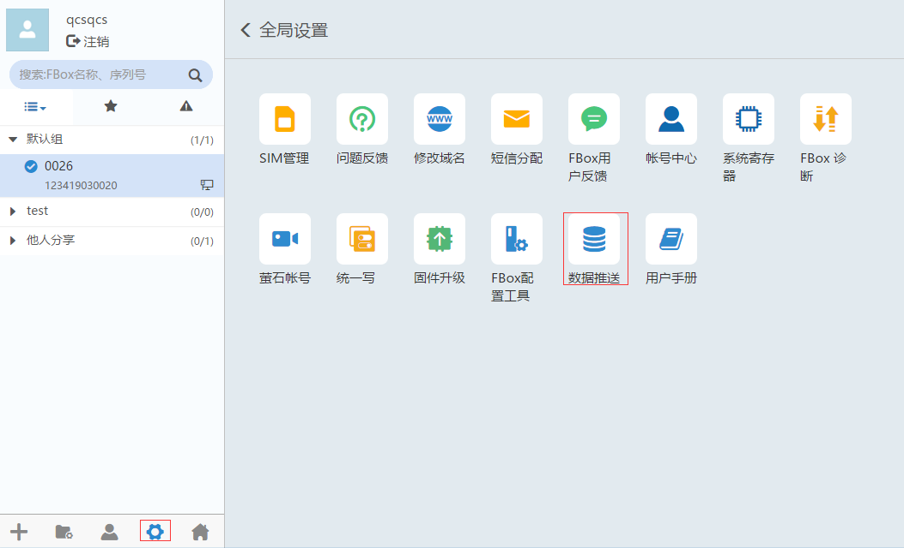
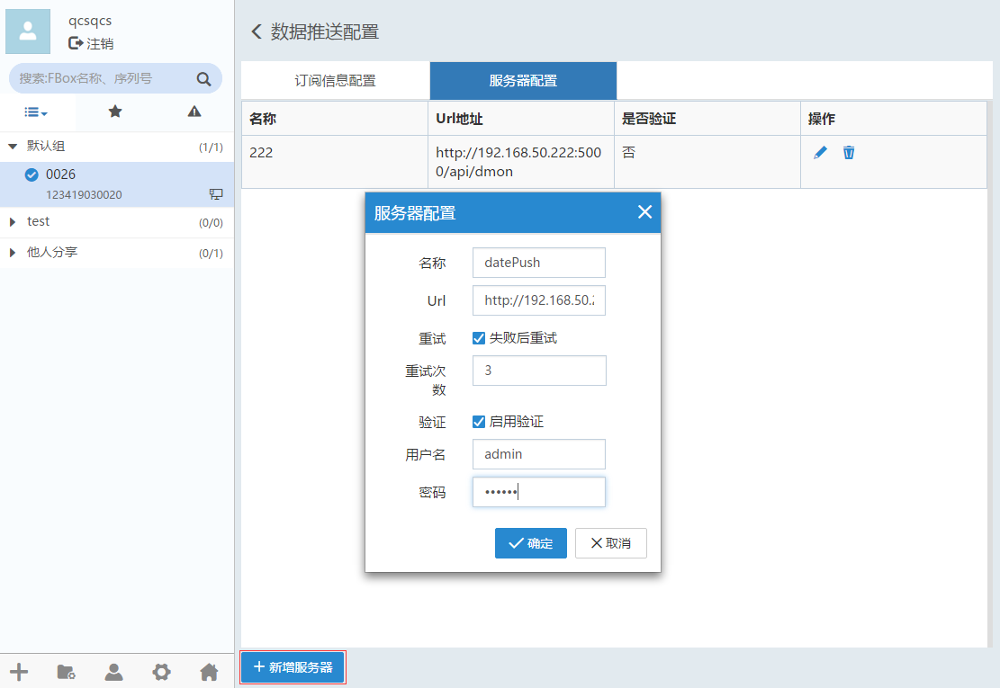
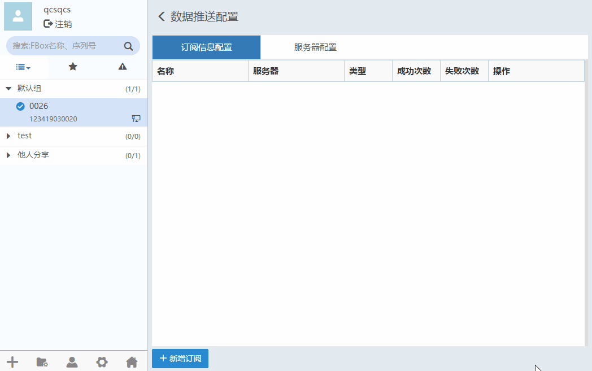
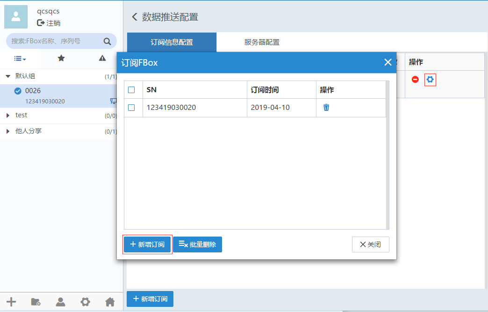
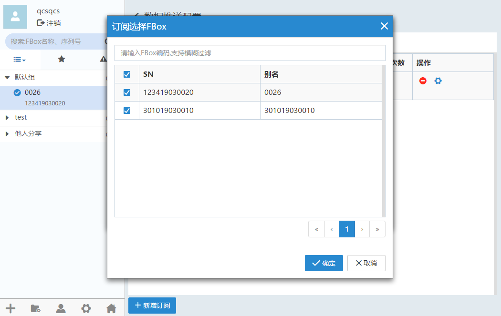
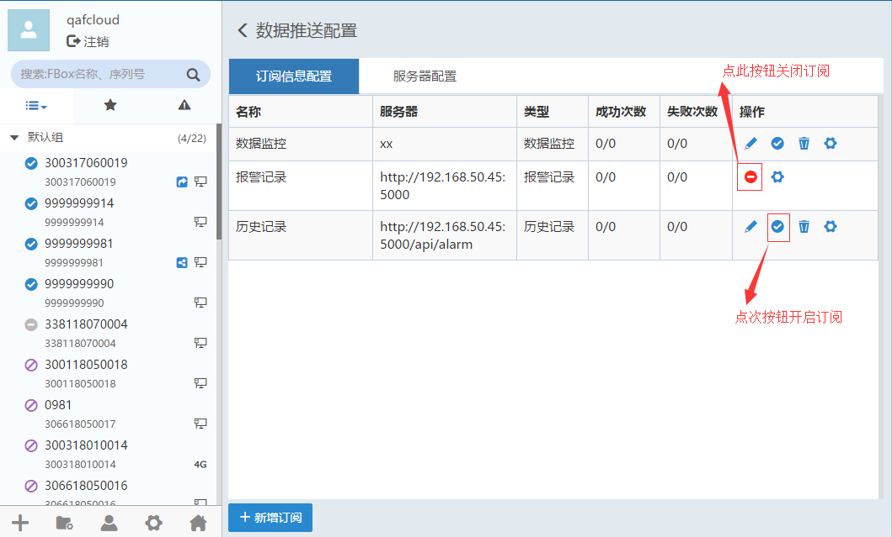

#### **数据推送**  

盒子的数据可以通过服务器配置信息推送到客户的服务器上。  

在设备管理区域，点击进入全局设置,选择“数据推送”，如下图所示  

  

#### **服务器配置**  

点击“服务器配置”--> “新增服务器”,填写需要推送的服务器信息  

  

点击修改服务器配置信息。**注意** 当已经开启订阅时，无法修改服务器配置信息，需要停止订阅才可以修改服务器信息  

点击可以删除服务器配置信息。**注意** 当已经开启订阅时，无法删除服务器配置信息，需要停止订阅才可以修改服务器信息  

#### **订阅信息配置**  

点击新增订阅，输入名称，选择订阅的数据类型，数据类型有数据监控、报警记录，最后选择已经配置好的接收服务器。  

  

点击按钮，可以新增和删除订阅的盒子。  

  

点击新增订阅，选择需要订阅的FBox，支持按FBox编码搜索，最后确认即可。  

  

**注意：**在开启订阅时，可实时新增订阅FBox。  

#### **停止、启用订阅**  

点击  

**开启订阅：**在已经选择订阅FBox后，服务器将会把已选择的FBox对应监控点、报警记录信息推送到对应需要推送的指定服务器。开启订阅后，不能动态的修改或删除订阅。  

**停止订阅：**点击停止订阅按钮后，将不再推送订阅的FBox数据。  

在停止订阅的状态下，点击修改订阅配置。  

在停止订阅的状态下，点击删除订阅配置。