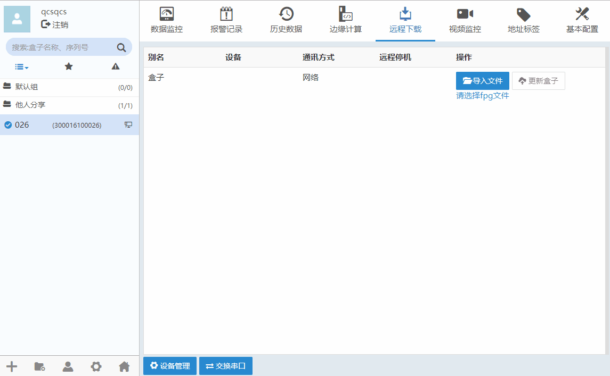
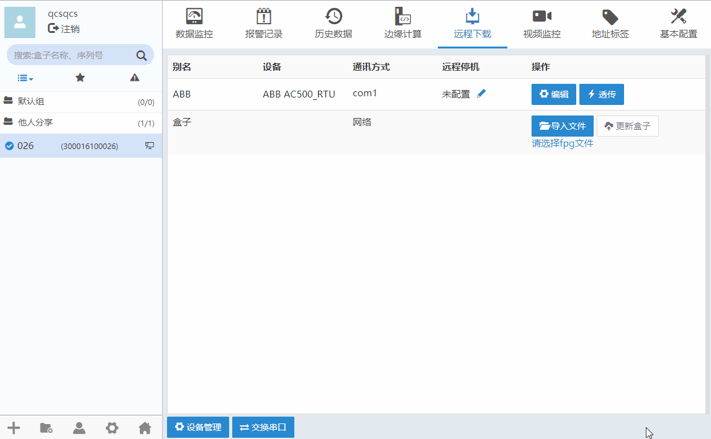
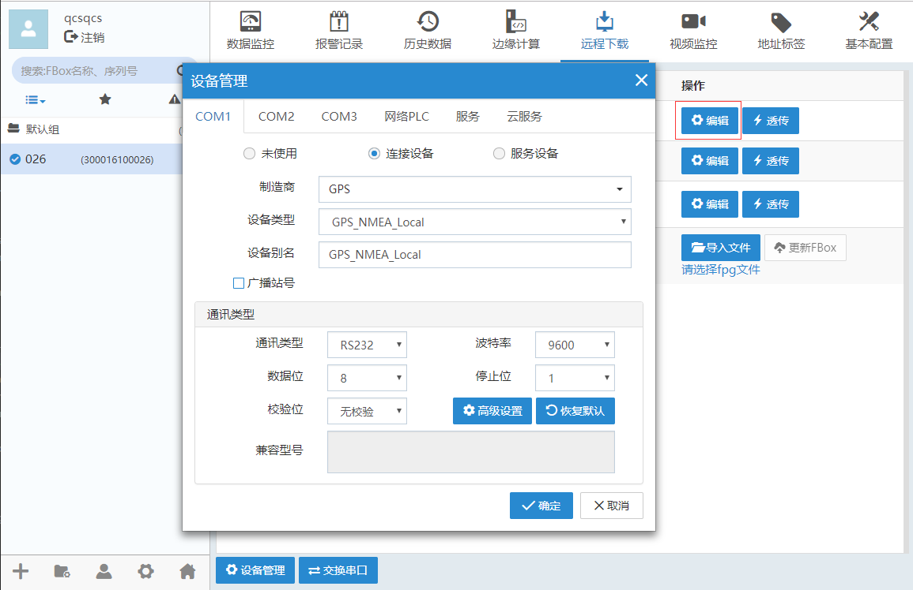
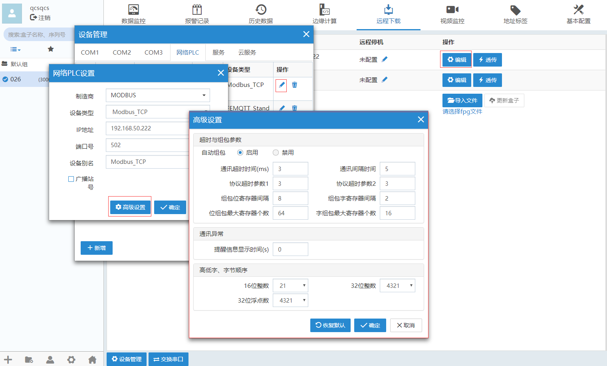
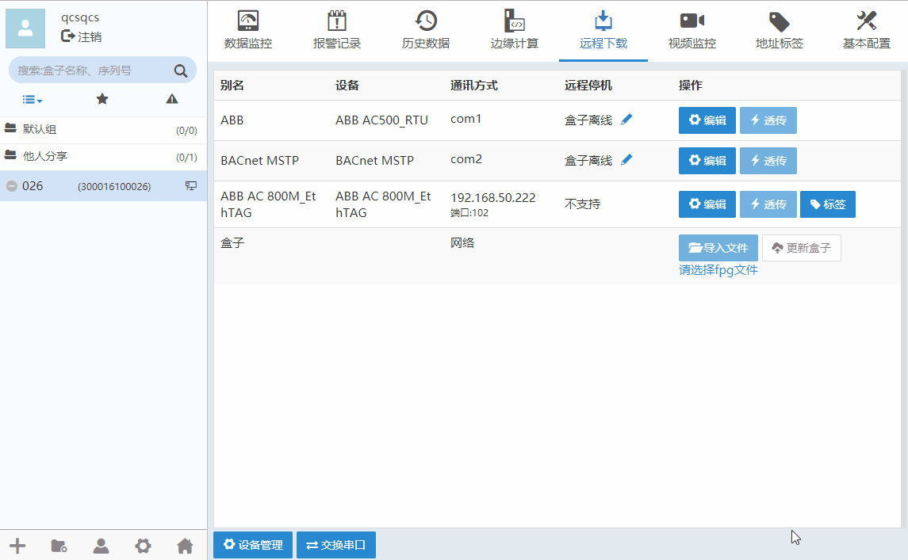

#### **远程下载**  

盒子可以通过串口或以太网口与设备端进行连接。设备端的设备可以是PLC控制器、HMI和仪表等。将盒子设备与设备端（如PLC）连接好并已配置好盒子上网配置之后，“远程下载”可以对与盒子连接的设备进行管理，包括添加设备、删除设备，配置所连接设备的通信参数等。  

#### **串口连接**  

使用串口通讯线，将盒子设备与PLC通过串行通讯端口相连。对盒子设备进行上网配置，使盒子设备在线。然后可使用客户端软件建立串口连接。  
远程下载”-->“设备管理”，根据实际连接的串行接口选择COM1、COM2或COM3标签页，配置盒子设备通过串口所连接的PLC信息。如下图所示。  

#### **以太网连接**  

使用以太网线，将盒子与PLC设备通过以太网端口相连。对盒子进行上网配置，使盒子在线。  
远程下载”-->“设备管理”，选择网络PLC。对网络PLC的IP地址、制造商、设备类型、预设站号等信息进行设置。如下图所示。  

  

#### **编辑**  

点击“编辑”，弹出当前驱动信息界面，可以直接对驱动进行修改  

#### **高级设置**  

在此处也可对其他具体的通信参数进行修改配置  

#### **交换串口**  

“远程下载”-->“交换串口”。串口交换后，添加的数据监控点、报警条目、历史条目监控点数据也会随着串口变动而变。如下图所示。  

