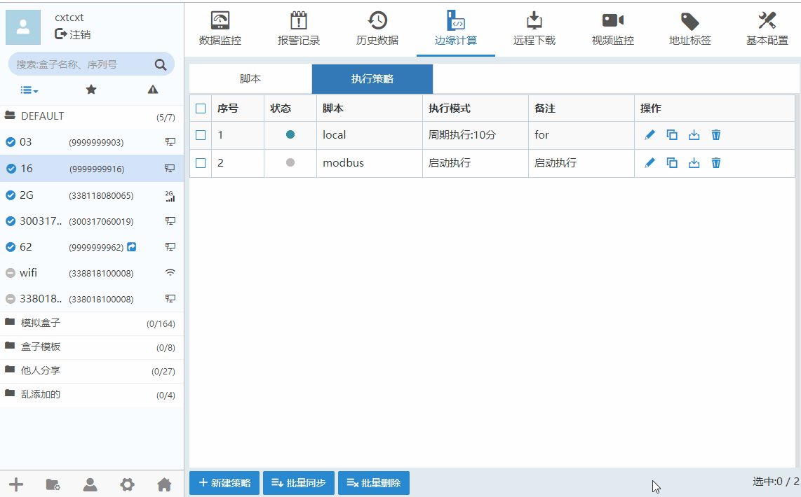
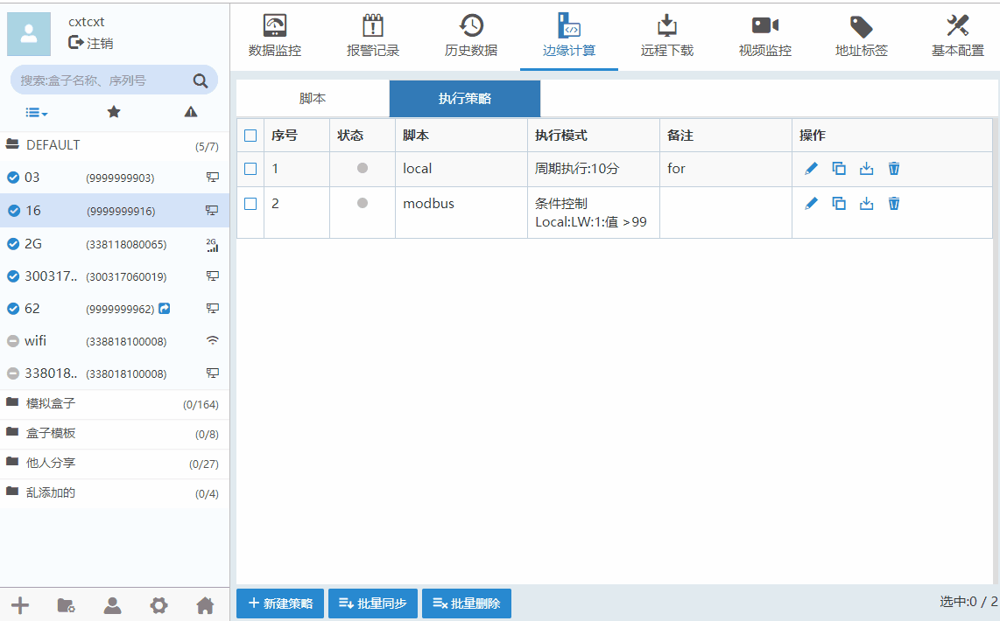
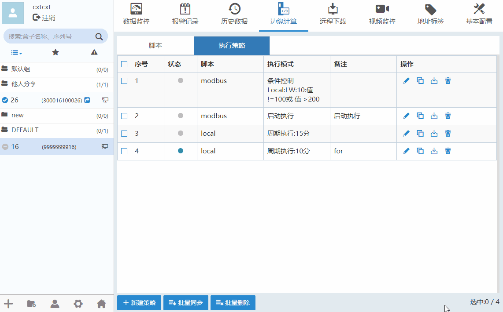

#### **新建策略**  

边缘计算”-->“执行策略”，点击“新建策略”，如下图所示。点击修改策略，点击可以删除策略。  
不同的执行模式代表脚本的不同启动方式。  
**盒子 启动时执行:**在 盒子 上电启动时自动执行。  
**周期执行:**可以设置执行的间隔周期。在 盒子 上电之后开始计时。  
**条件执行:**以某一变量的变化来启动。在参数变化之后执行。  

**注意：**  

每次修改完脚本之后，都要在执行策略中同步一下，当执行策略和脚本中状态全部都为此状态后，才能正常运行脚本  
选择 盒子 启动时执行与条件执行的情况下，脚本只执行一次。若需循环执行则需要在代码中使用循环语句。  
表示脚本或执行策略已同步，表示未同步。  

**启动执行**  

  

**周期执行**  

  

**条件执行**  

  

#### **批量同步**  

边缘计算”-->“执行策略”，勾选新建的策略，点击“批量同步”，如下图所示。  
  

#### **批量删除**  

边缘计算”-->“执行策略”，勾选新建的策略，点击“批量删除”，如下图所示。  
  