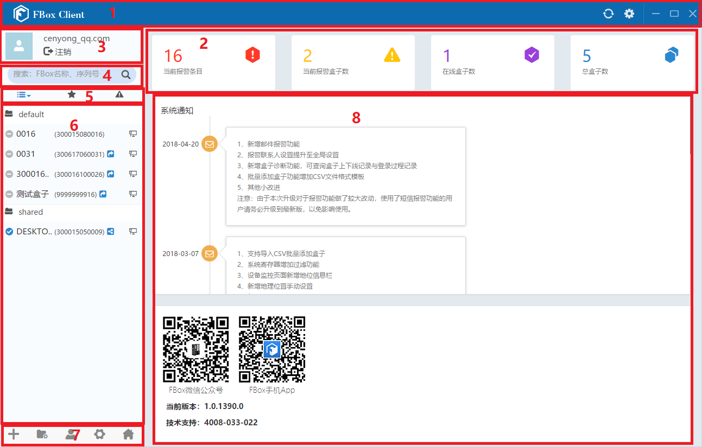

## **盒子客户端软件的功能**  

盒子客户端软件主界面如图3-14所示。该界面主要有8个区域，如下图中数字标示所示，依次是标题栏区域、盒子主要功能区域、用户信息区域、搜索区域、分类列表区域、盒子设备列表区域、设置管理区域和内容显示区域。  

  

  
    **图 盒子客户端软件主界面**  

  

### **标题栏区域**  

标题栏区域显示软件名称，通过点击标题右侧相应的工具按钮“”，可以实现软件窗口的刷新、设置（语言，检查更新，关于）、最小化、最大化和关闭功能。  

### **盒子客户端主要功能区域**  

盒子客户端主要功能区域分为远程下载、数据监控 、历史记录、视频监控、报警记录和基本信息等功能按钮。  

