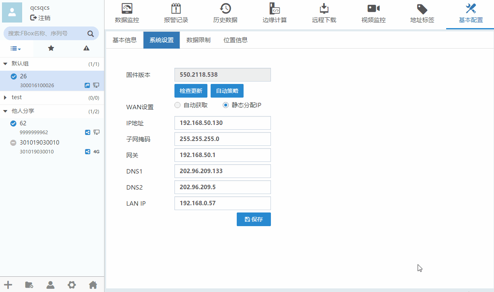
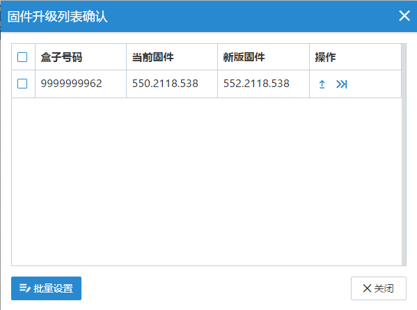
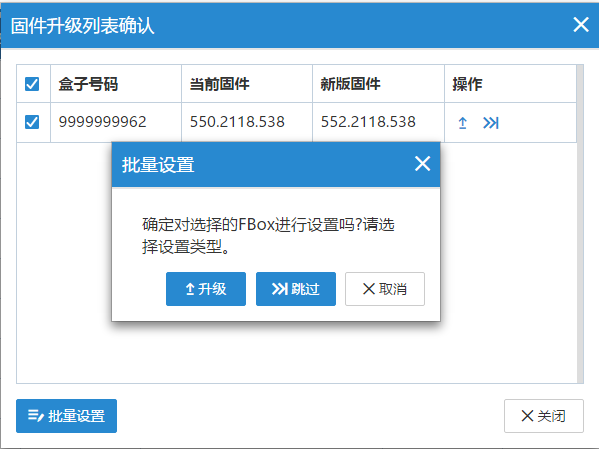
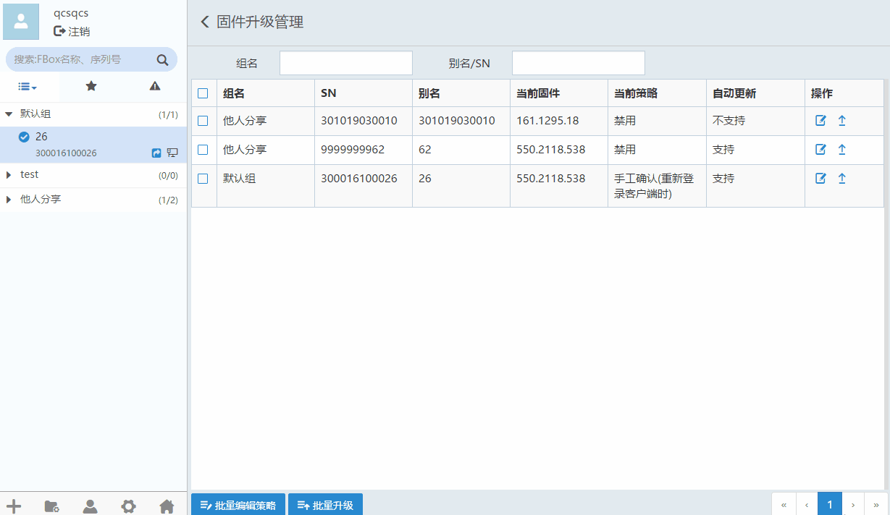
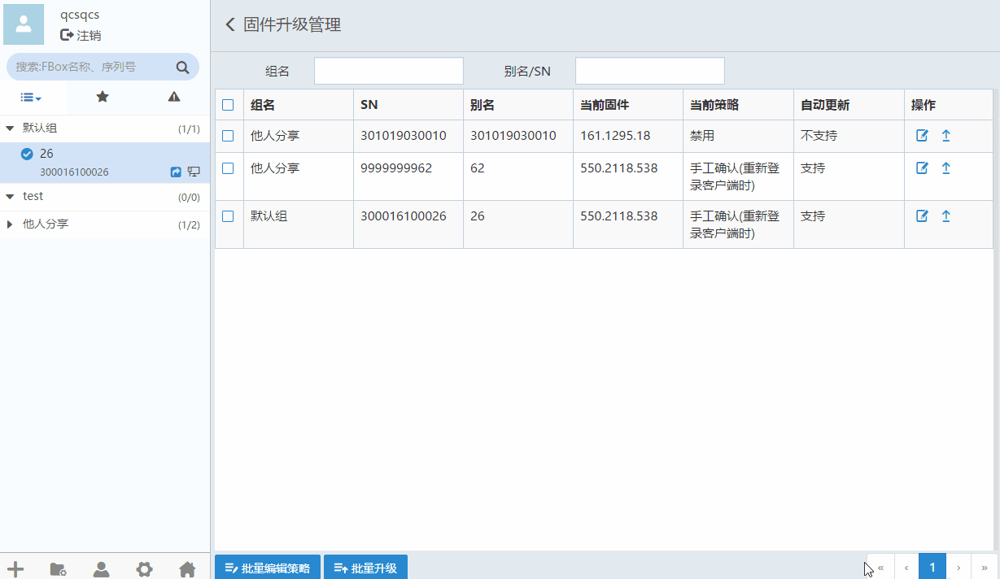

#### **固件升级**  

可以对盒子进行“自动升级策略”设置以及固件更新。  

在设备管理区域，点击进入全局设置,选择“固件升级”，如下图所示  

  

点击修改自动升级策略，点击可以对盒子固件进行升级。  

**自动策略**  

立即更新：固件自动下载后，盒子会重启更新固件。  
指定时间更新：固件自动下载后，盒子将在指定的更新时间点重启更新。  
等待下次重新启动更新：固件自动下载后，固件将在下次重启时更新。  
通知手工确认：发现新固件后，重新登录客户端，收到盒子固件更新通知。  

选择手工确认升级策略后，重新登录客户端时，将会弹出列表。如下图  

  

点击跳过本次升级,点击可以对盒子固件进行升级。  
选择需要批量操作的盒子，可以对选择的盒子进行批量升级固件或批量跳过。弹出下图。  

  

#### **批量编辑策略**  

勾选需要编辑的盒子，点击“批量编辑策略”按钮，会对所有支持编辑的盒子进行编辑。  

**若选中不支持编辑的盒子会自动过滤掉**  

  

#### **批量升级**  

勾选需要升级固件的盒子，点击“批量升级”按钮，会对所有支持升级固件的盒子进行升级。  

**若选中不支持升级的盒子会自动过滤掉**  

  