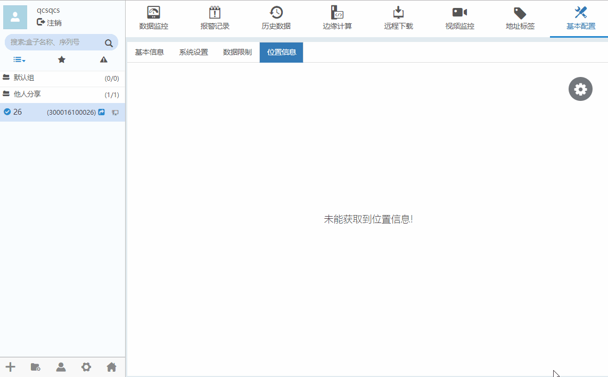
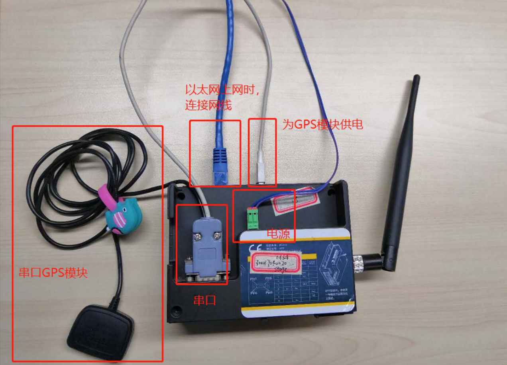
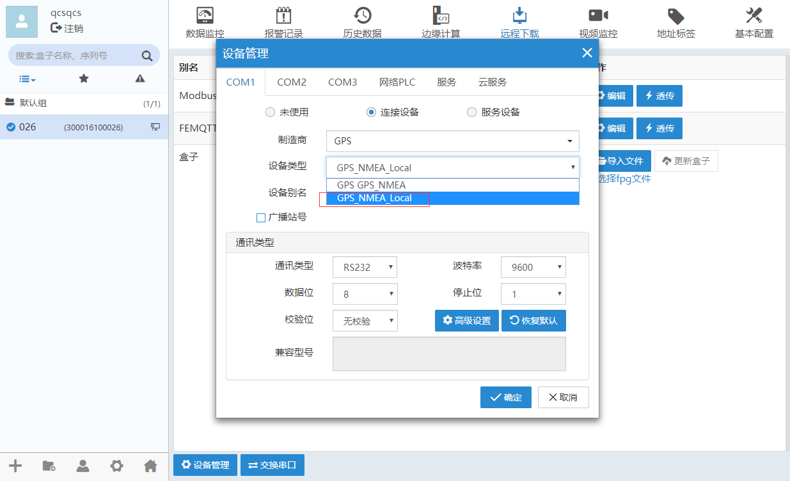
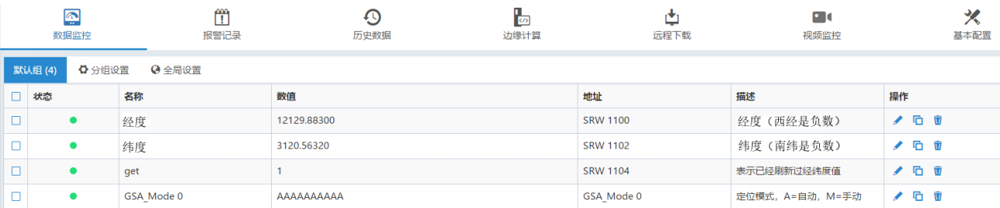
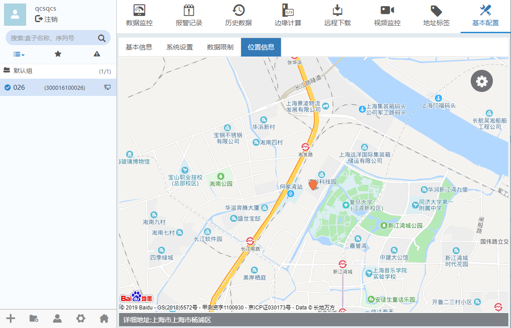

#### **位置信息**  

盒子的定位方式有自动定位和手工定位两种。  
**自动定位：**仅支持2G、4G盒子使用物联网卡上线的情况。  
**手工定位：**手动设置盒子的所在位置。基本配置”-->“位置信息”。如下图所示。  

  

#### **GPS 驱动**  

该驱动所有寄存器均为只读  
调试驱动使用的 GPS 模块型号：UB-355 RS232  

  

**注意：该图中的 GPS 模块可能会因为在室内会出现没有信号的情况，需要将它放在窗户旁边或者室外。**  

1、在客户端添加连接GPS模块的盒子驱动：  

  

2、在数据监控页面添加监控点，可以读取当前 GPS 模块定位的经纬度  

  

**SRW1100：**经度（西经是负数，dddmm.mmmmm 度分格式）  
**SRW1102：**纬度（南纬是负数，dddmm.mmmmm 度分格式）  
**SRW1104：**表示已经刷新过经纬度值  

**注意：如果不使用 GPS 模块，将串口拔掉，监控点中的经纬度读取的数值就是 0。**  

  

在基本配置--->位置信息中可以查看 GPS 模块定位的该盒子的位置。