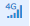
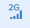

#### **图标解释**  

* **图标解释**  

    | 参数名   |参数描述|
    | - | :- | 
    ||盒子在线|
    ||盒子离线|
    ||盒子设备编码没有在服务器注册，服务器不识别|
    ||盒子正在下发数据|
    ||盒子有分享者|
    ||盒子是分享的|
    ||盒子绑定了摄像头|
    ||盒子上网方式是以太网|
    ||盒子上网方式是WIFI|
    ||盒子上网方式是4G|
    ||盒子上网方式是2G|
