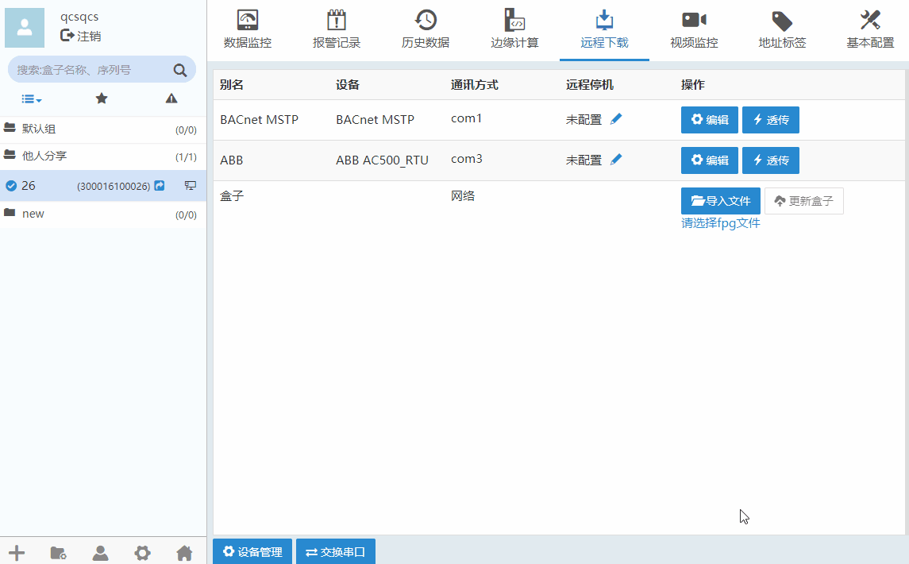
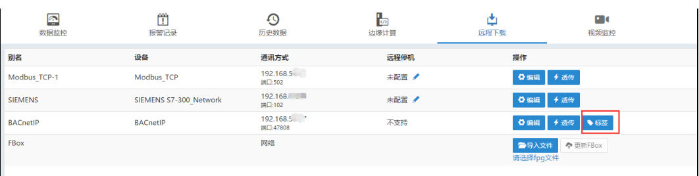
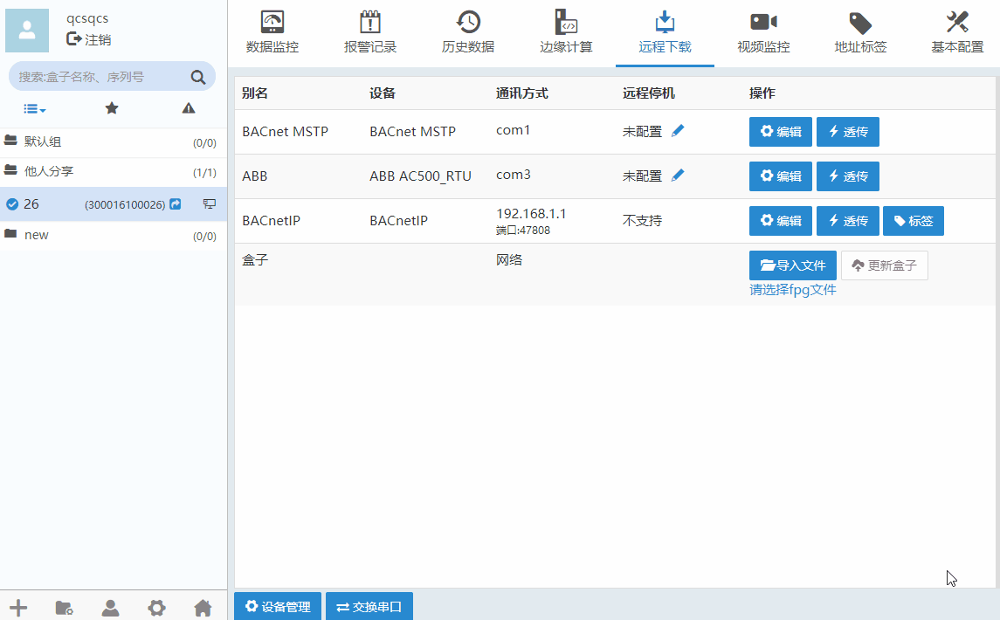
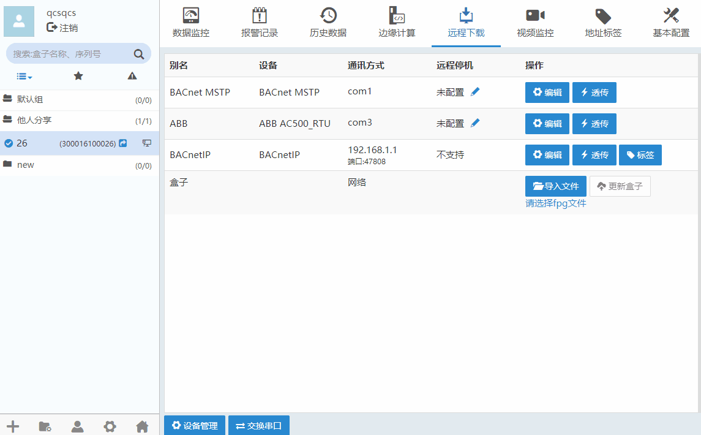
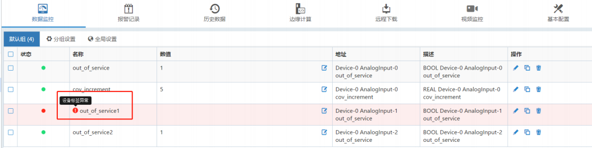
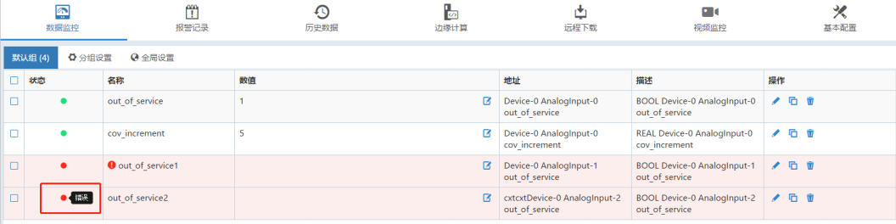
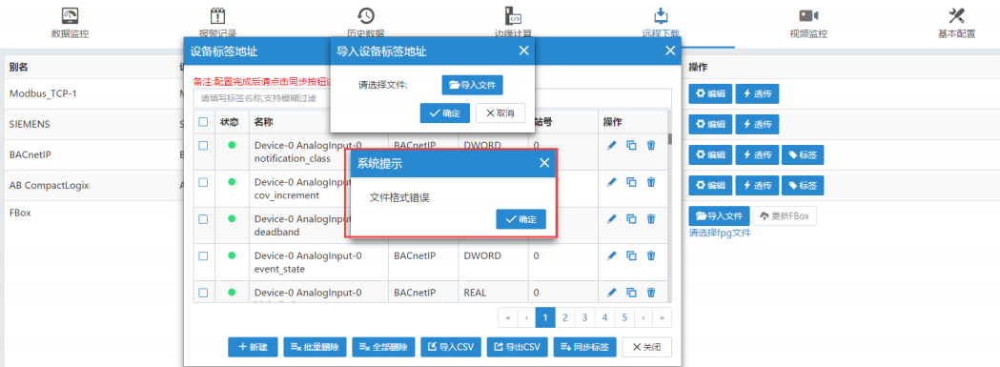

### **标签类型驱动配置**  

部分类型的PLC可以通过标签定义数据变量，在添加此类PLC监控数据点时，需要先新建标签列表。  

#### **添加有标签的驱动**  

  

添加后的远程下载页面，添加的驱动会有“标签”按钮：  

  

#### **新建标签**  

点击“标签”按钮，进入添加该驱动的标签页面，可以对标签进行增、删、改、导入、导出等操作。如下图所示。  

  

点击修改标签，点击可以删除当前标签。点击可以弹出当前标签配置信息，修改名称可快速新增。  
“批量删除”需要选中需要删除的标签。“全部删除”会删除当前驱动的所有标签。  

#### **同步标签**  

增加标签后，点击“同步标签”按钮，会对所有未同步的标签进行同步。  

  

表示标签已同步，表示未同步。  
在数据监控、历史报警、历史数据、边缘计算中可以添加该驱动的标签地址变量。  

#### **导出/导入标签**  

点击“导出CSV”按钮，会对所有的标签导出，格式为CSV。点击“导入文件”将标签文件导入，文件中的标签会全部导入到此列表中。  

**注意**  

1、如果删除其中一个标签，导出标签 CSV 文件中，该标签所在的位置会有“ReservedIndex”的标志，还占用当前的索引位，并不会被删除  
2、删除一个标签，点击“同步标签”下发到盒子，使用该标签地址的变量都会有“设备标签异常”的提示，如下图  

  

3、修改一个标签，用到该标签地址的变量不能通讯。修改标签相当于删除这个标签，再新增加一个标签，这个新增加的标签在 PLC 中是不存在的，自然是不能通讯的，如下图  

  

4、如果导入的不是标签文件，会提示文件格式错误，如下图  

  