#### **MQTT**  

盒子支持通过MQTT 推送第三方服务器接口，第三方服务器需符合我们定义的MQTT协议文档接口。  

#### **配置云服务**  

"远程下载”-->“网络PLC”，中创建MQTT连接设备，如图设置。  

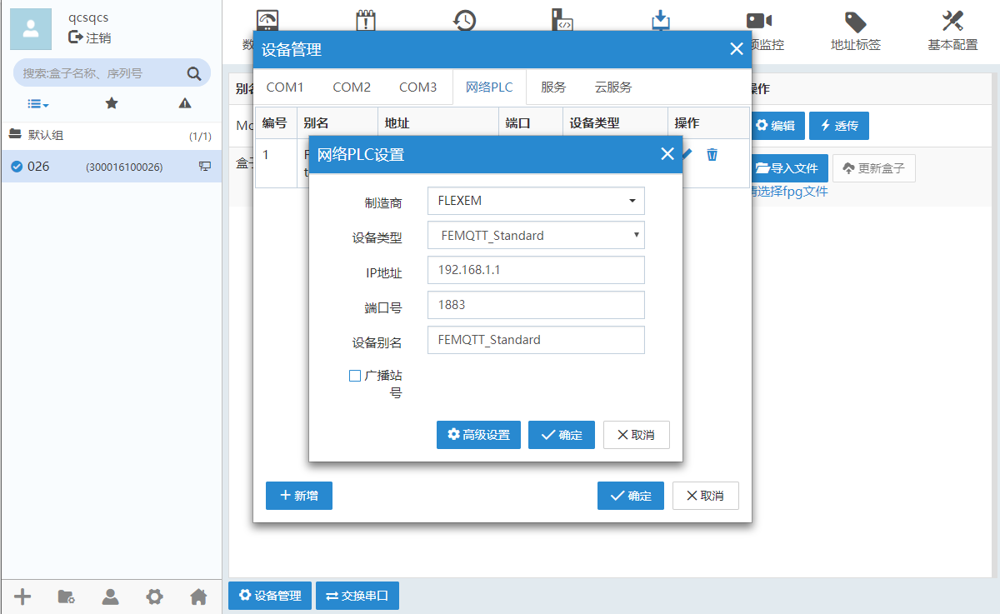  

在此处添加的设备中，IP地址和端口是忽略的，在下一步配置云服务中设置IP地址（服务地址）和端口号。  

"远程下载”-->“云服务”，中配置MQTT推送的服务器地址、端口号、设备ID、登录用户名与密码等信息，如图设置。  

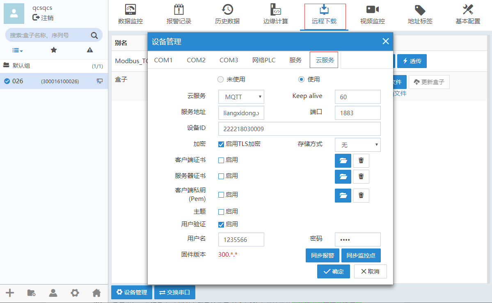  

**云服务：**MQTT，指定的MQTT服务协议  
**Keep alive：**心跳包时间，单位：s  
**服务地址：**MQTT推送的服务器地址  
**设备ID：**用于指定盒子的设备ID（比如盒子序列号，或者用户自定义的ID）  
**加密：**启用加密，支持盒子与MQTT服务器使用TLS（SSL）进行通讯（选择了就需要选择用户验证）  
**离线缓存方式：**允许在MQTT离线的状态下，将推送的消息缓存到SD卡或U盘，如果不需要缓存，选择“无”  
**客户端证书：**若启用了TLS加密，方可启用客户端证书。该证书为盒子使用  
**服务器证书：**若启用了TLS加密，方可启用服务器证书。该证书为MQTT服务器所使用的证书。若盒子需要双向加密，可启用该项，否则不需要启用  
**主题：**支持自定义主题前缀，若不自定义，则默认使用这个前缀：Topic/flexem/fbox/。  
以盒子序列号222218030009为例，重启的主题为：Topic/flexem/fbox/222218030009/system/Reboot，若自定义的前缀为：office/room1/,则重启的主题为：office/room1/222218030009/system/Reboot  
**用户验证：**是盒子登录MQTT服务器所需要的用户信息验证  
**同步报警、同步监控点：**若是首次使用MQTT服务，添加监控点或报警条目后，需要点击“同步报警”或者“同步监控点”才能使添加的条目推送MQTT生效；若不是首次需要点击“同步报警”或者“同步监控点”后，再重启设备才能使添加的条目推送MQTT生效。如果不使用报警，可以不进行同步报警。  

验证MQTT服务器与客户端是否连通，在数据监控中添加地址类型为“mqtt_connect”的监控点，数值为1时，就代表连通，如果值为0，代表没有连通，需要去检查前两部的配置是否有错误  

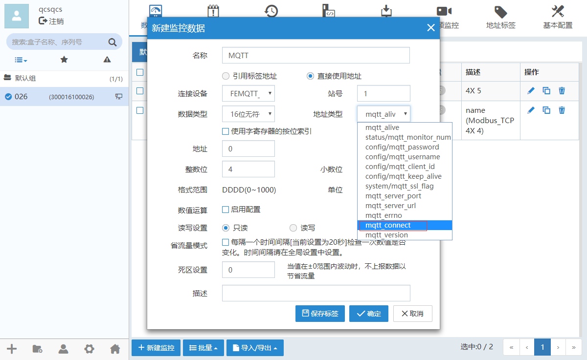  

#### **盒子的订阅与发布主题**  

MQTT服务端与盒子客户端连通后，**现以EMQTT网页客户端为例**，登录MQTT网页客户端，可以进行订阅和发布主题。在MQTT客户端可以查看设备的主题Topic列表，FLEXEM MQTT的主题（以下简称Topic）均以json格式传输。查看设备的主题列表如图：（以盒子222218030009为例）（登录：liangxidong.xyz:18083、admin/public）  

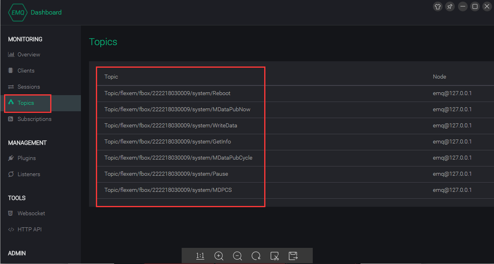  

已经订阅的主题，都会在这个地方展示出来。  
在MQTT客户端“Websocket”菜单中进行订阅、发布主题。注意填写内容大小写。  

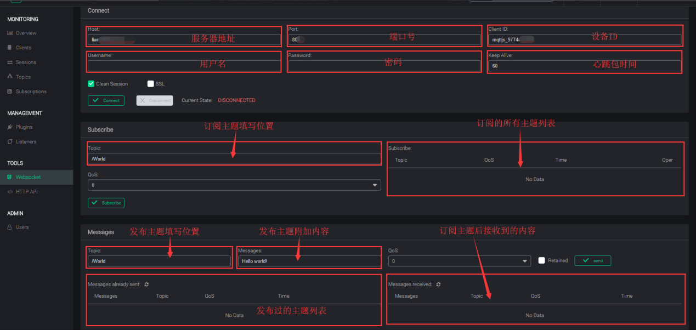  

#### **发布主题**  

在MQTT客户端的订阅处填写这些主题，就会接收到盒子发布的相应的信息。（以盒子222218030009为例，且主题没有自定义，默认是：Topic/flexem/fbox/）  

#### **实时数据**  
  

在MQTT客户端的订阅处填写这些主题，就会接收到盒子发布的相应的信息。（以盒子222218030009为例，且主题没有自定义，默认是：Topic/flexem/fbox/）  
该主题是盒子主动发布的主题，根据默认的发布周期（10s）进行发布，在MQTT客户端订阅此主题可以接收到盒子条目的推送。  
例：盒子中有监控点，在MQTT客户端订阅该主题，会接收到盒子中推送的监控点内容：  

| 参数名   |参数描述|
| - | :- |
|主题|Topic/flexem/fbox/222218030009/system/MonitorData|
|类型|发布|
|内容|{  "time":"2018-4-26 17:33:16",  "Data":[{"name":"Temp","value":"124"},  {"name":"mqtt_connect","value":"1"},  {"name":"bit","value":"0"},   {"name":"single","value":"45.500473"}  ]  }|  

"Time":条目监控点推送时间  
"name":监控点名称  
"value":监控点的值  

在盒子客户端中可以查看盒子中添加的监控点：  

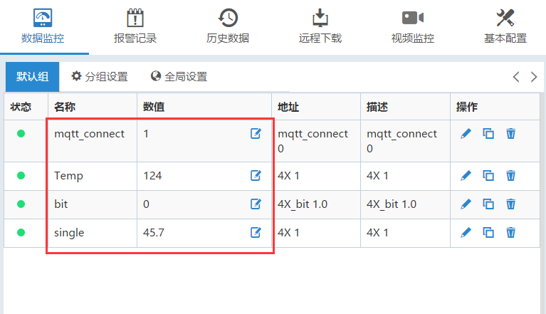  

在“Subscribe-->Topic”填写主题：Topic/flexem/fbox/222218030009/system/MonitorData，点击“Subscribe”，MQTT客户端订阅的主题会展示在右侧列表中，接收到的信息在右下方的“Messages received”列表中，按默认的发布周期接收信息。  

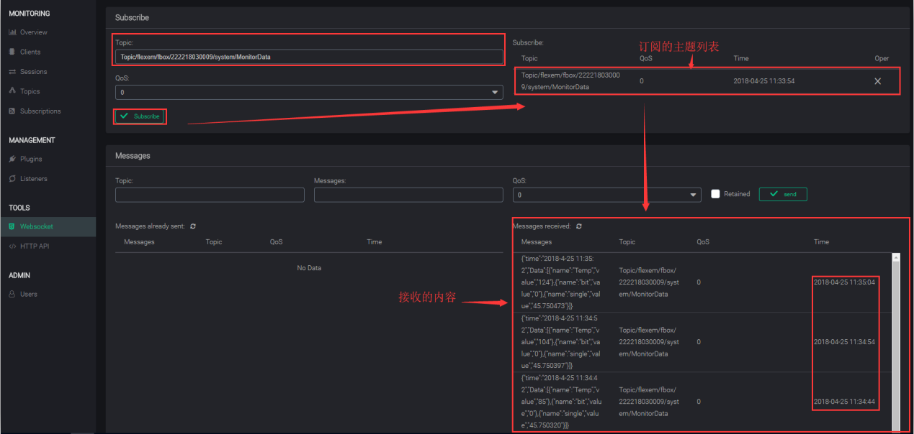  

如果要取消订阅该主题，在订阅的主题列表中取消该主题就行了。  

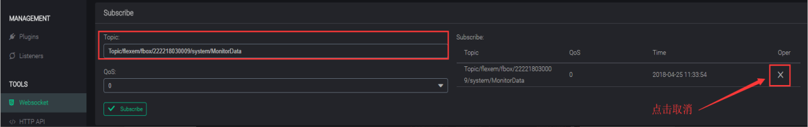  

#### **报警事件**  

报警事件发生时，服务器会收到设备推送的报警事件信息，报警分为当前报警和报警恢复，MQTT客户端订阅该主题后，报警触发和恢复都能收到信息。  

| 参数名   |参数描述|
| - | :- |
|主题|Topic/Topic/flexem/fbox/222218030009/system/AlarmEvent|
|类型|发布|
|内容  触发报警|{  "AlarmType":"AlarmEvent",  "time":"2018-4-25 14:50:37",  "name":"0184e6e647800498-Name",  "content":"0184e6e647800498-Text",  "value":"1"}|
|内容  恢复报警|{  "AlarmType":"AlarmRecover",  "time":"2018-4-2514:54:17",  "name":"0184e6e647800498-Name",  "content":"0184e6e647800498-Text",  "value":"0"}|  
"AlarmType":报警类型，"AlarmEvent"：报警触发，"AlarmRecover"：报警恢复  
"time":报警触发或恢复时间  
"name":报警条目名称  
"content":报警条目的报警内容  
"value":报警条目触发或恢复时的值  

在“Subscribe-->Topic”填写主题：Topic/flexem/fbox/222218030009/system/AlarmEvent，点击“Subscribe”订阅，触发或者恢复盒子报警，在“Messages received”列表中会接收到相应的信息。  
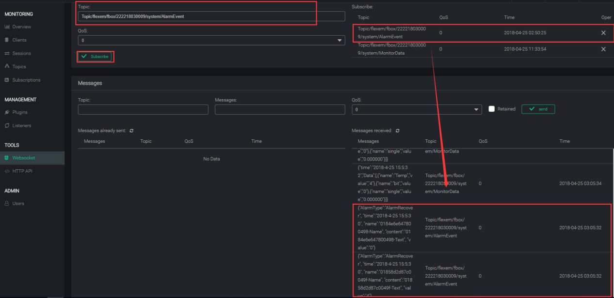  

**注意：MQTT客户端接收一条报警的触发或恢复信息中只包含一个报警条目的名称和内容**  

#### **发布盒子相关状态或信息**  

当盒子收到一些获取相关信息或状态主题时，则需要以该主题进行发布。MQTT客户端订阅该主题后，就会获取盒子的相关信息。  

| 参数名   |参数描述||
| - | :- | - |
|主题|Topic/flexem/fbox/222218030009/system/Status||
|类型|发布||
|内容|{  状态类型：状态值  }||
|状态：Pause|{"Pause":"Enable"} 或者{"Pause":"Disable"}|是否处于暂停|
|状态：MDataPubCycle|{"MDataPubCycle":10}|监控点发布周期值|  

**注意：**  
盒子不会主动发布该主题，当盒子收到主题为Topic/flexem/fbox/222218030009/system/GetInfo，内容为Pause或者MDataPubCycle 时，才会发布盒子相关状态或信息，MQTT客户端订阅该主题会收到相应的信息。  
在“Subscribe-->Topic”填写主题：Topic/flexem/fbox/222218030009/system/Status，点击“Subscribe”订阅该主题。在“Messages-->Topic”填写主题:Topic/flexem/fbox/222218030009/system/GetInfo，在“Messages-->Messages”填写点的内容“Pause”，会获取盒子是否处于暂停推送条目状态，填写内容“MDataPubCycle”，会获取盒子监控点发布周期值。  
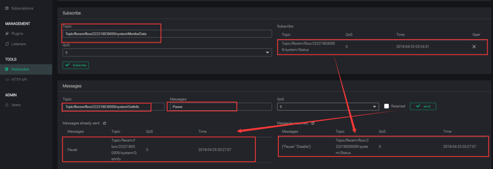  
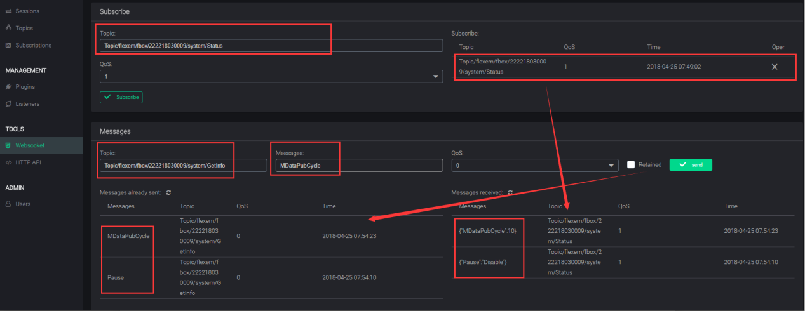  

#### **发布条目信息列表**  

在MQTT客户端订阅该主题后，就会获取盒子中的监控点信息。  

| 参数名   |参数描述|
| - | :- |
|主题|Topic/flexem/fbox/222218030009/system/Taglist|
|类型|发布|
|内容|{"Version":1,  "list":[{"name":"Temp"},  {"name":"mqtt_connect"},  {"name":"bit"},  {"name":"single"}  ]  }|  

**注意：**  
盒子不会主动发布该主题，当盒子收到获取盒子信息主题为  
Topic/flexem/fbox/222218030009/system/GetInfo  
并且内容为 Taglist时，表示要获取盒子的条目信息列表，这时盒子才会以  
Topic/flexem/fbox/222218030009/system/ Taglist进行发布。  

在“Subscribe-->Topic”填写主题：Topic/flexem/fbox/222218030009/system/Taglist，点击“Subscribe”订阅该主题。在“Messages-->Topic”填写发布主题：Topic/flexem/fbox/222218030009/system/GetInfo，在“Messages-->Messages”填写点的内容“Taglist”，会获取盒子中所有的监控点条目。  
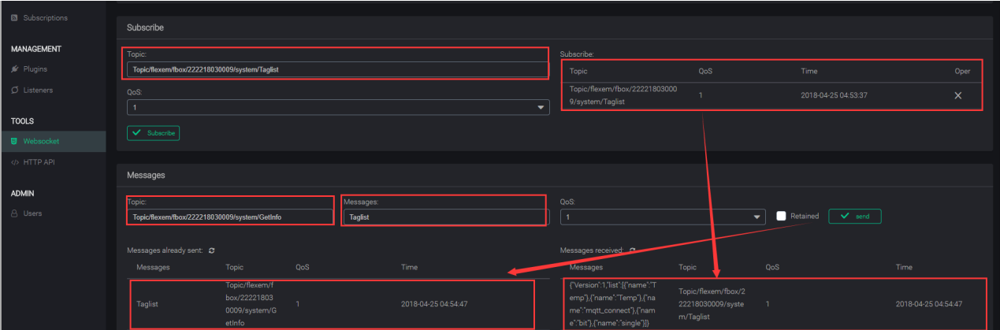  
