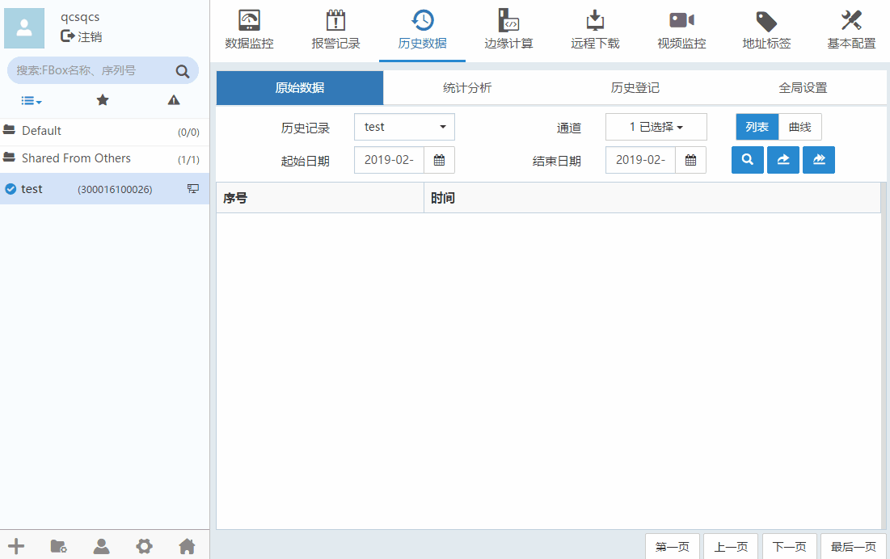
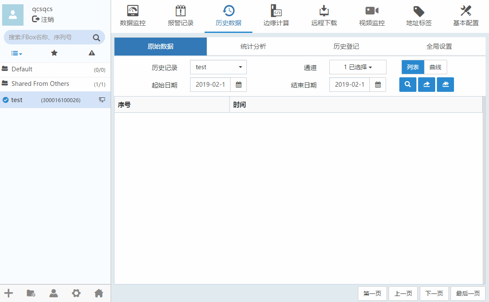
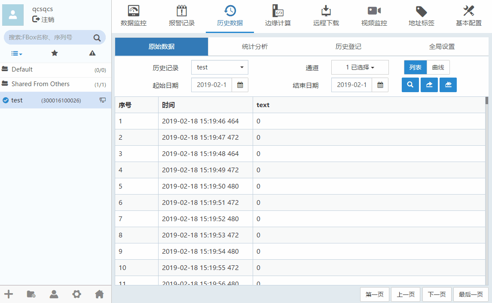

#### **原始数据**  

原始数据指添加了历史记录数据点在设置的采样周期下记录的所有数据。  

**列表查询**  

历史数据”-->“原始数据”，选择历史记录和通道，选择查询区间，默认是“列表”类型或者点击，如下图所示。  

  

**曲线查询**  

历史数据”-->“原始数据”，选择历史记录和通道，选择查询区间，点击“曲线”按钮，鼠标放在下方可以缩放曲线，如下图所示。  

  

#### **导入/导出原始数据**  

点击导出或按钮。点击弹出框中的超链接，即可下载文件。如下图所示。  

  
