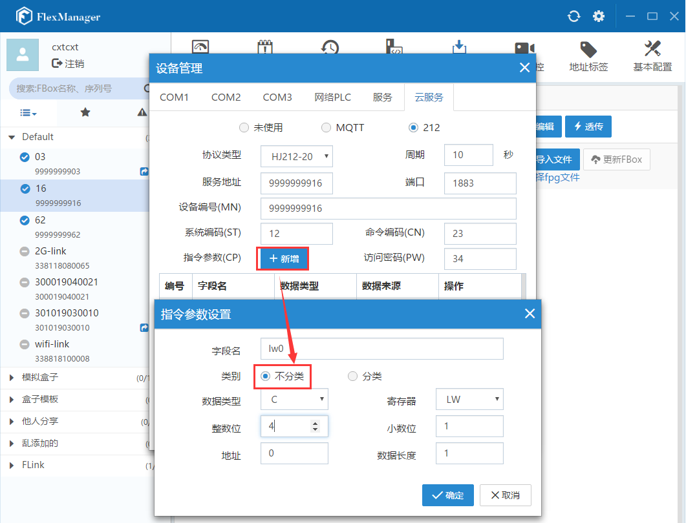

#### **配置服务信息**  

在FlexManager的“远程下载-->网络PLC”中创建P212的连接设备，如图设置：  

  

设置P212云服务信息  

  

根据需求增加指令参数：  

  

  

**注意：**  

1、指令参数中增加的数值默认都是本地local的float类型，地址使用lw或者rw类型  

2、分类指令参数类型，有一个标志位Flag，需要在添加的时候固定名称为“-Flag”，且放在最后一个位置，不然会导致不识别，发送的报文有误  

3、所有信息配置完成后，增加connect监控点判断是否连接上（注意：每次改变这个值，远程服务器就会接收到发送的报文）  

  

#### **远程服务器接收报文**  

在FlexManager的“远程下载-->网络PLC”中创建P212的连接设备，如图设置：  

  

目前用远程服务器TCP助手模拟接收报文:  

  