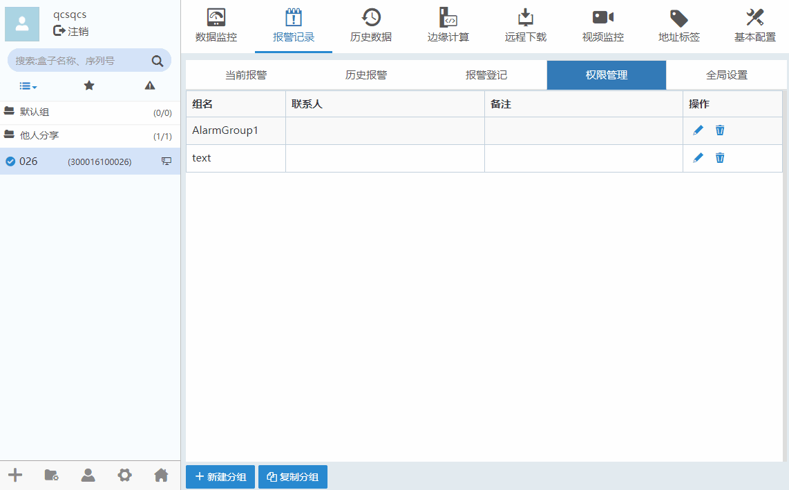
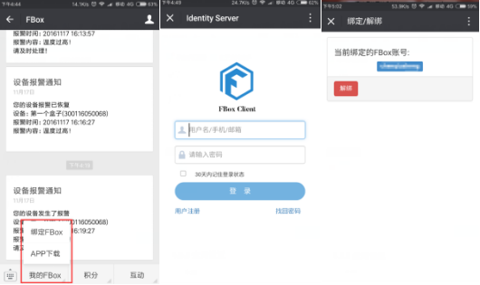
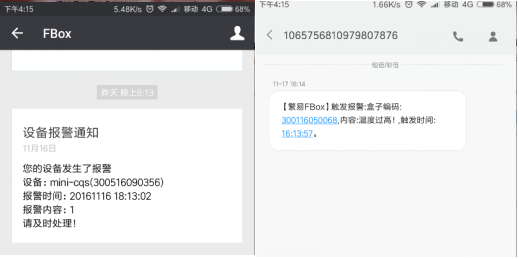
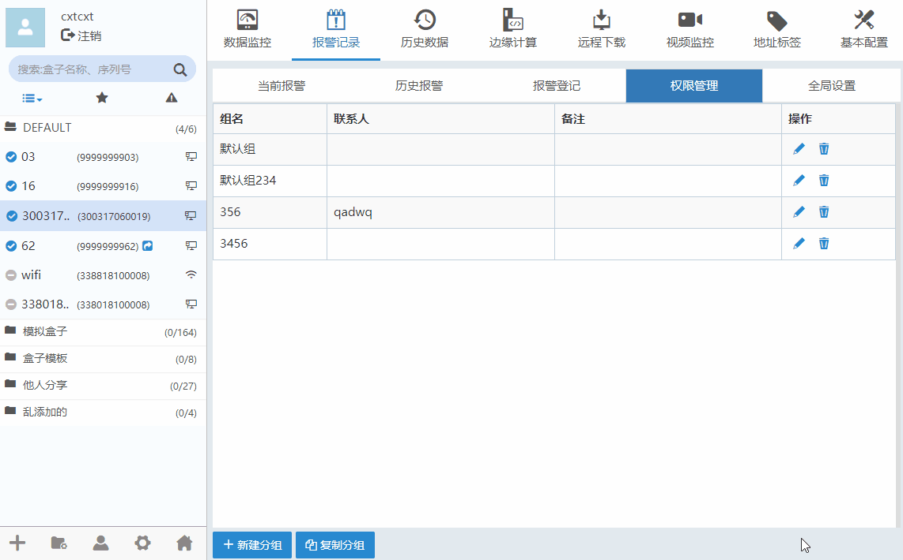

#### **权限管理**  

盒子云端服务器会将发生的报警信息自动推送到关联的微信号中，或者以短信的形式发送到你登记的手机中。所有的手机客户端和PC客户端都是数据同步的，远程数据和报警记录等功能都可以通过手机实时查看。  

#### **新建报警分组**  

点击“新建分组”按钮可以新增报警分组，点击修改报警分组，点击删除报警分组。如下图所示。  

  

#### **报警设置短信或语音推送**  

新建报警分组或者修改报警分组界面中，按钮为设置报警推送联系人。给报警分组设置报警联系人。当报警分组下的报警条目产生报警或者报警恢复时，将向指定的手机号发送短信，与用户的盒子采用SIM卡上网还是互联网上网无关。  

**注：短信语音功能是收费功能，目前每个手机号每天有10条免费报警短信或者5条报警语音。需要增加单日报警额度的，请联系销售或代理商开通短信服务。**  

#### **微信推送**  

在手机微信关注盒子公众号后，点击我的盒子，选择绑定盒子，进入绑定界面后输入盒子帐号密码，即可完成微信绑定。如下图所示。绑定成功后设备发生报警，手机微信将推送报警消息给用户。  

  

  
**图 微信公众号绑定盒子**  

  

微信报警消息推送与手机短信报警信息推送效果如下图所示  

  

  
**图 微信报警推送与短信报警推送**  

  

#### **复制报警分组**  

点击“复制分组”按钮将报警分组以及该报警分组关联到的联系人复制到另一个或多个盒子内。如下图所示。  

  