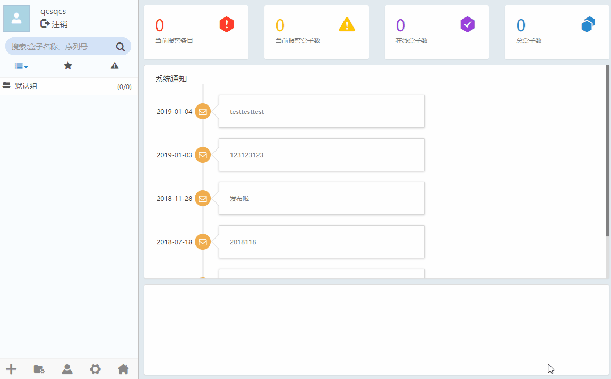
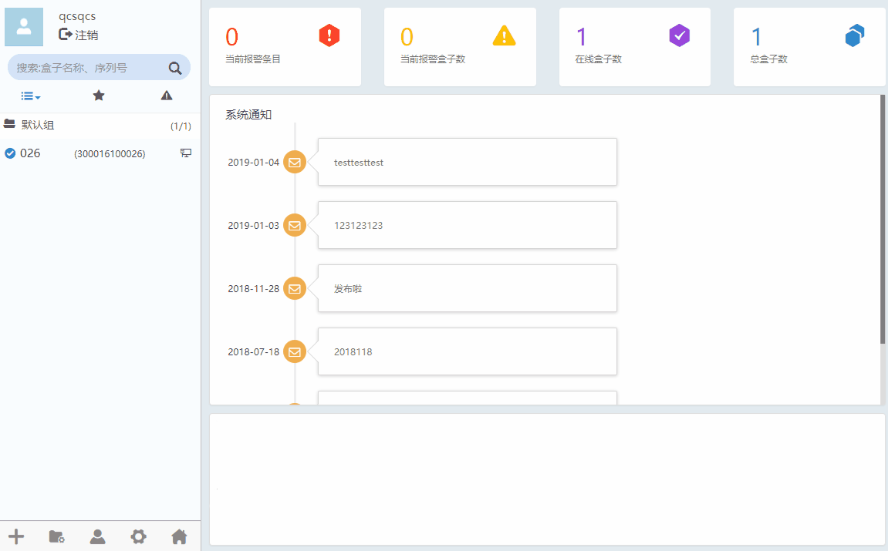
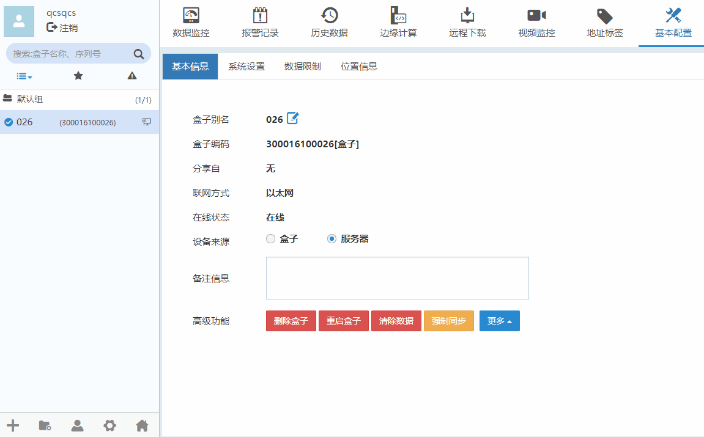
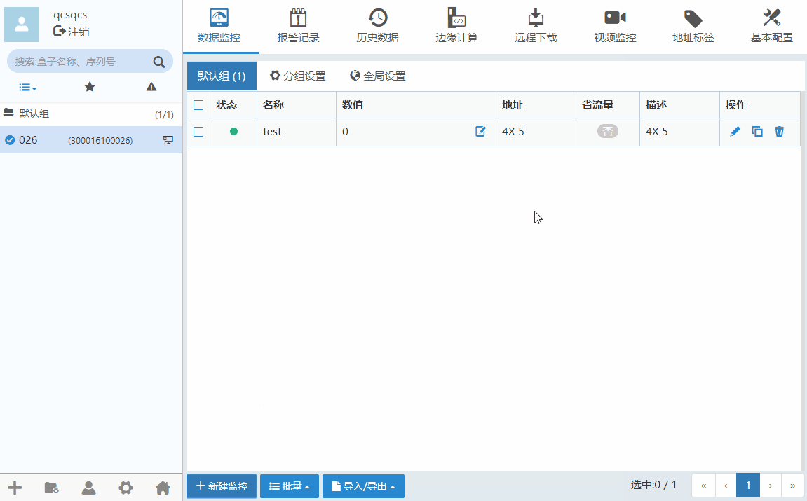
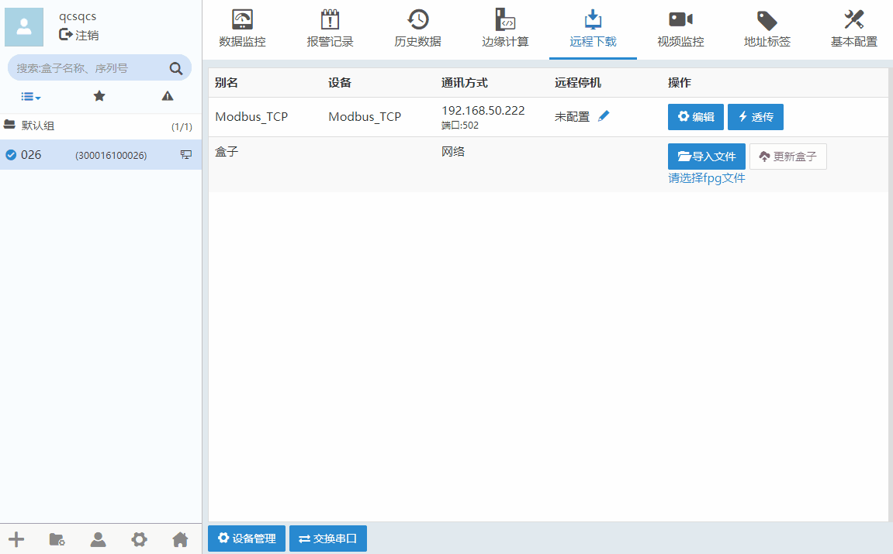
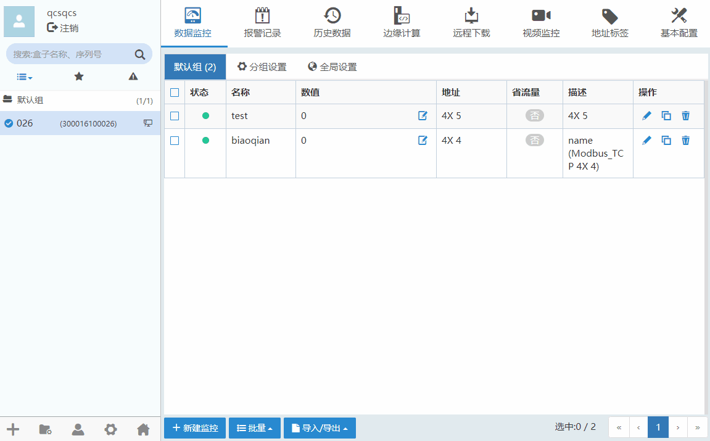
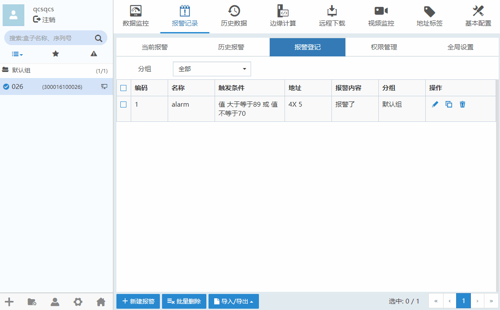

#### **添加盒子**  

要对某一盒子设备进行操作，需要先将其添加到客户端软件中。  

在设备管理区域，点击,选择“添加盒子”，如下图所示  

  

#### **查看基本信息**  

“基本配置”-->“基本信息”可以查看盒子联网方式，在线状态以及设备来源。如下图所示。  

#### **下载驱动**  

远程下载”-->“设备管理”，可以对与盒子连接的设备进行管理，包括添加设备、删除设备，配置所连接设备的通信参数等。盒子支持的PLC有AB、ABB、西门子、松下、三菱、永宏、和利时、台达、科威、步科、禾川、安川、欧姆龙、汇川、日立、信捷、施耐德等一百多家PLC型号，以Modbuls_TCP为例。如下图所示。  

  

#### **添加地址标签**  

地址标签”-->“新建标签”，可以添加标签。添加的标签可以在监控数据、报警记录、历史记录、边缘计算中引用。下图以监控数据引用地址标签。  

  

#### **添加监控点**  

在数据监控中，可以实现查看现场设备的数据。可通过“添加监控点”或者“批量添加”的方式，监控PLC、仪表等数据，监控点名称可自由定义。

数据监控”-->“新建监控”，根据设备驱动，数据类型，寄存器类型，地址，配置监控点信息。如下图所示。  

  

#### **添加报警条目**  

报警记录用于对报警点的数据进行检测与记录  

报警记录”-->“报警登记”，“新建报警”。根据设备驱动，数据类型，寄存器类型，地址，报警条件，配置报警条目信息。如下图所示。  

  

#### **添加历史条目**  

历史条目可以实现设置和查看历史数据、显示趋势图、对历史数据进行统计分析等功能  

**采样方式：**  
**1、周期式：**用设置的固定周期来采集记录数据。  
**2、触发式：**没有固定周期，当设置的触发条件满足时采集一次数据。  
**使能设置：**用一个位类型的数据点作为使能参数，满足条件后，会开始用设置好的采样周期来采集历史数据。  

“历史数据”-->“历史登记”，“新建历史”。配置采样方式，采集周期。“新增通道”。根据设备驱动，数据类型，寄存器类型，地址，配置历史条目信息。如下图所示。  

  