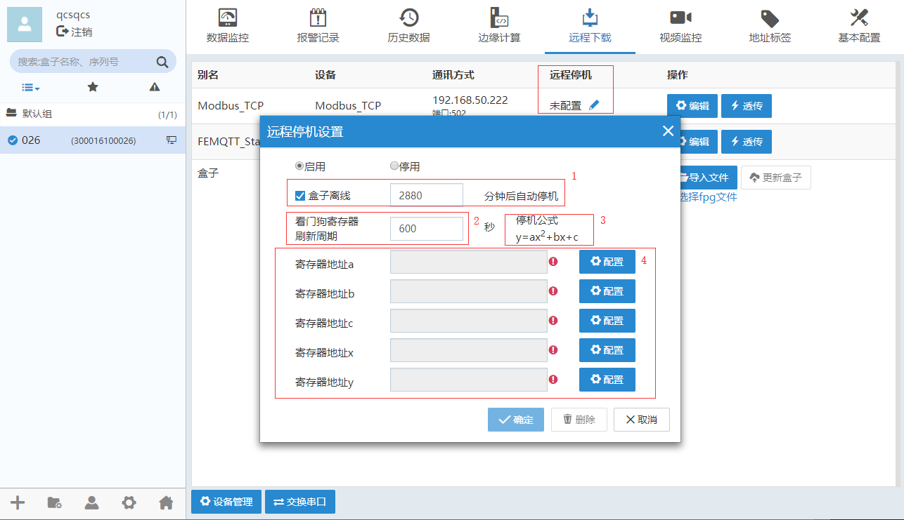

#### **远程停机**  

此功能可用于远程控制 PLC，实现停机、回款等功能；  
当 盒子 与 PLC 连接断开，或者 盒子 离线，均可检测通知 PLC。远程停机按钮位于远程下载，设备驱动列表中，每个驱动可单独设置远程停机功能。  

#### **原理**  

盒子 从 PLC 中获取相应数据，通过算法计算出数据后，再发给 PLC。PLC 可以判断所计算的数值是否正确。  
对 PLC 编程者来说，可以将一些变化的数值发给 盒子，然后 PLC 通过编程自己计算出来一个数值，与 盒子 发送过来的数值进行比较，来判断 盒子 是否正常工作。  
假如 盒子 与 PLC 之间通讯出现问题，诸如通讯线断开、盒子上网出现问题、SIM 卡被拔掉等，均可通过配置实现不再给 PLC 发送数据。  
当 PLC 判断 盒子 发送过来的数据与自己计算出来的数据不一致时，则可以判断 盒子 已经离线或者 PLC 与 盒子 之间通讯线断开。PLC 可以通过编程序来判断是否需要停机。  

#### **使用说明**  

“远程下载”，点击远程停机设置，如下图所示。  

  

**1、盒子 离线**  
当选中 盒子 离线，则当 盒子 上网出现问题，诸如 SIM 被拔掉，或者手机欠费等，均会在一定时间后停止向 PLC 发送数据。  
默认时间为 2880 分钟。当输入 0 时，表示立即停止给 PLC 发送数据。  
**2、看门狗时间**  
设置 盒子 向 PLC 发送数据的间隔，默认是 600s  
**3、停机公式**  
y=ax^2+bx+c  
其中 a、b、c、x 均从 PLC 中获取。  
y 为计算出来后在发送给 PLC  
**4、数值配置：**  
 配置 PLC 的数值  