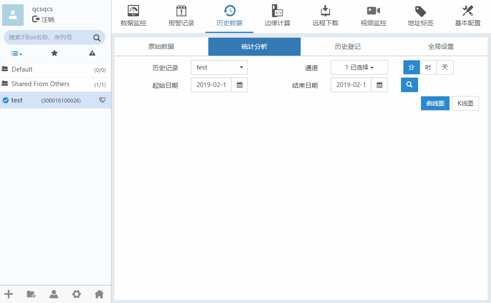

#### **统计分析**  

软件可以对历史数据进行简单的统计分析，按照不同是时间间隔查询，使用曲线图或K线图的方式展示。  

**分/时/天查询**  

历史数据”-->“统计分析”，选择历史记录和通道，选择查询区间，选中“分”，“时”或“天”按钮，如下图所示。  

  

统计分析可通过点击“曲线图按钮”和”K线图“按钮，查询曲线图和K线图。如果查询曲线图，鼠标放在下方可以缩放曲线。