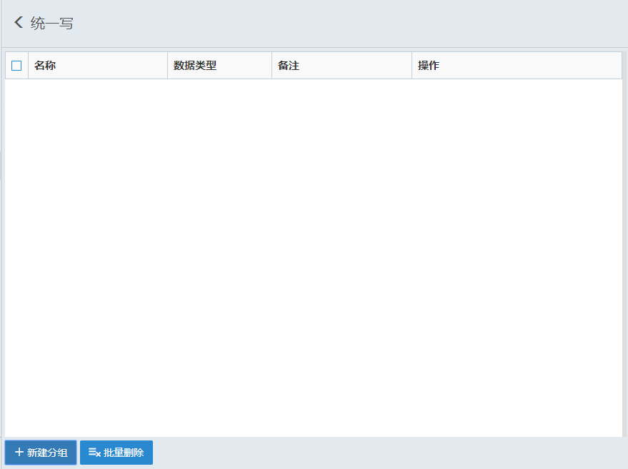
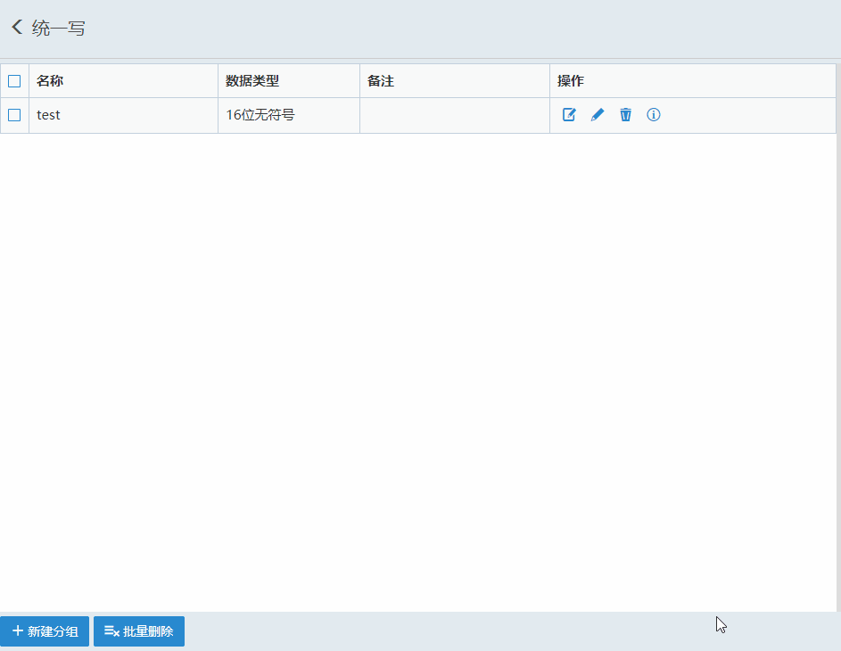
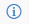
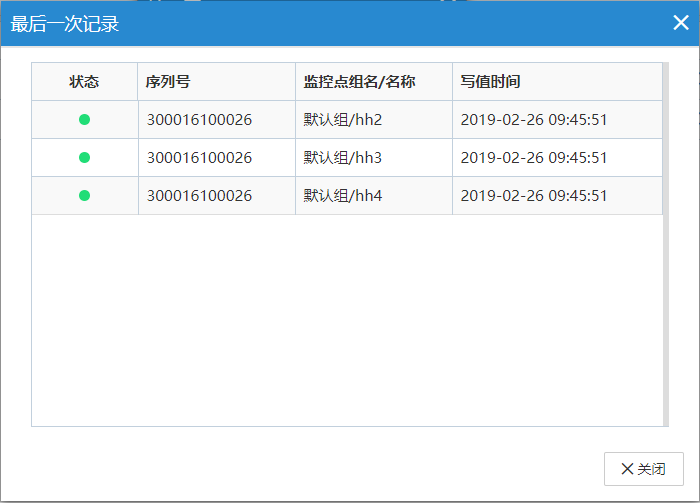

#### **统一写**  

用户可以按照自己需求把同一数据类型的监控点编为一组，可以以组为单位对监控点进行写值操作。  

**注意:**  
1、过滤只读监控点  
2、同一分组中监控点只能相同数据类型  

在设备管理区域，点击,选择“统一写”，点击修改控制分组，点击可删除控制分组。如下图所示  

  

#### **新建控制分组**  

点击“新增分组”，选择“数据类型”，点击“新增控制”，根据监控点名称过滤符合要求的监控点。选中需要统一写的监控点，确定。如下图所示  

  

点击“”输入需要统一写的值。确定后弹出下图写值记录界面或点击查看。  

