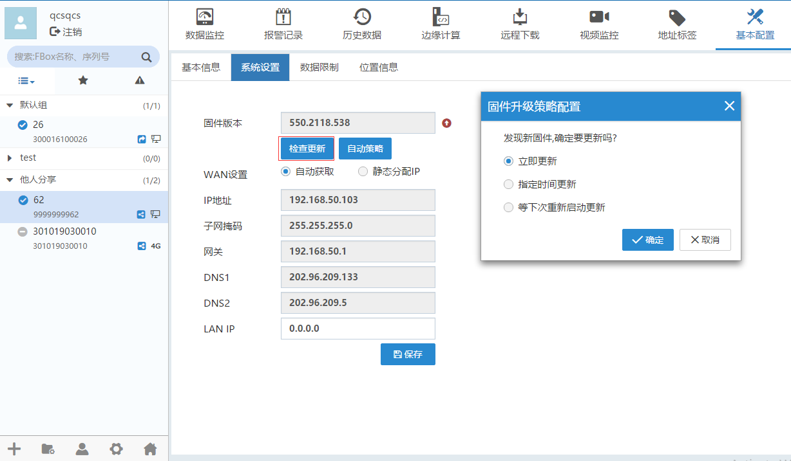

#### **检查更新**  

对于盒子Client客户端软件许多后期增加的功能，老版本的盒子设备需要进行固件升级，才可使用。该操作称为更新固件。  

基本配置”-->“系统设置”。点击“检查更新”可以更新最新固件，如下图所示。  

  

立即更新：盒子将会重启并更新固件。  
指定时间更新：盒子将在设置的时间点重启更新固件。  
等下次重新启动更新：固件将在下次重启时更新。  

#### **自动策略**  

可在盒子固件自动下载后，设置更新策略。  

  

立即更新：固件自动下载后，盒子会重启更新固件。  
指定时间更新：固件自动下载后，盒子将在指定的更新时间点重启更新。  
等待下次重新启动更新：固件自动下载后，固件将在下次重启时更新。  
通知手工确认：发现新固件后，重新登录客户端，收到盒子固件更新通知。  

选择手工确认升级策略后，重新登录客户端时，将会弹出列表。如下图  

  

点击跳过本次升级,点击可以对盒子固件进行升级。  
选择需要批量操作的盒子，可以对选择的盒子进行批量升级固件或批量跳过。弹出下图。  

  

#### **上网配置**  

在该标签页中，显示当前盒子设备的上网配置，如果是“静态分配Ip”，可手动进行修改信息，点击保存，重启盒子后生效。对于2G、4G、wifi的盒子，根据盒子设备的上网方式，可以选择以太网或GPRS方式。设置信息要根据盒子上网的实际网络环境来配置。  