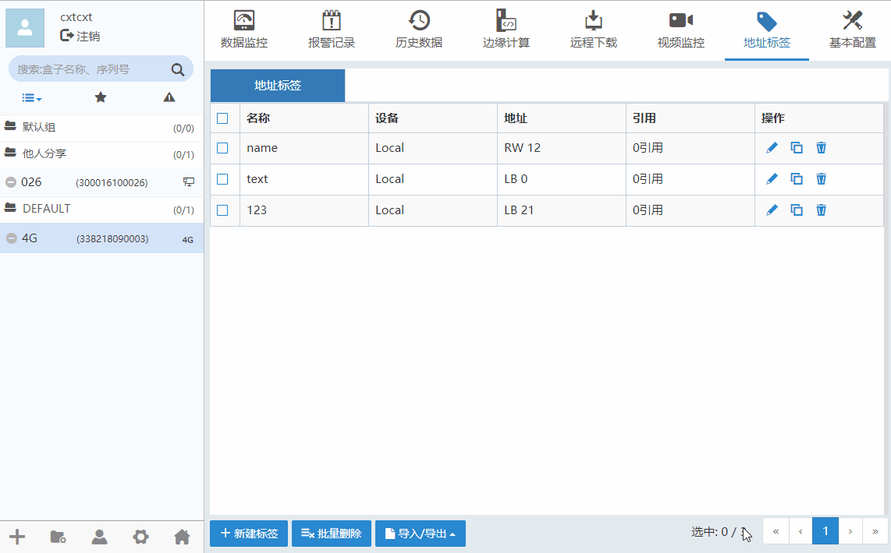
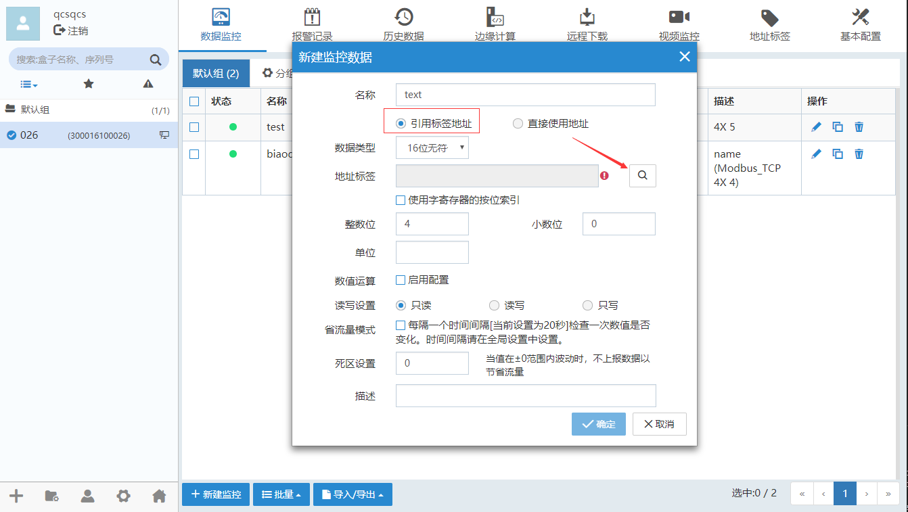
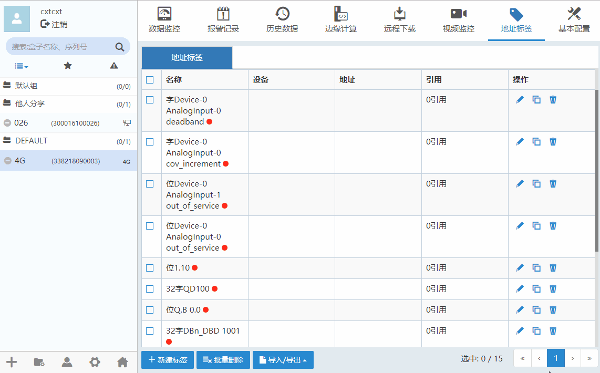
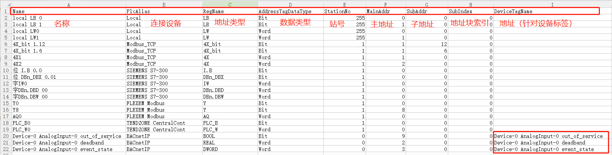

#### **新建标签**  

点击“新建标签”，填写配置信息。如下图所示。  

  

点击修改标签，点击可以删除标签。  
表示地址标签被移除。  

**注意：修改地址标签信息，会影响引用该标签的监控点、报警记录，历史数据，边缘计算**  

新建的标签，可以直接在数据监控点，报警记录，历史数据，边缘计算选择“引用标签地址”，根据数据类型可选择地址。如下图  

  

#### **批量删除**  

选中需要删除的标签，点击“批量删除”。如下图所示。  

  

#### **导入/导出标签**  

点击“导入/导出”按钮。如下图所示。  

  

**导出地址标签CSV**  

  

导出地址标签配置信息CSV文件参数  
| 参数名   |参数描述|
| - | :- |
|Name|名称，必填|
|PlcAlias|连接设备，必填|
|RegName|地址类型，必填|
|AddressTagDataType|数据类型，必填(Bit,Word)|
|StationNo|站号，必填|
|MainAddr|主地址，必填|
|SubAddr|子地址，根据数据类型编辑|
|SubIndex|地址块索引，根据PLC类型编辑|
|DeviceTagName|地址（针对设备标签）|

**注意：**  

1、批量添加监控点不支持使用标签  
2、修改地址标签信息，会影响引用该标签的监控点、报警、历史、JS  
3、导出CSV文件，如果用EXcel编辑，注意需要另存为.csv格式，再导入  
