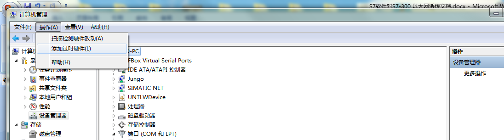
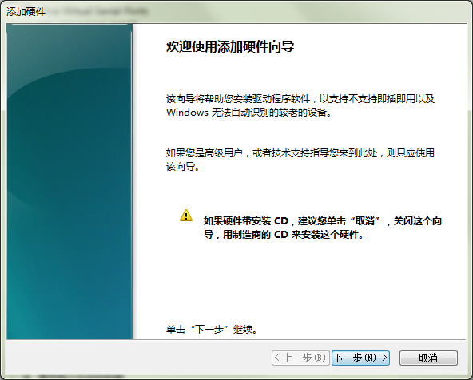
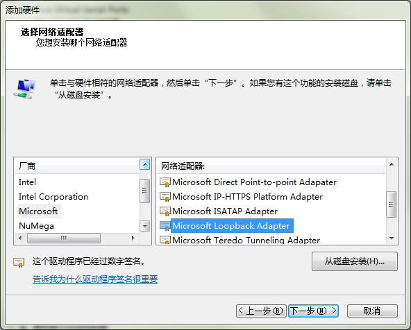
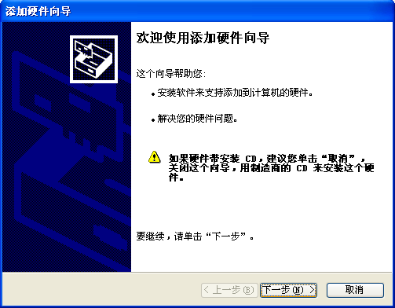
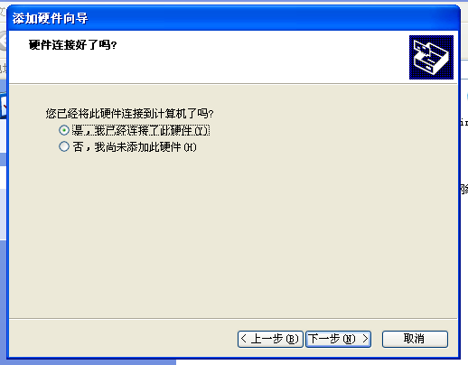
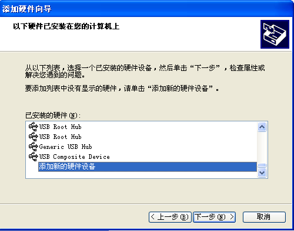
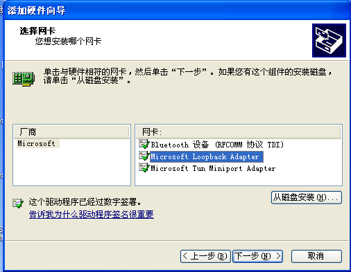

## **ABB-AC500的透传和数据监控使用说明**  

CM577以太网模块的通讯，冗余PLC的通讯  
安装虚拟网卡  

#### **WIN7下安装虚拟网卡**  

**注意：如在XP下操作，请跳过此章节，直接跳往下一章XP下安装虚拟网卡的步骤**  

  为了确保对Control Builder Plus软件AC500以太网plc的透传成功，需要在win7电脑上安装虚拟网卡。（虚拟网卡只需要安装一次，以后就不需要安装，就可以直接使用了）  

1）在计算机，设备管理器里，操作—添加过时硬件  

  

2）单击“下一步”  

  

3）手动从列表选择硬件，然后单击“下一步”  

  

4）选择网络适配器  

  

5）让电脑自动搜索  

  

6）厂商选择“Microsoft ”，网络适配器选“Microsoft Loopback Adapter”，单击“下一步”  

  

7）单击“下一步”，然后开始安装驱动  

  

8）驱动正在安装  

  

9）驱动安装完成  

  

10）安装完成后，会在网络连接中，多出这个虚拟网卡网络设备  

  

#### **XP下安装虚拟网卡**  

1）控制面板-添加硬件  

  

2）单击“下一步”  

  

3）在出现的弹框中，选“是，我已经连接了此硬件”，然后单击“下一步”  

  

4）选择添加新的硬件，然后单击“下一步”  

  

5）选择如图，从列表安装，然后单击“下一步”  

  

6）选择网络适配器，再“下一步”  

  

7）选择厂商为“Microsoft”，网卡为“Microsoft Loopback Adapter ”，然后单击“下一步”  

  

8）如图，点“下一步”即可安装  

  

9）安装虚拟网卡完成  

  

10）安装完成后看到如下设备  

  

#### **Modbus TCP协议方式透传及数据监控**  

1、虚拟网卡设置，设置虚拟网卡的IP地址为PLC的IP地址，如下图，其中，192.168. 0.10就是plc的IP地址。  

  

2、Automation Builder软件设置

  

1）添加Modbus TCP/IP 设备，这里的PLC设置为从站  

  

2）如下图，打开Modbus TCP/IP Server 参数设置  

“服务器连接”是设置可连接至PLC的客户端个数，最大可设置为12；为 0 时，表示纯客户主站（ Modbus 主站）。这里只连接盒子可设置为1。  

“Open Modbus时间”设定了接收到应答报文后连接的保持时间，保持时间应大于主站对PLC的扫描周期，以保证连接不会频繁关闭。  

  

如下图所示为ABB的以太网模块CM577的modbus server设置(冗余PLC模块设置)  

  
  

#### **FlexManager数据点监控**  

1）添加网络PLC，登录FlexManager，打开“设备管理”  

  

新增网络PLC  

  

设置如下参数。其中IP地址为PLC的IP；通信端口号为502。  

  

2）添加监控数据  

  

  

设置成功的状态  

  

#### **Control Builder Plus对AC500透传**  

**注：由于Control Builder Plus编程端口为1201，所以透传时需要新建设备，端口为1201**  

1）新增一个Modbus TCP/IP设备，端口设置为1201  

  

2）建立透传通道,如下图所示为透传通道建立成功，然后可以进行后续操作  

  

3）CoDeSys通信设置，双击打开CoDeSys  

  

在菜单栏选择“Online”—“ Communication Paramenters”，参数设置如下  

  

“Online”—“Login”，在线成功  

  

## **Modbus RTU协议方式透传及数据监控**  

**注：由于AC500编程口参数是固定的，如果使用PLC的同一个串口进行数据监控和透传，串口参数需要和编程口参数一致**  

#### **Control Builder Plus软件设置**  

添加Modbus串口设备，这里把COM2设置为Modbus协议方式，用于数据监控；COM1作为编程口  

  

设置串口参数,其中“Parity”设置为“None”，和编程口一致,这里PLC做从站，所以“Operation mode”设置为“Server”,“Address”根据实际需要设置  

  

#### **FlexManager数据点监控**  

1）添加串口PLC,参数设置如下  

  

2）添加要监控的数据点,站号要和Control Builder Plus中的“address”一致  

  

监控成功  

  

#### **Control Builder Plus对AC500透传**  

**注：由于Control Builder Plus软件编程口不支持Modbus协议，透传时需要将COM1连接到FBox。**  

也可在FBox的COM1和COM3分别创建两个Modbus RTU设备，分别连接PLC 的COM1和COM2，一个用于监控数据，一个用于透传。  

1）建立透传通道  

  

如下图所示为透传通道建立成功，然后可以进行后续操作  

  

CoDeSys通信设置,双击打开CoDeSys  

  

在菜单栏选择“Online”—“ Communication Paramenters”，参数设置如下  

  

“Online”—“Login”，在线成功  

  
