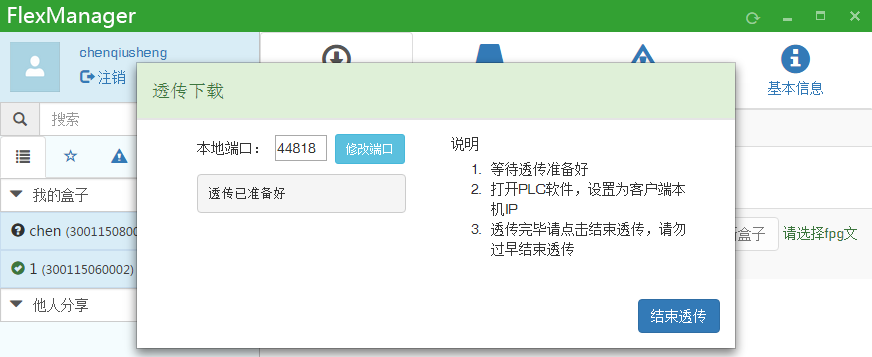

## **CP1L-E内置以太网口通讯透传**  

1、PLC设置，首先，在PLC里设置IP地址，设置好后，将设置下载到PLC里，并将PLC断电重启（断电后，PLC的IP，端口等才能生效）.  

  

2、FBox设置：  
a、选择OMRON CJSeries_EthSlave，输入PLC的IP.  

  

b、设置LAN IP,输入和PLC在一个网段的IP，然后在数据监控里添加监控点，即可以读写PLC里的寄存器地址.  

  

3、VPN透传和普通透传均通过以下方式让PLC远程在线。  
透传的时候选择CP1L以太网在线——选择HUB连接，然后输入PLC的IP，点击连接.  

  

**注：点击连接，第一次会连不上，紧接着再点一次连接，就可以正常在线了**  

  

## **FBox--以太网透传--欧姆龙CJ2M-CPU31**  

系统：Win7 32位  
软件：CX-programmer V9.5   FlexManager 1.0.617.0  

#### **CJ2M-CPU31连接CX软件查看并设置PLC的IP地址**  

1、USB连接。PLC上电后通过USB线连接到计算机，打开CX-programmer软件，点击PLC--自动在线--直接在线，选择USB连接--确定即可。  

  

2、以太网连接。PLC上电后通过网线连接到计算机，打开CX-programmer软件，点击PLC--自动在线--以太网/IP节点在线，选择以太网/IP节点在线，点击浏览，选择CJ2M-CPU31--确定--连接。选择自动上线后从PLC传输程序，勾选传送IO表和特殊单元设置，点击 是。  

  

  

3、连接完成后在工程栏点击IO表和单元设置，选择内置端口/插入板，双击CJ2M-EIP21进入CJ2M-EIP21编辑参数窗口，查看并根据需求设置PLC的IP地址。这里设置的IP地址是192.168.100.2，子网掩码：255.255.240.0，网关：192.168.100.100 点击确定。如果更改了设置，要再次传送到PLC。  

  

#### **FBox连接通信**  
盒子配置  
打开FStudio软件，新建工程，选择设备型号：FBox-2G，点击下一步，选择自动获取IP地址，下一步，看到如下界面，选择网络PLC--新增--选择制造商和设备类型：欧姆龙omron CJ series Ethernet slave，修改网络PLC的IP地址（即前面设置的CJ2M的IP地址）端口号：9600（通信用），44818（透传用）。点击确认。  

  

盒子监控PLC数据用的端口与透传用的端口不一样，这里共需要新增两个设备。  

  

创建好工程后打开HMI设置，不勾选“使用GPRS/3G/4G远程连接”然后确定，通过USB线下载工程到盒子  

  

硬件接线配置  
    盒子上电，连接以太网上网，LAN口再连接到CJ2M上的以太网口。  
FlexManager设置  
工程下载到盒子后，打开盒子客户端，可以看到盒子在线成功，显示OMRON CJ series设备。在远程数据栏里添加PLC的监控点（设备为端口号是9600的）。看到状态正常，表示盒子与PLC通信成功。 

  

  

#### **FBox以太网透传**  

1、在远程下载栏下点击透传（设备端口号为44818），待出现透传已准备好后进行下一步操作.  

  

2、打开CX-programmer，点击PLC--自动在线--以太网/IP节点在线，选择以太网连接，设置IP地址，其IP地址设置为电脑的IP地址而不是PLC的IP地址（打开电脑的本地连接查看本机IP地址），点击连接  

  

3、出现“要在自动上线后从PLC传输程序吗？”点击是。稍等片刻即完成连接.  

  

4、连接成功后即可对PLC进行透传上下载程序.  

  
