#### **FBox-4G-VPN透传-繁易触摸屏,以及VNC**  

测试环境  
系统：Win7 32位  
软件：CX-programmer V9.5   FlexManager 1.0.617.0  

#### **CJ2M-CPU31连接CX软件查看并设置PLC的IP地址**  

1、USB连接。PLC上电后通过USB线连接到计算机，打开CX-programmer软件，点击PLC--自动在线--直接在线，选择USB连接--确定即可  

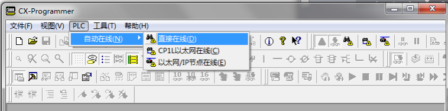  

2、以太网连接。PLC上电后通过网线连接到计算机，打开CX-programmer软件，点击PLC--自动在线--以太网/IP节点在线，选择以太网/IP节点在线，点击浏览，选择CJ2M-CPU31--确定--连接。选择自动上线后从PLC传输程序，勾选传送IO表和特殊单元设置，点击 是。  

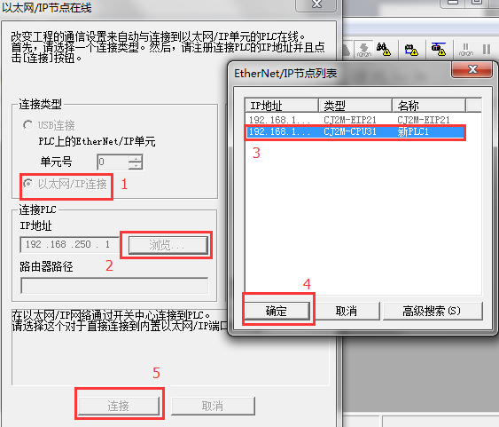  

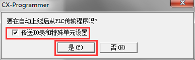  

3、连接完成后在工程栏点击IO表和单元设置，选择内置端口/插入板，双击CJ2M-EIP21进入CJ2M-EIP21编辑参数窗口，查看并根据需求设置PLC的IP地址。这里设置的IP地址是192.168.100.2，子网掩码：255.255.240.0，网关：192.168.100.100 点击确定。如果更改了设置，要再次传送到PLC。  

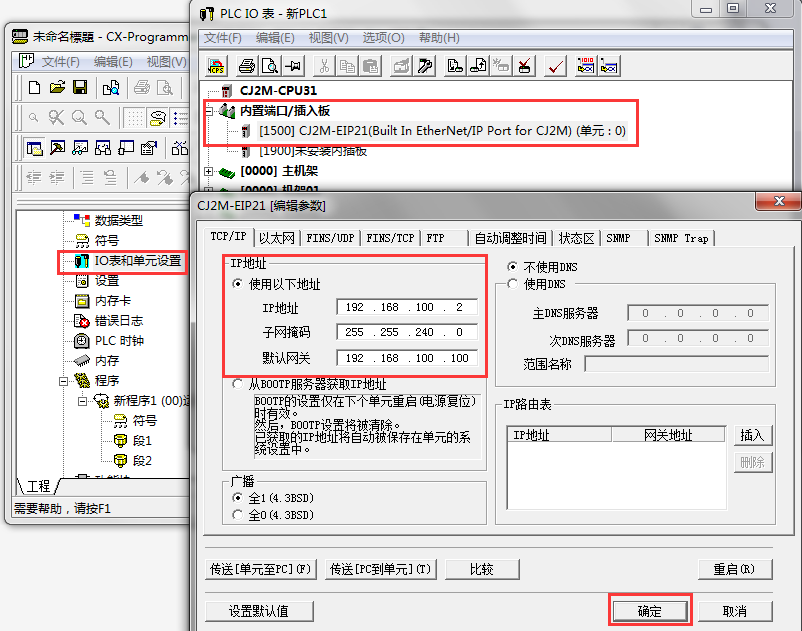  

#### **盒子配置**  

1.首先设置FBox-4G上线  
使用最新版FS软件，设置使用“GPRS/3G/4G远程连接”，任意固定ip即可，用USB下载到FBox-4G中  

  

2.准备好4GSIM卡（大卡），网络支持4G（移动/联通/电信）、3G（移动/联通）、2G（移动/联通），卡槽边上按钮弹出卡槽，将卡插入卡槽中，使用4G专用天线，上电等待RF灯常亮  

3.启动“FlexManager”客户端,客户端显示FBox-4G已经上线后，点击“远程下载”，使用“VPN透传”不用选中几号设备  

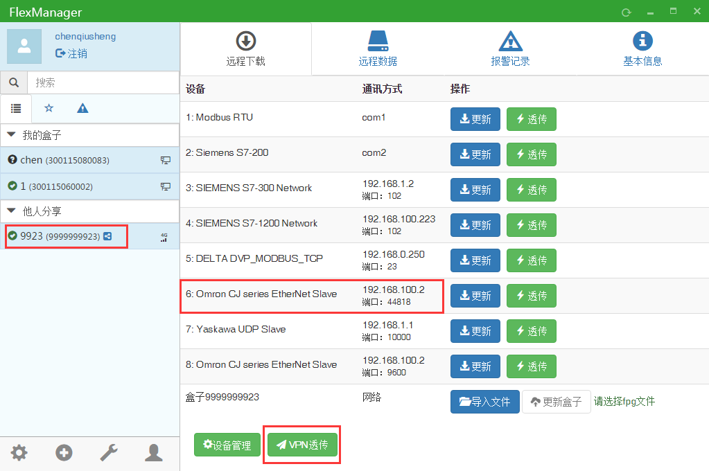  
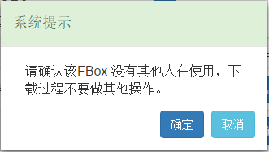  

确认该FBox没有其他人使用后，点击“确定”  

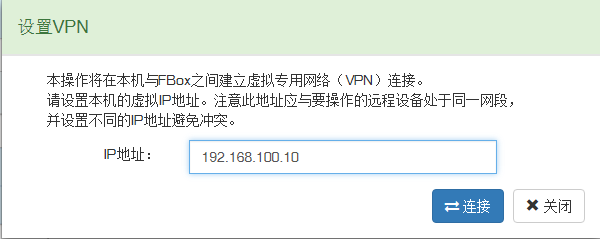  

输入和现场PLC同网段的IP，点击“连接”，例如PLC的IP地址是192.168.100.2，我们在VPN里设置的IP为192.168.100.10，只要同网段且不与现场冲突的IP即可。  

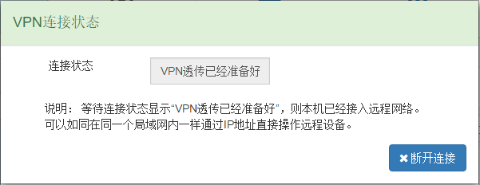  

等待连接状态显示“VPN透传已经准备好”即可。启动VPN后，可能会弹出一个命令行窗口，如下图，直接最小化即可，不要关闭此窗口。  

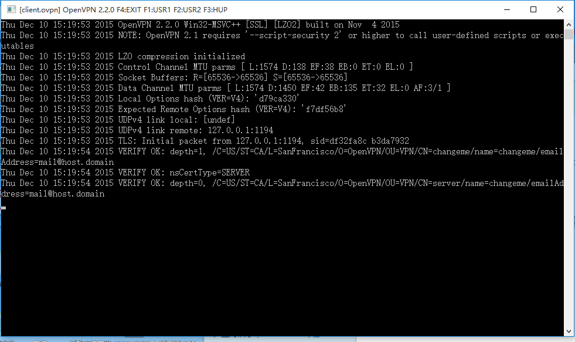  

4.确认VPN虚拟网卡  

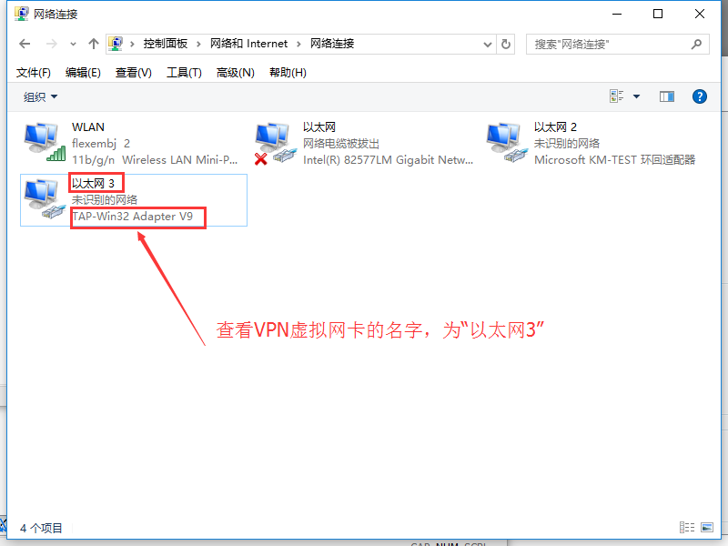  

以TAP开头的名称的，即为VPN虚拟网卡，如果显示“未识别的网络”，说明VPN已可用，如果显示“网络电缆被拔出”，说明VPN是断开的  

**注意：**  
1、如果命令行窗口自动关闭，虚拟网卡一直显示“网络电缆被拔出”，可点击进入网卡的连接属性，查看是否设置的是自动获得IP地址，如不是，改成自动获取。  

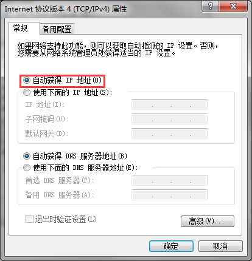  

2、如果点击连接后出现如下提示，程序名称为iphelper，请一定点击是！这是透传需要的程序！  

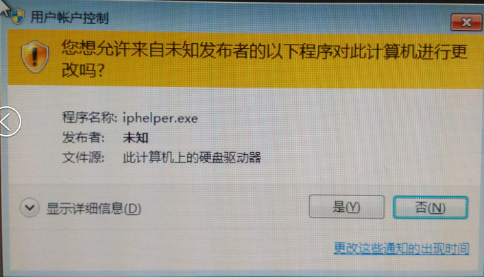  

#### **VPN透传**  

1、打开CX-programmer，点击PLC--自动在线--以太网/IP节点在线，选择以太网/IP节点在线，输入步骤一设置的PLC的IP地址：192.168.100.2，点击连接。  

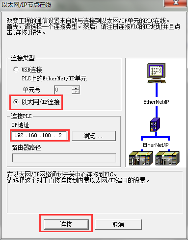  

2、出现“要在自动上线后从PLC传输程序吗？”点击是。稍等片刻即完成连接  

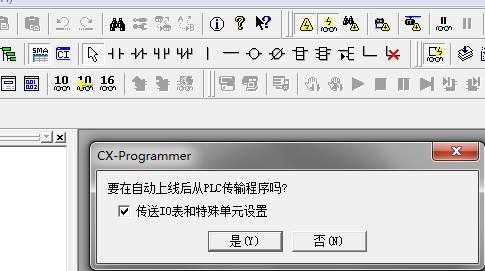  

3、连接成功后即可对PLC进行透传上下载程序  

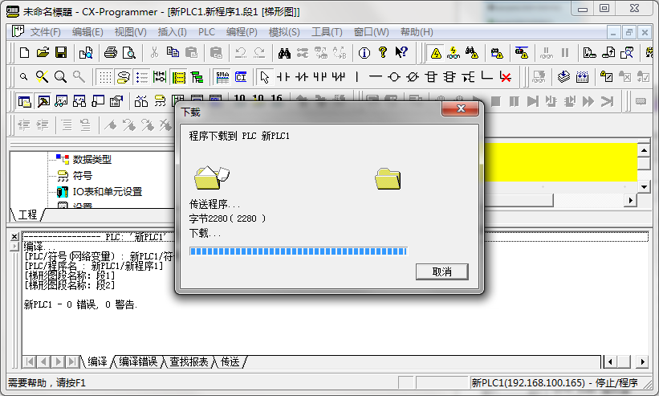  
