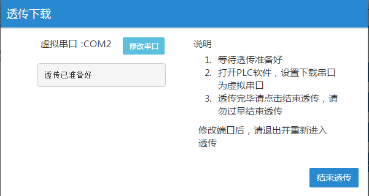
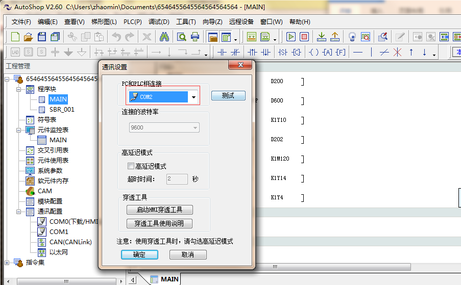
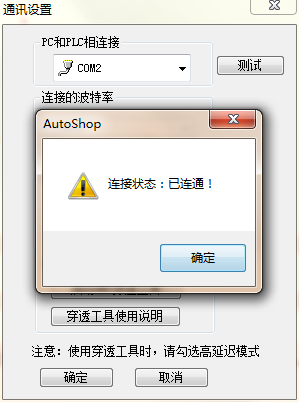
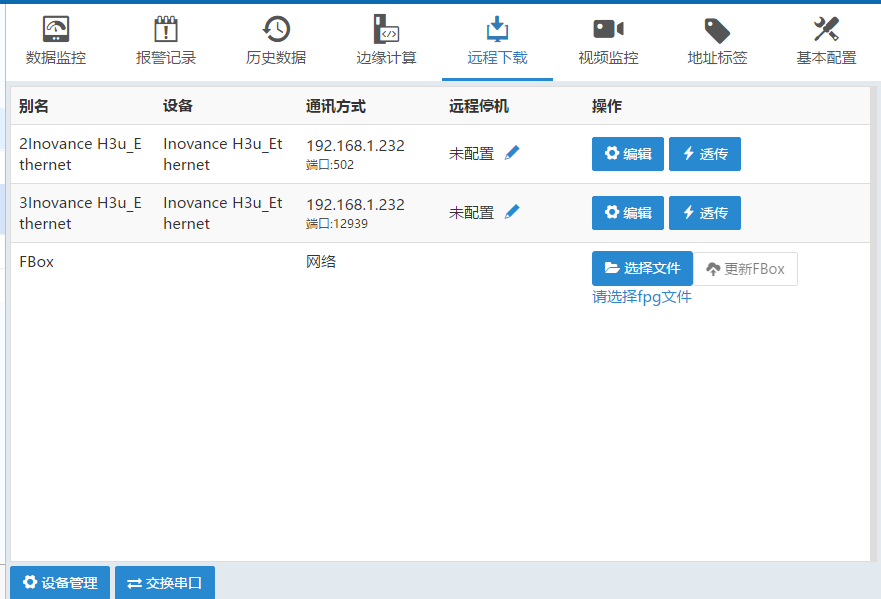
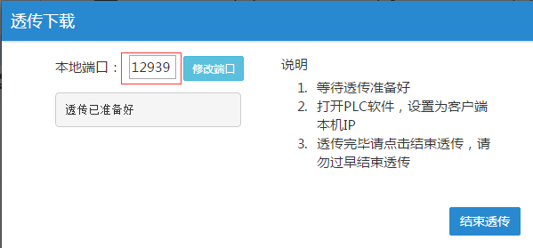
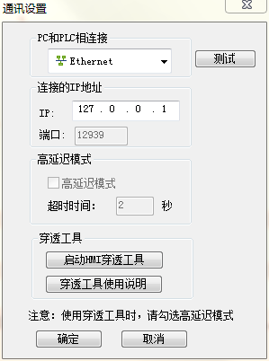
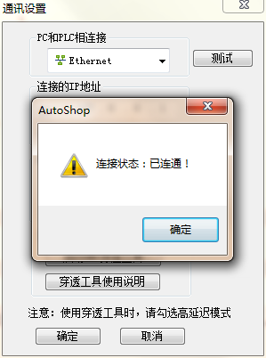

#### **COM口透传下载**  

请先点击Flexmanager-远程下载-透传，待透传通道准备好，如下图所示  

  

汇川H3U PLC对应的软件准备  
1、打开plc软件，点击菜单按钮的“工具”-“通讯设置”，按照下图设置  

  

点击测试，提示“已连通”。  

**注意：串口透传改波特率不会成功，因为一旦透传波特率就是固定了。**  

  
此时即可透传下载，监控了  

#### **网口透传下载**  

请先配置两个网络驱动，一个端口为502，用于通讯；一个端口为12939，用于透传。  

  

透传前，请先点击端口为12939的透传按钮  

  

汇川H3U PLC对应的软件准备。打开plc软件，点击菜单按钮的“工具”-“通讯设置”，按照下图设置。  

  

按照上述设置完成后，点击测试，提示“已连通”此时即可上传下载了  

  
