#### **基恩士串口透传步骤**  

透传前，请先打开以上FS设置的COM口的透传窗口!  

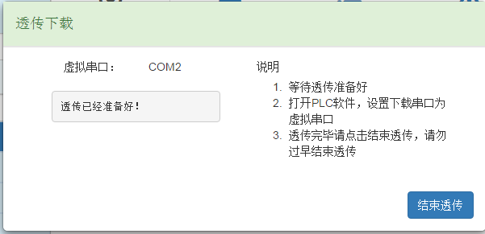  

打开基恩士KV-STUDIO的PLC软件，点击下图所示的红色按钮，选择串行通讯下载，将COM口设置为盒子客户度提示的虚拟串口，最后确定OK  

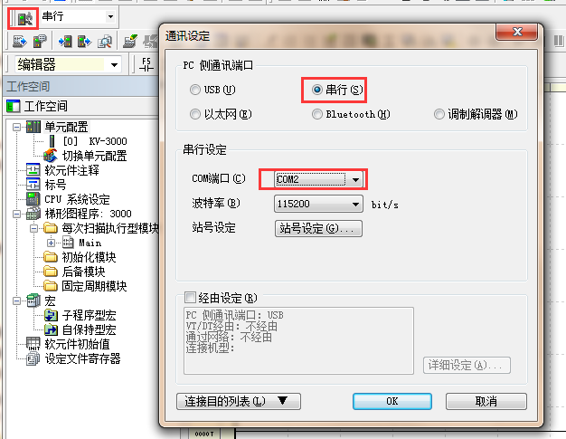  

点击读取PLC或者PLC传输，待弹出下面窗口，即代表可以透传了  

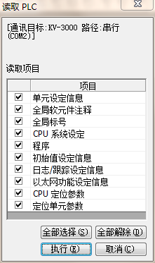  

点击执行即可，注意：读取PLC时，此时数据比较多，需要稍微等待，待PLC工程传上来即可。  

#### **欧姆龙PLC透传步骤**  

注意：透传前请打开盒子端对应的透传窗口，待透传准备好  

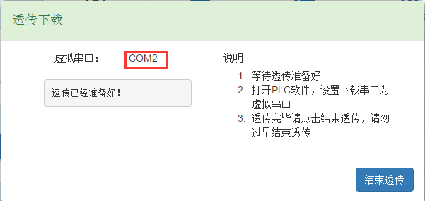  

**注意：FS配置的驱动参数，需要设置如下**  

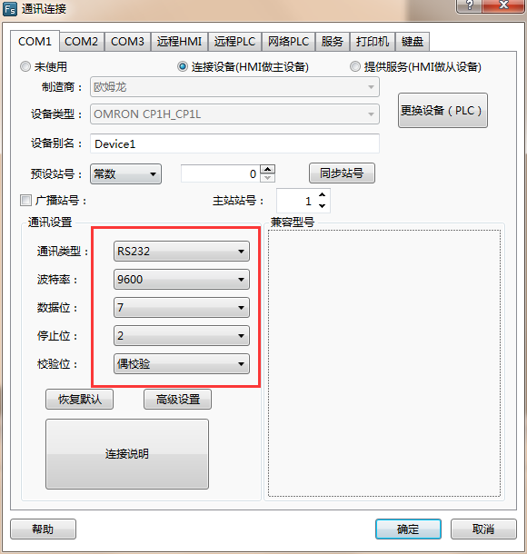  

如果在盒子客户端配置参数也要配置如此  

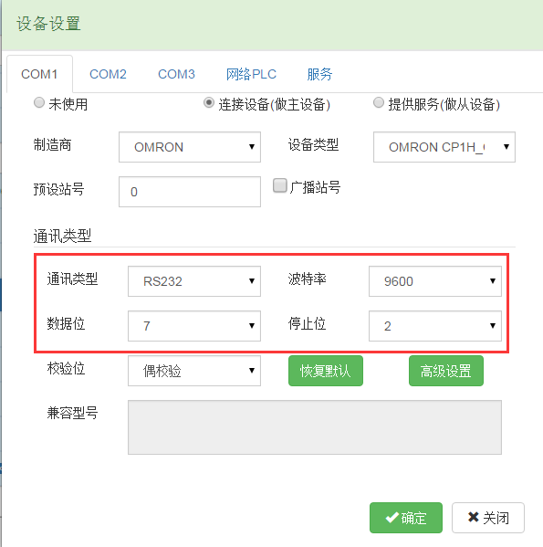  

打开PLC，设置下载COM口为透传提示的虚拟串口  
双击PLC软件左边导航的PLC型号，（注意在离线模式下双击才有效）如下图所示的红色框  

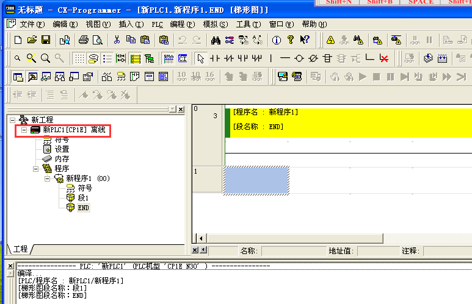  

2、在弹出的窗口里，将网络类型选为“SYSAMC WAY”,再点击设定。  

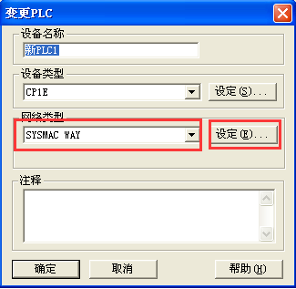  

3、在弹出的窗口里选择“驱动”，将端口名称选项设置为虚拟串口，这里为COM2.  

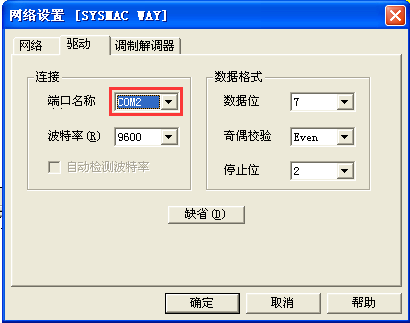  

此时将软件设置为在线工作  

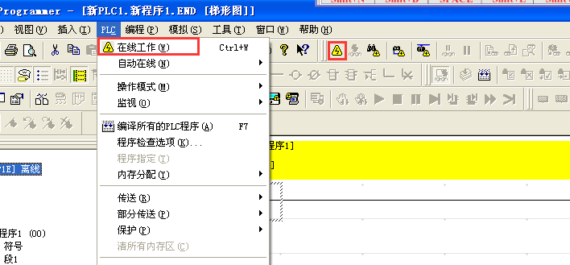  

点击完在线模式后，PLC软件会处于监视模式，见下图  

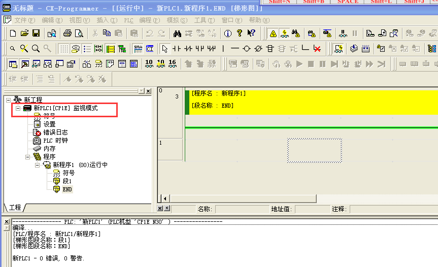  

在监视模式下后，就可以透传下载、上传、及监视  

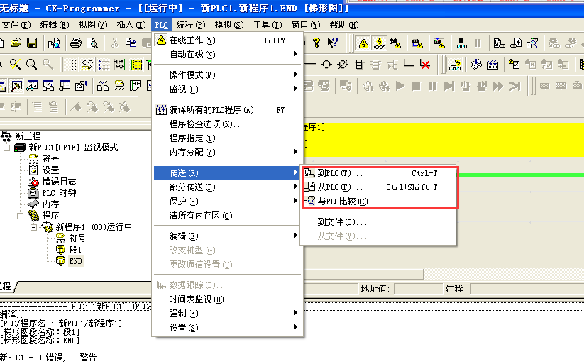  
